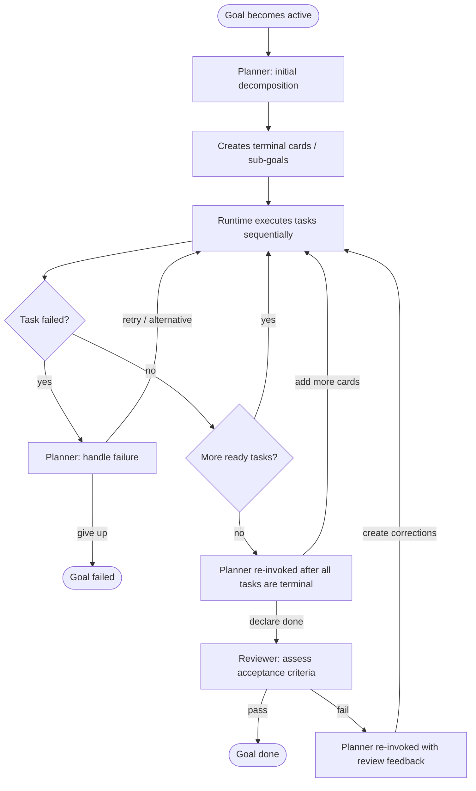

# Card Model

## Core Concept

All work is organized as a **card-based work tree**. Cards are the
single unit of planning, execution, and reporting.

The leaderboard, the plan, and the task backlog all collapse into one
structure: the card tree.

---

## Card Types

A **card** is a node in a recursive tree. Every piece of work — from a
strategic goal down to a concrete deliverable — is a card.

```
Project  "acme-search — improve search relevance"
  └─ Goal   "Reduce zero-result queries below 5%"
       ├─ Plan
       ├─ Goal  "Synonym expansion"
       │    ├─ Plan  (→ simple, creates terminal cards)
       │    ├─ Code      "Build synonym dict from query logs"
       │    ├─ Code      "Integrate into search pipeline"     (depends_on: prev)
       │    └─ Test      "Run A/B test on 10% traffic"        (depends_on: prev)
       │
       └─ Goal  "ML-based query rewriting"
            ├─ Plan  (→ complex, creates sub-goals with ordering)
            ├─ Goal  "Design"
            │    ├─ Plan
            │    ├─ Architecture  "Define rewriter architecture"
            │    └─ Doc           "Write design doc"
            ├─ Goal  "Implementation"  (depends_on: "Design")
            │    ├─ Plan
            │    ├─ Code  "Implement seq2seq model"
            │    ├─ Code  "Build training pipeline"
            │    └─ Test  "Unit + integration tests"
            └─ Goal  "Rollout"  (depends_on: "Implementation")
                 ├─ Plan
                 ├─ Code  "Canary deployment script"
                 └─ Test  "A/B test on 5% traffic"
```

### Goal-like and system card types

| Type         | Has planner? | Meaning                                                |
|--------------|--------------|--------------------------------------------------------|
| **Project**  | yes          | Root. One per workspace. Global context, constraints.  |
| **Goal**     | yes          | Work unit. Recursive — can nest arbitrarily deep.      |
| **Plan**     | —            | Auto-created first child. The planner's diary.         |

### Terminal card types

Terminal cards are leaves. They cannot have children and do not get
their own planner:

| Type         | Meaning                                                |
|--------------|--------------------------------------------------------|
| Architecture | Design decisions, system structure, API contracts.     |
| Code         | Implementation work — write, modify, refactor code.    |
| Test         | Verification — unit tests, integration, A/B, manual.   |
| Doc          | Documentation — guides, READMEs, specs, runbooks.      |
| Data         | Data work — acquisition, cleaning, transformation.     |
| Research     | Investigation — spikes, benchmarks, literature review.  |
| Ops          | Infra/operational — deploy, configure, monitor, fix.   |

Terminal cards are the **leaf work** executed by the agent. They
carry a specific type that tells the executor what kind of work is
expected and lets the UI show appropriate icons/labels.

The list of terminal types is **extensible** — projects can define
custom types beyond the built-in set.

The **project card is a goal** for planning purposes — it gets its
own plan card. There is no supervisor agent. The depth-0 planner is
the regular planner for the project card: it decides what top-level
goals to create, reacts to top-level goal failures, and proposes new
work when everything is done.

---

## Card history and tracked mutations

Cards remain mutable, but operator-intent edits are tracked.

Each `CardRecord` carries `version_seq`, which starts at `1` and
increments on tracked mutations. Before a tracked mutation is written,
the previous card snapshot is appended to per-card history.

Tracked fields are:

- `title`, `description`, `acceptance`, `instructions_file`
- `type`, `subtype`, `parent`
- `tags`, `priority`, `urgency`, `estimate`
- `depends_on`, `blocks`, `related`
- `assigned_to`
- `artifacts`, `attachments`

Untracked updates do **not** create history entries. These are runtime
and result fields such as:

- `status`
- `started_at`, `completed_at`, `duration_ms`
- `result`, `metrics`
- `error`, `retries`
- `updated_at`, `depth`

Operationally, tracked edits must go through `CardStore.mutateCard`;
untracked status/timing/result updates may continue to use the
untracked update path.

History is available to operators and agents through UI, REST, and
chat tools so they can inspect stale-work conditions and compare old vs
current instructions.

---

## The Planning Mechanism

Every **goal** (including the project) gets a **plan card**
auto-created as its first child when it transitions to `active`.
The plan card represents the **planner agent** for that goal —
its diary and persistent memory.

Review is **not** a pre-created card. It is triggered automatically
by the runtime when the planner declares the goal done. No goal
can succeed without a passing review.

The lifecycle of every goal:



### Plan invocation points

1. **Initial decomposition** (goal becomes `active`):
   The planner reads the parent's description, acceptance criteria,
   and project context. It creates sibling cards:
   - **Terminal cards** — leaf work (simple case).
   - **Sub-goals** — goals that will get their own plan
     when activated (complex case).
   - **Mixed** — any combination.
   - Sub-goals can use `depends_on` for ordering when sequential
     phases are needed.

2. **All tasks complete** (all planned sibling tasks have been
  invoked and every sibling card has reached `done`/`failed`):
   The planner is re-invoked. It reads:
   - Its own diary (previous decisions).
   - The state and results of all sibling cards.
   - The list of **still-running external processes**, if any
     (so it can decide to wait, kill, or ignore them).
   Then it decides:
   - **Add more cards** — if the work is incomplete, the planner
     creates follow-up cards and the cycle repeats.
   - **Declare done** — if the planner is satisfied, it signals
     completion. The runtime then triggers the reviewer
     automatically (see below).

3. **After review rejection** (reviewer says criteria not met):
   The planner is re-invoked with the reviewer's assessment. It:
   - Creates correction cards to address the gaps.
   - The cycle repeats: tasks execute → planner → reviewer.
   - Rolls up metrics and results from children into the parent.

4. **Failure** (a sibling card transitions to `failed`):
   The planner is re-invoked to decide remediation:
   - Retry the failed card.
   - Create an alternative card with a different approach.
   - Ignore the failure and continue with remaining siblings.
   - Give up → mark the parent goal as `failed`. The system
     automatically escalates to the parent's planner.

### Review

Review is triggered by the runtime — not pre-created as a card.
When the planner declares the goal done, the runtime invokes the
**reviewer agent**, which:

1. Reads the parent goal's acceptance criteria.
2. Reads the results, metrics, and artifacts from sibling cards.
3. Assesses whether the goal's acceptance criteria are met.
4. Produces a structured assessment: pass/fail, what was achieved,
   what's missing.
5. The assessment is **appended to the plan card** (the planner's
   diary), so all review history lives in one place.

If the review **passes**, the goal transitions to `done`.

If the review **fails**, the planner is re-invoked with the
reviewer's assessment (invocation point 3). The planner creates
correction cards and the cycle continues.

The reviewer does NOT decide what happens next — it only assesses.
The planner reads the review from the plan card and decides.

### Escalation

When a planner cannot remediate a failure, it marks its own goal as
`failed`. The system detects this and re-invokes the **parent's
planner** with the failure event. This propagates upward until
either a planner resolves it or it reaches the project-level
planner (the depth-0 planner). If the depth-0 planner can't handle
it, it notifies the user.

### The plan card as a diary

The plan card is the planner's **persistent memory**. Every
invocation appends to the plan's notes:

- What the planner observed (state of sibling cards, results, errors).
- What it decided and why.
- What cards it created, retried, or abandoned.
- **Reviewer assessments** — each review result is appended here,
  so the planner has the full review history in one place.

When the planner is re-invoked (on completion, review rejection,
or failure), it reads its own plan card first. This diary gives it
full context of its previous decisions without needing to
reconstruct history from the card tree. The planner can see: "I
already tried approach A and it failed, then I tried B which
partially worked — now C just failed, so I should escalate rather
than keep trying."

Operational work is represented with `Ops` terminal cards or ordinary
goals that contain `Ops` cards. Operational goals do **not** skip
planning or review: every goal still needs a plan card and a passing
review before it can be marked `done`.

**Recursion**: since sub-goals get their own plan card,
decomposition naturally recurses. Projects define a configurable
maximum goal depth (default: 5 goal levels). The planner receives
the current depth and max depth in context and must stop
decomposing into sub-goals before it exceeds the limit.

There is exactly **one project card** per workspace. It is the implicit
root of the tree — all goals are its children. It carries:

- **Context**: what the project is about, domain description, data
  sources, infrastructure constraints.
- **Goals summary**: high-level goals (derived from child goal
  cards, but also editable as prose).
- **Global constraints**: things that apply to every card below
  (resource limits, architectural rules, time constraints).

The project card can be presented in the UI as the root of the tree,
or as a separate "Project Settings" view — either works.

Agents always have access to the project card's context when reasoning
about any card in the tree, so global constraints propagate naturally.

---

## Card Fields

```yaml
# ── Identity ─────────────────────────────────────────────
id:               string
version_seq:      number       # starts at 1; increments on tracked mutation
                               # unique, e.g. "project", "goal-3",
                               # "plan-3", "code-15"
type:             project | goal | plan |
                  architecture | code | test | doc |
                  data | research | ops
parent:           string | null
depth:            number         # distance from project root (project=0, its goals=1, …)
title:            string
description:      string       # markdown, can be long
status:           drafting | backlog | active | running | blocked | done | failed | cancelled

# ── Classification ───────────────────────────────────────
subtype:          string | null
instructions_file:string | null
tags:             string[]
priority:         number
urgency:          low | normal | high | critical

# ── Authorship & ownership ───────────────────────────────
created_by:       user | analyst | planner
created_at:       ISO timestamp
updated_at:       ISO timestamp
assigned_to:      string | null

# ── Dependencies & relationships ─────────────────────────
depends_on:       string[]
blocks:           string[]
related:          string[]

# ── Acceptance & results ─────────────────────────────────
acceptance:       string
result:           object | null
metrics:          object | null

# ── Artifacts & attachments ───────────────────────────────
artifacts:        Artifact[]
attachments:      Attachment[]

# ── Effort tracking ─────────────────────────────────────
estimate:         string | null
started_at:       ISO timestamp | null
completed_at:     ISO timestamp | null
duration_ms:      number | null
error:            string | null
retries:          number
```

Notes are stored **separately** from the card record (one append-only
log per card), not embedded. See the Note schema below.

### Artifact

```yaml
path:             string
type:             model | data | config | log | report | other
description:      string
created_at:       ISO timestamp
retain:           boolean
```

### Attachment (inline-renderable content)

```yaml
path:             string
mime:             string
title:            string
description:      string
created_at:       ISO timestamp
```

### Note (activity log entry)

```yaml
id:               string
author:           string
timestamp:        ISO timestamp
content:          string
kind:             comment | progress | directive | escalation
handled:          boolean
```

| Kind        | Meaning                                                    |
|-------------|------------------------------------------------------------|
| comment     | General observation or context (any author)                |
| progress    | Status update from the executor (fold N/M, checkpoint…)    |
| directive   | Instruction that changes how the card should be executed   |
| escalation  | Something is wrong, needs attention                        |

**Mutable until handled**: notes can be edited or deleted while
`handled: false`. Once the executor (or any processing agent) reads
and acknowledges a note, it is marked `handled: true` and becomes
immutable — no edits, no deletions. This lets the user correct or
retract a directive before it takes effect, but preserves a reliable
audit trail of what was actually acted upon.

**Directives are actionable**: the executor reads unhandled notes
before each step. A user directive like "don't use CPU fallback, kill
and retry with smaller batch size" changes behavior mid-execution
without editing the card's description or acceptance criteria.

Directive and escalation notes also drive notifications:

- `directive` → session notification severity `warn`
- `escalation` → session notification severity `block`
- `comment` / `progress` → operator-surface notification only

---

## Hierarchy Rules

- There is exactly **one project card** (id: `project`). It is
  created at project init and cannot be deleted. The project card
  is itself a goal and gets its own plan card.
- A **goal** can have the project or another goal as parent
  (recursive, up to the configured depth limit). Sub-goals can use `depends_on`
  for sequential ordering.
- A **plan** is auto-created as the first child of a goal
  (including the project). There is exactly one plan per goal.
  It runs before any sibling and is re-invoked when
  all tasks complete, after review rejection, and on failure.
- **Terminal cards** (architecture, code, test, doc, data,
  research, ops) are always leaves — they cannot have children.
- A card cannot start (`active`) while any card in `depends_on`
  is not `done`.
- A plan card must complete its initial decomposition (`done`)
  before any of its siblings can transition to `active`.
- `blocks` is the auto-computed inverse of `depends_on` — never
  set manually.
- A goal cannot transition to `done` while it has children in
  `active`, `running`, or `blocked` status. The transition to
  `done` requires the planner to declare done and the
  reviewer to pass.
