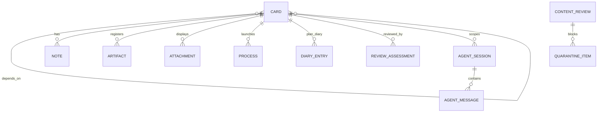

# Data Model & File Tree

All entities are stored as JSON. Markdown is a rendering format, not
the source of truth for structured records such as plan diary entries.

The storage split is:

- **`.saivage/`**: Persistent project metadata, configuration,
  card records, diaries, notes, agent sessions, runtime state,
  skills, and indexes.
- **`.saivage-work/`**: Generated work products, retained artifacts,
  disposable temporary files, process output, downloads, stash, and
  quarantine payloads.

Agents access these files through MCP/support software, not direct
filesystem reads/writes.

---

## Entity Overview



The project card (`type: "project"`) is the tree root and semantic
owner of project-wide context. The base `CardRecord` stays common to
all cards, so project-only fields are stored in the linked
`ProjectConfig` sidecar record.

---

## Project Configuration

Project-wide settings are stored in `.saivage/project.json`. This is
the project card's sidecar metadata — the project card itself remains
a regular `CardRecord` with `type: "project"` stored alongside other
cards.

```ts
interface ProjectConfig {
  id: "project";
  name: string;
  context: string;
  goals_summary: string;
  constraints: string[];
  max_goal_depth: number; // default 5
  planner_enabled: boolean;
  created_at: string;
  updated_at: string;
}
```

---

## Card

```ts
type CardType =
  | "project"
  | "goal"
  | "plan"
  | "architecture"
  | "code"
  | "test"
  | "doc"
  | "data"
  | "research"
  | "ops";

type CardStatus =
  | "drafting"
  | "backlog"
  | "active"
  | "running"
  | "blocked"
  | "done"
  | "failed"
  | "cancelled";

interface CardRecord {
  id: string;
  type: CardType;
  parent: string | null;
  depth: number;
  title: string;
  description: string;
  status: CardStatus;
  subtype?: string | null;
  tags: string[];
  priority: number;
  urgency: "low" | "normal" | "high" | "critical";
  created_by: "user" | "analyst" | "planner";
  created_at: string;
  updated_at: string;
  assigned_to?: string | null;
  depends_on: string[];
  blocks: string[];
  related: string[];
  acceptance: string;
  result?: Record<string, unknown> | null;
  metrics?: Record<string, number | string | boolean | null> | null;
  artifacts: ArtifactRef[];
  attachments: AttachmentRef[];
  estimate?: string | null;
  started_at?: string | null;
  completed_at?: string | null;
  duration_ms?: number | null;
  error?: string | null;
  retries: number;
}
```

Rules:

- Project and goal cards get exactly one plan child.
- Terminal cards are leaves.
- Cards are editable while not scheduled (`drafting` or `backlog`).
- Goal `done` requires reviewer pass.
- Task `done` is set when the executor reports completion.

---

## Plan Diary Entry

```ts
interface DiaryEntry {
  id: string;
  plan_card_id: string;
  invocation_id: string;
  kind:
    | "planner_invocation"
    | "planner_decision"
    | "card_mutation"
    | "review_assessment"
    | "failure_handling";
  timestamp: string;
  input_summary?: string;
  decision?: string;
  rationale?: string;
  created_cards?: string[];
  updated_cards?: string[];
  reviewed_cards?: string[];
  assessment?: ReviewAssessment;
  raw?: Record<string, unknown>;
}
```

Diary entries are stored as JSON and rendered as Markdown on the fly.

---

## Review Assessment

```ts
interface ReviewAssessment {
  id: string;
  goal_card_id: string;
  plan_card_id: string;
  reviewer_session_id: string;
  result: "pass" | "fail";
  summary: string;
  achieved: string[];
  missing: string[];
  evidence_card_ids: string[];
  created_at: string;
}
```

Review assessments are appended to the plan diary.

---

## Note

```ts
interface NoteRecord {
  id: string;
  card_id: string;
  author: "user" | "analyst" | "planner" | "executor" | "reviewer" | "runtime";
  timestamp: string;
  content: string;
  kind: "comment" | "progress" | "directive" | "escalation";
  handled: boolean;
  handled_at?: string | null;
}
```

Notes are stored separately from the card record and become immutable
after they are handled.

---

## Process

```ts
interface ProcessRecord {
  id: string;
  card_id: string;
  command: string;
  cwd: string;
  status: "running" | "exited" | "failed" | "killed";
  pid?: number | null;
  started_at: string;
  completed_at?: string | null;
  exit_code?: number | null;
  required_for_card_completion: boolean;
  output_dir: string;
  stdout_path: string;
  stderr_path: string;
  combined_log_path: string;
}
```

Processes are external programs launched asynchronously while executing
terminal cards. Process metadata is persisted under `.saivage/runtime/`,
while process output files live under `.saivage-work/processes/`.

---

## Artifact and Attachment

```ts
interface ArtifactRef {
  id: string;
  card_id: string;
  path: string;
  type: "model" | "data" | "config" | "log" | "report" | "other";
  description: string;
  retain: boolean;
  created_at: string;
}

interface AttachmentRef {
  id: string;
  card_id: string;
  path: string;
  mime: string;
  title: string;
  description?: string;
  created_at: string;
}
```

Attachments render inline only in the web UI.

---

## Agent Session and Messages

```ts
interface AgentSession {
  id: string;
  role: "analyst" | "planner" | "executor" | "reviewer" | "content_supervisor";
  goal_card_id?: string | null;
  card_id?: string | null;
  status: "active" | "done" | "failed";
  started_at: string;
  completed_at?: string | null;
  model?: string;
}

interface AgentMessage {
  id: string;
  session_id: string;
  role: "user" | "assistant" | "system" | "tool";
  kind:
    | "text"
    | "activity"
    | "tool_call"
    | "tool_result"
    | "tool_error"
    | "model_issue"
    | "model_repair"
    | "model_recovered";
  content: string;
  tool?: string;
  timestamp: string;
  links?: EntityLink[];
}

interface EntityLink {
  entity_type: "card" | "process" | "artifact" | "attachment" | "quarantine";
  entity_id: string;
  label?: string;
}
```

---

## Runtime State

```ts
interface RuntimeState {
  status: "idle" | "running" | "paused" | "error";
  project_id: "project";
  pid: number;
  started_at: string;
  current_card_id?: string | null;
  current_agent_session_id?: string | null;
  paused: boolean;
  paused_at?: string | null;
  queue: string[];
  running_processes: string[];
  updated_at: string;
}
```

The runtime state file is `.saivage/runtime/state.json`. Temporary
runtime locks and scratch files live under `.saivage-work/tmp/runtime/`.

---

## Content Supervision

```ts
interface ContentReview {
  id: string;
  source_kind: "command_output" | "file" | "download" | "web" | "api" | "tool";
  source_ref: string;
  status: "passed" | "blocked" | "sanitized";
  summary: string;
  risk: "low" | "medium" | "high";
  quarantine_id?: string | null;
  created_at: string;
}

interface QuarantineItem {
  id: string;
  review_id: string;
  source_ref: string;
  stored_path: string;
  reason: string;
  created_at: string;
}
```

Content review metadata is persisted under `.saivage/supervision/`.
Blocked original content is stored under `.saivage-work/quarantine/`.

---

## File Tree Structure

```text
.saivage/
  project.json
  saivage.json
  auth-profiles.json
  skills/
    index.json
    architecture.md
    code.md
    test.md
    doc.md
    data.md
    research.md
    ops.md
  instructions/
    planner.md              # depth-0 planner instructions (user-editable)
    executor.md             # global executor instructions (optional)
  cards/
    index.json
    by-id/
      project.json
      goal-0001.json
      plan-0001.json
      code-0002.json
    tree/
      project.children.json
      goal-0001.children.json
    dependencies/
      depends-on.json
      blocks.json
  diaries/
    plan-0001/
      index.json
      000001.initial.json
      000002.card-mutations.json
      000003.review-assessment.json
  reviews/
    by-goal/
      goal-0001.index.json
  notes/
    by-card/
      goal-0001.jsonl
      code-0002.jsonl
    queue.json
  agents/
    sessions/
      analyst-0001.json
      planner-0002.json
      executor-0003.json
      reviewer-0004.json
    messages/
      analyst-0001.jsonl
      planner-0002.jsonl
      executor-0003.jsonl
      reviewer-0004.jsonl
  runtime/
    state.json
    queue.json
    pause.json
    events.jsonl
    errors.jsonl
    processes.json
  supervision/
    reviews.jsonl
    quarantine-index.json
  views/
    leaderboard.json
    saved-filters.json
```

```text
.saivage-work/
  cards/
    goal-0001/
      artifacts/
        retained/
        working/
      attachments/
      tmp/
    code-0002/
      artifacts/
        retained/
        working/
      attachments/
      tmp/
  processes/
    proc-0001/
      meta.json
      stdout.log
      stderr.log
      combined.log
      exit.json
    proc-0002/
      meta.json
      stdout.log
      stderr.log
      combined.log
      exit.json
  downloads/
    dl-0001/
      meta.json
      original.bin
      sanitized.txt
      review.json
  quarantine/
    q-0001/
      meta.json
      raw.bin
      summary.md
  tmp/
    runtime/
      runtime.lock
      shutdown-handoff.json
    stash/
    uploads/
    previews/
```

---

## Cleanup Policy

Cleanup operates on `.saivage-work/`, not `.saivage/`.

Safe cleanup targets:

- `.saivage-work/cards/*/tmp/`
- `.saivage-work/cards/*/artifacts/working/`
- completed `.saivage-work/processes/*/` directories after their logs
  are summarized and no retained artifact references them
- stale `.saivage-work/tmp/stash/` files older than 24 hours
- stale previews/uploads

Never delete without an explicit retention check:

- `.saivage-work/cards/*/artifacts/retained/`
- `.saivage-work/cards/*/attachments/`
- `.saivage-work/downloads/*/review.json`
- `.saivage-work/quarantine/*/meta.json`

Metadata in `.saivage/` is the source of truth and should be edited
only through MCP/runtime APIs.