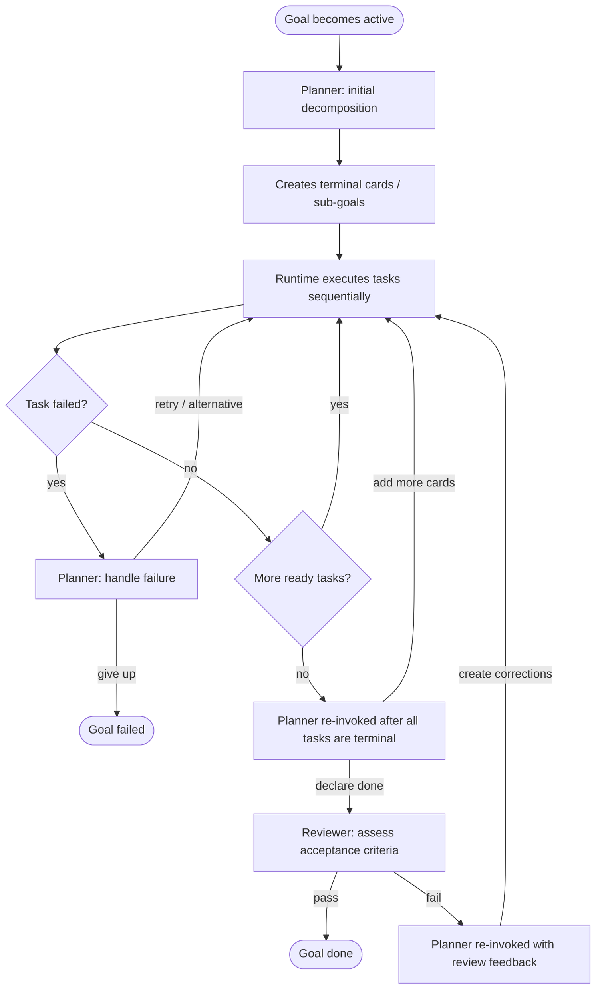
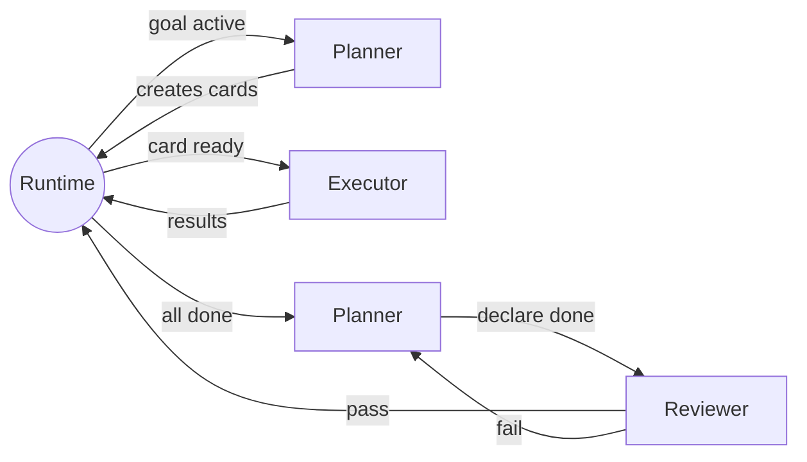
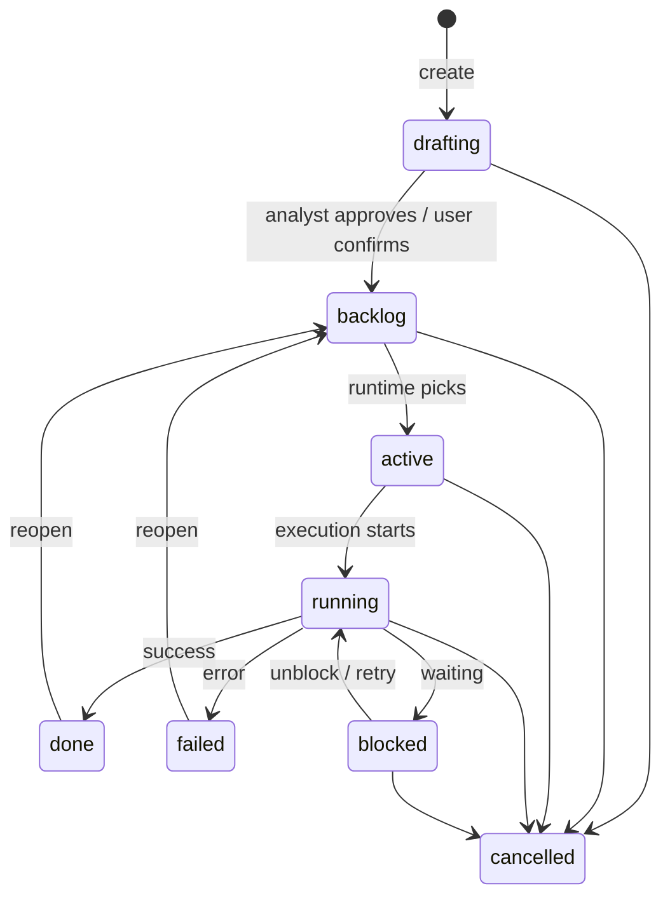

# Saivage v3 — Functional Analysis

## Core Concept

All work is organized as a **card-based work tree**. Cards are the
single unit of planning, execution, and reporting.

The leaderboard, the plan, and the task backlog all collapse into one
structure: the card tree.

---

## 1. Card Model

A **card** is a node in a recursive tree. Every piece of work — from a
strategic goal down to a concrete deliverable — is a card.

```
Project  "acme-search — improve search relevance"
  └─ Goal   "Reduce zero-result queries below 5%"
       ├─ Plan
       ├─ Goal  "Synonym expansion"
       │    ├─ Plan  (→ simple, creates terminal cards)
       │    ├─ Code      "Build synonym dict from query logs"
       │    ├─ Code      "Integrate into search pipeline"     (depends_on: prev)
       │    └─ Test      "Run A/B test on 10% traffic"        (depends_on: prev)
       │
       └─ Goal  "ML-based query rewriting"
            ├─ Plan  (→ complex, creates sub-goals with ordering)
            ├─ Goal  "Design"
            │    ├─ Plan
            │    ├─ Architecture  "Define rewriter architecture"
            │    └─ Doc           "Write design doc"
            ├─ Goal  "Implementation"  (depends_on: "Design")
            │    ├─ Plan
            │    ├─ Code  "Implement seq2seq model"
            │    ├─ Code  "Build training pipeline"
            │    └─ Test  "Unit + integration tests"
            └─ Goal  "Rollout"  (depends_on: "Implementation")
                 ├─ Plan
                 ├─ Code  "Canary deployment script"
                 └─ Test  "A/B test on 5% traffic"
```

### Card types

Goal-like and system card types:

| Type         | Has planner? | Meaning                                                |
|--------------|--------------|--------------------------------------------------------|
| **Project**  | yes          | Root. One per workspace. Global context, constraints.  |
| **Goal**     | yes          | Work unit. Recursive — can nest arbitrarily deep.      |
| **Plan**     | —            | Auto-created first child. The planner's diary.         |

Terminal cards are leaves. They cannot have children and do not get
their own planner:

| Type         | Meaning                                                |
|--------------|--------------------------------------------------------|
| Architecture | Design decisions, system structure, API contracts.     |
| Code         | Implementation work — write, modify, refactor code.    |
| Test         | Verification — unit tests, integration, A/B, manual.   |
| Doc          | Documentation — guides, READMEs, specs, runbooks.      |
| Data         | Data work — acquisition, cleaning, transformation.     |
| Research     | Investigation — spikes, benchmarks, literature review.  |
| Ops          | Infra/operational — deploy, configure, monitor, fix.   |

Terminal cards are the **leaf work** executed by the agent. They
carry a specific type that tells the executor what kind of work is
expected and lets the UI show appropriate icons/labels.

The list of terminal types is **extensible** — projects can define
custom types beyond the built-in set.

The **project card is a goal** for planning purposes — it gets its
own plan card. There is no supervisor agent. The depth-0 planner is
the regular planner for the project card: it decides what top-level
goals to create, reacts to top-level goal failures, and proposes new
work when everything is done.

### The planning mechanism

Every **goal** (including the project) gets a **plan card**
auto-created as its first child when it transitions to `active`.
The plan card represents the **planner agent** for that goal —
its diary and persistent memory.

Review is **not** a pre-created card. It is triggered automatically
by the runtime when the planner declares the goal done. No goal
can succeed without a passing review.

The lifecycle of every goal:



#### Plan invocation points

1. **Initial decomposition** (goal becomes `active`):
   The planner reads the parent's description, acceptance criteria,
   and project context. It creates sibling cards:
   - **Terminal cards** — leaf work (simple case).
   - **Sub-goals** — goals that will get their own plan
     when activated (complex case).
   - **Mixed** — any combination.
   - Sub-goals can use `depends_on` for ordering when sequential
     phases are needed.

2. **All tasks complete** (all planned sibling tasks have been
  invoked and every sibling card has reached `done`/`failed`):
   The planner is re-invoked. It reads:
   - Its own diary (previous decisions).
   - The state and results of all sibling cards.
   - The list of **still-running external processes**, if any
     (so it can decide to wait, kill, or ignore them).
   Then it decides:
   - **Add more cards** — if the work is incomplete, the planner
     creates follow-up cards and the cycle repeats.
   - **Declare done** — if the planner is satisfied, it signals
     completion. The runtime then triggers the reviewer
     automatically (see below).

3. **After review rejection** (reviewer says criteria not met):
   The planner is re-invoked with the reviewer's assessment. It:
   - Creates correction cards to address the gaps.
   - The cycle repeats: tasks execute → planner → reviewer.
   - Rolls up metrics and results from children into the parent.

4. **Failure** (a sibling card transitions to `failed`):
   The planner is re-invoked to decide remediation:
   - Retry the failed card.
   - Create an alternative card with a different approach.
   - Ignore the failure and continue with remaining siblings.
   - Give up → mark the parent goal as `failed`. The system
     automatically escalates to the parent's planner.

#### Review

Review is triggered by the runtime — not pre-created as a card.
When the planner declares the goal done, the runtime invokes the
**reviewer agent**, which:

1. Reads the parent goal's acceptance criteria.
2. Reads the results, metrics, and artifacts from sibling cards.
3. Assesses whether the goal's acceptance criteria are met.
4. Produces a structured assessment: pass/fail, what was achieved,
   what's missing.
5. The assessment is **appended to the plan card** (the planner's
   diary), so all review history lives in one place.

If the review **passes**, the goal transitions to `done`.

If the review **fails**, the planner is re-invoked with the
reviewer's assessment (invocation point 3). The planner creates
correction cards and the cycle continues.

The reviewer does NOT decide what happens next — it only assesses.
The planner reads the review from the plan card and decides.

#### Escalation

When a planner cannot remediate a failure, it marks its own goal as
`failed`. The system detects this and re-invokes the **parent's
planner** with the failure event. This propagates upward until
either a planner resolves it or it reaches the project-level
planner (the depth-0 planner). If the depth-0 planner can't handle
it, it notifies the user.

#### The plan card as a diary

The plan card is the planner's **persistent memory**. Every
invocation appends to the plan's notes:

- What the planner observed (state of sibling cards, results, errors).
- What it decided and why.
- What cards it created, retried, or abandoned.
- **Reviewer assessments** — each review result is appended here,
  so the planner has the full review history in one place.

When the planner is re-invoked (on completion, review rejection,
or failure), it reads its own plan card first. This diary gives it
full context of its previous decisions without needing to
reconstruct history from the card tree. The planner can see: "I
already tried approach A and it failed, then I tried B which
partially worked — now C just failed, so I should escalate rather
than keep trying."

Operational work is represented with `Ops` terminal cards or ordinary
goals that contain `Ops` cards. Operational goals do **not** skip
planning or review: every goal still needs a plan card and a passing
review before it can be marked `done`.

**Recursion**: since sub-goals get their own plan card,
decomposition naturally recurses. Projects define a configurable
maximum goal depth (default: 5 goal levels). The planner receives
the current depth and max depth in context and must stop
decomposing into sub-goals before it exceeds the limit.

There is exactly **one project card** per workspace. It is the implicit
root of the tree — all goals are its children. It carries:

- **Context**: what the project is about, domain description, data
  sources, infrastructure constraints.
- **Goals summary**: high-level goals (derived from child goal
  cards, but also editable as prose).
- **Global constraints**: things that apply to every card below
  (resource limits, architectural rules, time constraints).

The project card can be presented in the UI as the root of the tree,
or as a separate "Project Settings" view — either works.

Agents always have access to the project card's context when reasoning
about any card in the tree, so global constraints propagate naturally.

### Card fields

```yaml
# ── Identity ─────────────────────────────────────────────
id:               string       # unique, e.g. "project", "goal-3",
                               # "plan-3", "code-15"
type:             project | goal | plan |
                  architecture | code | test | doc |
                  data | research | ops
parent:           string | null
depth:            number         # distance from project root (project=0, its goals=1, …)
title:            string
description:      string       # markdown, can be long
status:           drafting | backlog | active | running | blocked | done | failed | cancelled

# ── Classification ───────────────────────────────────────
subtype:          string | null  # free-form within type, e.g. "data-pipeline",
                                 # "prototype", "integration", "analysis"
tags:             string[]       # free-form labels for filtering and grouping
priority:         number         # within siblings; lower = higher priority
urgency:          low | normal | high | critical  # how soon it needs attention

# ── Authorship & ownership ───────────────────────────────
created_by:       user | analyst | planner
created_at:       ISO timestamp
updated_at:       ISO timestamp
assigned_to:      string | null  # agent role or null

# ── Dependencies & relationships ─────────────────────────
depends_on:       string[]     # card IDs that must complete before this can start
blocks:           string[]     # card IDs that depend on this (auto-computed inverse)
related:          string[]     # "see also" links — not blocking, just relevant context

# ── Acceptance & results ─────────────────────────────────
acceptance:       string       # what "done" means (measurable when possible)
result:           object | null # free-form: summary, observations, conclusions
metrics:          object | null # structured, project-defined measurements

# ── Artifacts & attachments ───────────────────────────────
artifacts:        Artifact[]   # files produced during execution
                               # each: { path, type, description, retain }
                               # retain: true = keep long-term, false = working
                               # file, can be cleaned up
attachments:      Attachment[] # inline-renderable content attached to the card
                               # each: { path, mime, title, description }
                               # displayed in UI: images, plots, HTML, SVG, etc.

# ── Effort tracking ─────────────────────────────────────
estimate:         string | null  # human-readable estimate
started_at:       ISO timestamp | null
completed_at:     ISO timestamp | null
duration_ms:      number | null  # wall-clock time (auto-computed)
error:            string | null  # failure reason if status=failed
retries:          number         # how many times this card has been retried

```

Notes are stored **separately** from the card record (one append-only
log per card), not embedded. See the Note schema below.

#### Artifact

```yaml
path:             string       # project-relative path
type:             model | data | config | log | report | other
description:      string       # what this file is
created_at:       ISO timestamp
retain:           boolean      # true = keep long-term; false = working file,
                               # can be cleaned up to save space
```

Artifacts with `retain: false` are disposable working files — intermediate
data, temporary outputs, scratch scripts. A future cleanup command can
remove them once the card is done. Only `retain: true` artifacts should
survive cleanup when that policy is implemented.

#### Attachment (inline-renderable content)

```yaml
path:             string       # project-relative path to the file
mime:             string       # e.g. "image/png", "image/svg+xml", "text/html"
title:            string       # display title in the UI
description:      string       # optional caption or context
created_at:       ISO timestamp
```

Attachments are files the UI can render inline on a card: charts,
plots, diagrams, HTML reports, SVG visualizations. They're stored as
regular files in the project; the attachment entry just tells the UI
where to find them and how to display them.

Typical use: an executor runs a script that produces a performance
chart → registers it as an attachment → the card shows the chart
directly in the web UI.

#### Note (activity log entry)

```yaml
id:               string       # unique within the card, e.g. "n-1", "n-2"
author:           string       # "user", "analyst", "planner", "executor", "reviewer"
timestamp:        ISO timestamp
content:          string       # markdown
kind:             comment | progress | directive | escalation
handled:          boolean      # true once the executor has seen/processed it
```

| Kind        | Meaning                                                    |
|-------------|------------------------------------------------------------|
| comment     | General observation or context (any author)                |
| progress    | Status update from the executor (fold N/M, checkpoint…)    |
| directive   | Instruction that changes how the card should be executed   |
| escalation  | Something is wrong, needs attention                        |

**Mutable until handled**: notes can be edited or deleted while
`handled: false`. Once the executor (or any processing agent) reads
and acknowledges a note, it is marked `handled: true` and becomes
immutable — no edits, no deletions. This lets the user correct or
retract a directive before it takes effect, but preserves a reliable
audit trail of what was actually acted upon.

**Directives are actionable**: the executor reads unhandled notes
before each step. A user directive like "don't use CPU fallback, kill
and retry with smaller batch size" changes behavior mid-execution
without editing the card's description or acceptance criteria.

### Hierarchy rules

- There is exactly **one project card** (id: `project`). It is
  created at project init and cannot be deleted. The project card
  is itself a goal and gets its own plan card.
- A **goal** can have the project or another goal as parent
  (recursive, up to the configured depth limit). Sub-goals can use `depends_on`
  for sequential ordering.
- A **plan** is auto-created as the first child of a goal
  (including the project). There is exactly one plan per goal.
  It runs before any sibling and is re-invoked when
  all tasks complete, after review rejection, and on failure.
- **Terminal cards** (architecture, code, test, doc, data,
  research, ops) are always leaves — they cannot have children.
- A card cannot start (`active`) while any card in `depends_on`
  is not `done`.
- A plan card must complete its initial decomposition (`done`)
  before any of its siblings can transition to `active`.
- `blocks` is the auto-computed inverse of `depends_on` — never
  set manually.
- A goal cannot transition to `done` while it has children in
  `active`, `running`, or `blocked` status. The transition to
  `done` requires the planner to declare done and the
  reviewer to pass.

---

## 2. Persistence

Cards are stored as **JSON files**, one per card. An **index file**
maintains the tree structure and summary fields for fast listing
without reading every card. The index is rebuilt from card files on
startup (source of truth = individual card files).

All state is project-local under `.saivage/` (metadata, indexes,
cards, diaries, sessions, runtime state, skills, configuration) and
`.saivage-work/` (generated outputs, artifacts, process logs,
downloads, quarantine). The two roots mirror each other by card and
process IDs so cleanup can target `.saivage-work/` without corrupting
metadata.

The detailed directory layout, data model schemas, and cleanup policy
are defined in the UX design document (`ux-design.md §File Tree
Structure`).

---

## 3. Agents and Runtime

### Agent model

**The runtime drives the loop.** Agents are specialized, short-lived
LLM sessions invoked by the runtime at specific points. They do
their job, produce output, and return control. They do not invoke
themselves or each other — the support software handles sequencing,
card state transitions, and agent dispatch.

This means:
- Agents have **specific lifetimes**. Planner, executor, and reviewer
  are scoped to their parent goal. The analyst is a special
  user-facing agent that lives outside any one goal.
- The runtime decides **what runs when** — which terminal card is
  next, when to invoke the planner, when to run a review.
- Agents can be **restarted** at any point — if an agent crashes or
  the system restarts, the runtime re-reads the cards and restores
  that agent's context from persisted state.
- No MCP-style self-invocation — the executor doesn't call a "run
  next task" tool. The runtime feeds it tasks one at a time.
- Agents **cannot read or write `.saivage/` directly** — all card,
  state, skill, and instruction access goes through MCP tools or is
  loaded into context by the support software.
- Content that may have come from outside the project is screened by
  the content supervisor before it is placed in an agent's context.

Each goal has **three agents**, all scoped to that goal's lifetime:

| Agent    | Lifetime                 | Invoked when                              |
|----------|--------------------------|-------------------------------------------|
| Planner  | Goal activation → done   | Initial, all tasks done, after review rejection, on failure |
| Executor | Goal activation → done   | For each terminal card, sequentially       |
| Reviewer | On demand → goal done    | When planner declares done; on re-review after corrections  |



### 3.1 Analyst (the chat agent)

**Interface**: Chat (Telegram, web UI, CLI). This is the agent users
talk to.

**Role**: The single gateway for managing cards **and** controlling
execution. The analyst is a conversational agent whose tools cover
card CRUD, execution control, and inspection. Its system prompt
includes the project card context so it always knows the global
constraints.

Tools — card management:

| Tool          | Description                                    |
|---------------|------------------------------------------------|
| `create_card` | Create a card at any level                     |
| `edit_card`   | Edit fields (title, description, acceptance…)  |
| `move_card`   | Re-parent a card in the tree                   |
| `delete_card` | Remove a card (and its children)               |
| `add_note`    | Append a note to a card's activity log         |
| `list_cards`  | Query/filter the card tree                     |
| `get_card`    | Read full card details (including notes)       |

Tools — execution control:

| Tool            | Description                                    |
|-----------------|------------------------------------------------|
| `pause_runtime` | Globally pause new planner/executor/reviewer dispatch |
| `resume_runtime`| Resume dispatch after a global pause           |
| `abort_goal`    | Abort a goal — marks it and children `cancelled`|
| `restart_card`  | Re-queue a done/failed task card → `backlog`   |
| `restart_goal`  | Reset a goal: cancel running children, clear the plan diary, re-queue the goal → `backlog` so the planner starts fresh when it is next activated |
| `kill_process`  | Kill a running external process                |

Tools — inspection:

| Tool              | Description                                    |
|-------------------|------------------------------------------------|
| `get_card`        | Full card details, notes, attachments          |
| `list_cards`      | Query/filter (by status, type, parent, etc.)   |
| `get_plan_diary`  | Read a goal's plan card diary + review results |
| `get_card_output` | Tail output of a card's running/completed processes |
| `get_tree`        | Show the full or partial card tree             |
| `get_status`      | Runtime status — active cards, running processes, queue |

The analyst can inspect everything: cards at any level, plan
diaries (including reviewer assessments stored there), execution
output, running processes, and system state. It uses this to answer
user questions about what's happening, what was tried, and why.

Typical interactions:

- **User**: "I want to try a caching layer for the search index"
  → analyst finds/creates the right goal, creates a goal
  with acceptance criteria, asks the user to confirm.
- **User**: "Change the project constraint to max 2-week experiments"
  → analyst edits the project card.
- **User**: "Stop the synonym expansion goal, it's going nowhere"
  → analyst calls `abort_goal` on the synonym expansion goal.
- **User**: "Pause everything until I check the data"
  → analyst calls `pause_runtime`, which stops new agent dispatch
  but does not automatically kill already-running processes.
- **User**: "What is the executor doing right now?"
  → analyst calls `get_status` and `get_card_output` to describe
  the current work and its output.
- **Planner**: "We haven't explored query rewriting under the
  current constraints"
  → analyst creates a goal (non-interactive, no confirmation needed
  since the planner provided enough context).

The analyst never performs terminal task work — it manages cards,
controls execution, and inspects runtime state.

### 3.2 Planner (per-goal agent)

**Lifetime**: Scoped to its parent goal. Created when the goal
becomes `active` and retained until the goal reaches a terminal
state. If the system restarts, the runtime restores the planner's
context from the plan card diary and persisted runtime state.

**Invoked by the runtime** at four points (see §1):
1. **Initial decomposition** — goal becomes active.
2. **All tasks complete** — all sibling cards reach done/failed.
3. **After review rejection** — reviewer says criteria not met.
4. **On failure** — a sibling card fails.

Each invocation receives the plan card (diary) as context, so the
planner sees its full history of decisions.

**Role**: Decomposes goals, reads review assessments, handles
failures. At the project level, this is the regular planner for the
project card (depth 0): it decides strategic direction and proposes
new top-level goals when the system is idle.

**Configurable instructions**: Each planner reads:
1. Its own plan card (diary of previous decisions).
2. The parent goal's description and acceptance criteria.
3. The project card's context and constraints.
4. An optional user-editable instruction file
  (`.saivage/planner.md` for the depth-0 planner, or
  a field on the goal card for deeper levels). The support
  software loads or links these instructions into the planner's
  context; the planner does not read `.saivage/` directly.

The depth-0 planner instructions are where the user defines the
overall strategy:

```markdown
# Planner Instructions

## Strategy
- Prioritize goals that explore new approaches over
  re-running existing ones with minor tweaks.
- When a goal fails, try once with an adjusted approach before
  escalating to the user.
- Do not create more than 3 goals in backlog at any time.

## When idle
- Review completed goals and look for patterns.
- Propose follow-up goals for the best-performing results.
- Identify gaps in coverage.
```

The depth-0 planner can be **enabled or disabled**. When
disabled, only user-originated goals exist and the system idles
when all work is done.

**Interface**: The planner emits structured card mutation requests.
The runtime applies them through the same card MCP and validation
path used by the analyst. It doesn't have direct card-write access;
this ensures every card goes through the same structuring logic.

### 3.3 Executor (per-goal agent)

**Lifetime**: Scoped to its parent goal. Created when the first
terminal card under that goal is ready to execute. Persists until
all terminal cards are complete (or the goal is cancelled/failed).

**Invoked by the runtime** for each terminal card in sequence. The
runtime determines the order based on `depends_on` and `priority`.
The executor does not choose what to run next — it receives a card,
does the work, returns results.

**Execution is sequential by default** — one terminal card at a
time. Besides the analyst, the runtime runs only one agent at a
time. Planner, executor, and reviewer invocations are not parallel
unless explicitly configured as a future extension.

**Role**: Runs terminal cards — the actual leaf work. The card's
type tells the executor what kind of work is expected:

| Terminal type  | Executor behavior                                  |
|----------------|----------------------------------------------------|
| Architecture   | Produce design docs, diagrams, API specs           |
| Code           | Write, modify, or refactor code                    |
| Test           | Write and run tests, report results                |
| Doc            | Write documentation, guides, runbooks              |
| Data           | Acquire, clean, transform data                     |
| Research       | Investigate, benchmark, review literature          |
| Ops            | Deploy, configure, monitor, fix infrastructure     |

#### Skill files

For every terminal card type, an optional **skill file** can exist
at `.saivage/skills/<type>.md` (e.g. `.saivage/skills/code.md`,
`.saivage/skills/research.md`). When present, the support software
loads or links the skill file into the executor's context before it
starts work on a card of that type. If an agent needs a skill that
was not preloaded, it requests it through a dedicated MCP tool; it
does not read the skill file directly.

Skill files contain domain-specific instructions: coding
conventions, preferred tools, testing strategies, research
methodology, deployment checklists, etc. They let the user
customize executor behavior per task type without modifying the
system prompt.

For each terminal card:
1. Receives the card from the runtime.
2. Reads the card's description and acceptance criteria.
3. Does the work (shell commands, file edits, scripts, etc.).
4. Captures results (metrics, artifacts, attachments).
5. Returns results to the runtime, which transitions the card
   to `done` or `failed`.

The executor has tools for doing work (shell, filesystem, git,
etc.) but does **not** have tools for card management or
self-dispatch. It cannot create cards, choose the next task, or
invoke other agents.

#### External command execution model

All external commands (shell, scripts, training runs, etc.) are
launched as **processes** and executed asynchronously. Tasks are the
low-level terminal cards; processes are external programs launched
while executing those cards. The MCP layer provides:

| Tool              | Description                                         |
|-------------------|-----------------------------------------------------|
| `start_process`   | Start a command asynchronously. Returns a process ID. Output is streamed to a file. |
| `wait_process`    | Wait for a process to finish, up to a timeout. If the timeout is reached, the process is **not killed** — the return says it's still running. The agent decides whether to kill or let it continue. |
| `start_and_wait`  | Shortcut: `start_process` + `wait_process` in one call. |
| `tail_output`     | Get the last N lines of a process's output file.    |
| `kill_process`    | Kill a running process by ID.                       |
| `list_processes`  | List running/completed processes for the current card. |
| `download_file`   | Download a file and run it through content supervision before it can be used. |

Key properties:
- Output is always saved to a file, so it survives agent restarts
  and can be inspected later (by the analyst, planner, or reviewer).
- `start_and_wait` is the common case — run a command and get the
  result. But if the command takes longer than expected, the agent
  isn't stuck: it gets a "still running" response and can decide
  to wait more, kill, or move on.
- Long-running processes (training, benchmarks) are started with
  `start_process` and polled with `tail_output`.
- When the planner is re-invoked after all tasks complete, the
  runtime includes the list of still-running processes so the
  planner can decide what to do with them.

### 3.4 Reviewer (per-goal agent)

**Lifetime**: Scoped to its parent goal. Invoked the first time the
planner declares the goal done. Recalled for every subsequent
re-review (when the planner adds correction cards and they
complete, and the planner declares done again).

**Invoked by the runtime** when the planner declares the goal done.

**Role**: Checks whether the goal's acceptance criteria were met.
For each review:
1. Reads the parent goal's acceptance criteria.
2. Reads results, metrics, and artifacts from sibling cards.
3. Produces a structured assessment: pass/fail, what was achieved,
   what's missing.
4. Returns the assessment to the runtime, which **appends it
   to the plan card** (the planner's diary).

If the review **passes**, the goal transitions to `done`.

If the review **fails**, the planner is re-invoked. It reads
the review from the plan card, creates correction cards, and the
cycle continues.

The reviewer does NOT decide what happens next — it only assesses.
The planner reads the review from its diary and decides.

### 3.5 Content supervisor (security layer)

A **content supervisor** screens all content coming from
external sources before it reaches any agent. This includes:

- Command output (stdout/stderr from executed processes).
- File contents read from dangerous or externally sourced locations.
- Web pages, API responses, downloaded data.
- Any tool output that originates outside the LLM.

The MCP layer provides safe ingestion tools:

| Tool               | Description                                      |
|--------------------|--------------------------------------------------|
| `download_file`    | Download a file and run it through content supervision before it can be used. |
| `read_file`        | Read a workspace file. If the path or metadata indicates external/dangerous provenance, the result is supervised before reaching the agent. |
| `supervise_content`| Explicitly request content supervision for text, file output, or tool output. |

Agents may request supervision explicitly when they are unsure
whether content is safe. Otherwise, MCP tools apply supervision
automatically when they know the content came from outside the
trusted project context or from a dangerous location.

The supervisor is a lightweight LLM pass (or rule-based filter)
that checks for **prompt injection attacks** — attempts to
manipulate agent behavior by embedding instructions in data.

When the supervisor detects a potential injection:
1. The suspicious content is **quarantined** (stored but not
   passed to the agent).
2. The agent receives a sanitized summary: "content blocked —
   possible prompt injection detected" with a reference to the
   quarantined content.
3. A note is added to the card's activity log.
4. The user is notified (via the analyst).

The supervisor usually runs transparently between the MCP tool layer
and the agent, filtering tool results before they enter the agent's
context. Agents can also call `supervise_content` explicitly when
they want an additional review of suspicious content.


---

## 4. Leaderboard as a View

The leaderboard is not a separate data structure. It is a **query** over
the card tree:

> Show all `done` result cards sorted by a chosen metric.

The web UI renders this as a sortable table. Each row links to the
result card with full details, sub-tasks, attachments, execution
logs, etc.

Different views:
- **Leaderboard**: done result cards, sorted by metric.
- **Board**: kanban-style columns (backlog / active / done / failed).
- **Tree**: hierarchical view of all cards.
- **Timeline**: Gantt-style view of card durations.

---

## 5. Card Lifecycle

### States

| State     | Meaning                                              |
|-----------|------------------------------------------------------|
| drafting  | Being shaped by analyst + user/planner. Not yet actionable. |
| backlog   | Fully specified, waiting to be picked up.            |
| active    | Assigned to the runtime, preparing to run.           |
| running   | Executor is working (scripts, training, etc.).       |
| blocked   | Waiting on a dependency or user input.               |
| done      | Completely done. A task is done when its executor says it is done; a goal is done only after reviewer pass. |
| failed    | Completed with errors.                               |
| cancelled | Abandoned.                                           |

### Transitions



Any non-terminal state → `cancelled`.

Pause is **global**, not per card/task. A global runtime pause stops
new planner, executor, and reviewer dispatch. It does not change
individual card state and does not automatically kill already-running
external processes.

### Permissions by state

| State     | Card editable? | Notes editable?  | Executor works? | User can…                        |
|-----------|----------------|------------------|-----------------|----------------------------------|
| drafting  | yes            | yes (all)        | no              | edit everything, delete card     |
| backlog   | yes            | yes (unhandled)  | no              | reprioritize, edit, add notes    |
| active    | no             | yes (unhandled)  | preparing       | add directives, cancel           |
| running   | no             | yes (unhandled)  | yes             | add directives, cancel           |
| blocked   | no             | yes (unhandled)  | waiting         | unblock, add notes, cancel       |
| done      | no             | no               | no              | reopen → backlog                 |
| failed    | no             | no               | no              | retry → backlog, cancel          |
| cancelled | no             | no               | no              | reopen → drafting                |

---

## 6. Web UI

The web UI is a **card-centric control room** for supervising the
autonomous runtime. The detailed UX layout, navigation, section
composition, and visual design are defined in the UX design document
(`ux-design.md`). Key principles:

- A **left rail** provides section navigation (Dashboard, Cards,
  Agents, Files, Debug).
- The **Dashboard** combines the analyst chat stream and a runtime
  status panel.
- The **Cards** section is the primary workspace: tree view, board,
  leaderboard, and timeline over the card model. Card detail shows
  description, acceptance, results, attachments (rendered inline in
  the web UI only), execution logs, metrics, plan diary, and review
  history.
- The **Agents** section shows planner/executor/reviewer/analyst
  conversations and tool traces.
- The **Files** section browses `.saivage/` metadata and
  `.saivage-work/` outputs, including quarantine.
- The **Debug** section exposes runtime state, errors, and timeline.

Cards created via the web UI go through the analyst agent for
structuring (same as Telegram/chat).

---

## 7. Decisions / Deferred Items

1. **Card templates**: No templates for now.

2. **Parallelism**: No optional parallel planner/executor/reviewer
  mode for now. Execution remains sequential by default, with the
  analyst as the only always-available concurrent agent.

3. **Card editing**: Cards can be edited while they are not scheduled
  yet. Once scheduled or running, changes should be expressed as
  notes/directives or by cancelling/restarting work.

4. **Notification granularity**: Notify when goals are done.

5. **Budget tracking**: Not required for now.

6. **Functional/operational category**: Not required anymore.
  Operational work is represented by `Ops` terminal cards or by
  ordinary goals containing `Ops` cards.

7. **Artifact cleanup policy**: Not important yet. Keep the
  `retain` flag, but do not define an automatic cleanup policy for
  v3's initial design.

8. **Attachment rendering**: Attachments render only in the web UI.
  Telegram can link to the card or notify that attachments exist.

9. **Plan diary format**: Store planner diary entries as structured
  JSON. Render them as Markdown on the fly in the UI/chat.

10. **Recursion depth limit**: Use a configurable maximum goal depth
   (default: 5 levels). The planner receives the current/max depth
   and must plan within that limit.

11. **Plan card visibility**: Plan cards are visible in the tree.
   They contain the planner diary and reviewer assessments.

12. **Depth-0 planner escalation**: Notify the user via Telegram and
   make the escalation visible in the web UI.
