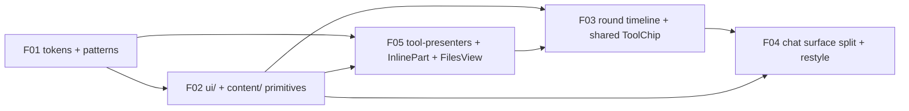

# Phase E METAPLAN — UI port from Saivage v2 to v3

Single executable program integrating the five approved issue plans
into one sequenced rollout. All inputs are **APPROVED** at their
authoritative round:

- [00-INDEX.md](00-INDEX.md), [00-SUBSYSTEM-MAP.md](00-SUBSYSTEM-MAP.md)
- F01: [analysis r2](F01-design-tokens/01-analysis-r2.md), [design r2](F01-design-tokens/02-design-r2.md), [plan r2](F01-design-tokens/03-plan-r2.md)
- F02: [analysis r2](F02-component-hierarchy/01-analysis-r2.md), [design r3](F02-component-hierarchy/02-design-r3.md), [plan r2](F02-component-hierarchy/03-plan-r2.md)
- F03: [analysis r2](F03-conversation-rounds/01-analysis-r2.md), [design r3](F03-conversation-rounds/02-design-r3.md), [plan r2](F03-conversation-rounds/03-plan-r2.md)
- F04: [analysis r3](F04-chat-surface-style/01-analysis-r3.md), [design r2](F04-chat-surface-style/02-design-r2.md), [plan r2](F04-chat-surface-style/03-plan-r2.md)
- F05: [analysis r2](F05-tool-detail-rendering/01-analysis-r2.md), [design r3](F05-tool-detail-rendering/02-design-r3.md), [plan r1](F05-tool-detail-rendering/03-plan-r1.md)

**Binding project rule (gates every batch):**
**ARCHITECTURE-FIRST, NO BACKWARD COMPATIBILITY.** No
`@deprecated`, no alias periods, no `var(--…, #fallback)` shims,
no `index.ts` barrels added beyond those each plan explicitly
introduces, no parallel old+new selectors at the tip of any
batch, no transitional dual visual system. Every replaced helper,
type, selector, route field, or producer arity is **deleted in
the same commit** that introduces its replacement.

---

## 1. Goal & scope

Port the Saivage v2 visual style and conversation rendering onto
v3 while introducing a **hierarchical UI component layering**
(tokens → primitives → content → conversation → surfaces).

In scope:

- A semantic CSS layer with design tokens and pattern classes
  (F01), the single source of colour, typography, radii, shadows
  for every Vue surface under [web/src/](../../../web/src/).
- A `ui/` / `content/` / `conversation/` primitive layer that
  replaces bespoke per-surface markup with a small, reused set of
  composable SFCs (F02).
- A round-stamped conversation timeline with diagnostics,
  pairing, compaction clusters, and a single shared `<ToolChip>`
  consumed by both [AgentConversationView](../../../web/src/components/agents/AgentConversationView.vue)
  and [AnalystChatPanel](../../../web/src/components/chat/AnalystChatPanel.vue) (F03).
- Re-styling of the analyst chat surface against the new
  primitives + tokens, splitting the monolithic chat SFC into
  six children + two composables + one util (F04).
- A `tool-presenters/` registry with structured `InlinePart[]`
  output, a JSON token view, formatted content composer, and the
  canonical `?root=meta|output&path=…` FilesView routing (F05).

Out of scope is restated in §10.

---

## 2. Dependency graph

Sequence: **F01 → F02 → F05 → F03 → F04**
(per [00-INDEX.md §"Cross-issue dependencies"](00-INDEX.md)).



ASCII fallback:

```
F01 ──┬── F02 ──┬── F05 ──┬── F03 ── F04
      │         │         │
      └─────────┴─────────┘
```

Justification:

- F01 owns the semantic vars + the F02-required pattern
  extensions ([F02 plan r2 §0 step 2](F02-component-hierarchy/03-plan-r2.md));
  no primitive can render without them.
- F02 owns the primitives that F03's `RoundCard` / `MessageBubble`
  / `ToolChip` / `DiagnosticRow` and F04's chat children consume
  ([F02 plan r2 §1.1](F02-component-hierarchy/03-plan-r2.md)).
- F05 must precede F03 because the shared `<ToolChip>` and the
  AnalystChatPanel chip swap both depend on `presentToolCall` /
  `presentToolResult` returning `InlinePart[]`
  ([F05 design r3 §4.1, §1](F05-tool-detail-rendering/02-design-r3.md);
  [F03 plan r2 commit 6](F03-conversation-rounds/03-plan-r2.md)).
- F03 must precede F04 because F04's `MessageList` / `MessageItem`
  consume the inherited `web/src/components/conversation/ToolChip.vue`,
  the F03 `chat/tool-chip-adapter.ts`, and the F03
  `web/src/utils/agent-timeline/` parser
  ([F04 plan r2 §1, §3](F04-chat-surface-style/03-plan-r2.md)).

---

## 3. Batch sequence

Each batch is one PR. Inside a PR the per-commit slicing from the
underlying plan is preserved verbatim; the batch is the merge
unit. **No batch is allowed to merge with red gates.**

### Batch 1 — F01 (design tokens + semantic layer)

- **Preconditions.** None of the other four batches started.
  `web/src/styles/` absent. npm bootstrap clean
  ([F01 plan r2 §1](F01-design-tokens/03-plan-r2.md)).
- **Commit boundaries.** **1 commit.** Atomic per
  [F01 plan r2 §6](F01-design-tokens/03-plan-r2.md): all six
  new style files + `main.ts` import rewrite + every hex →
  `var(--…)` substitution + snapshot re-baseline.
- **Validation gates.**
  - `grep` gates: zero hex outside `tokens.css` / `__tests__/`;
    11 F02 extension rules present in `patterns.css`; no
    `.tool-chip*` leaked; no F02-forbidden global patterns
    ([F01 plan r2 §7](F01-design-tokens/03-plan-r2.md) Steps
    10–11).
  - `npm --prefix web run typecheck && npm --prefix web run test && npm --prefix web run build`
    ([F01 plan r2 §5 Steps 12–14](F01-design-tokens/03-plan-r2.md)).
  - Visual diff matrix walk (rows 1–25, all surfaces enumerated in
    [F01 plan r2 §8](F01-design-tokens/03-plan-r2.md)).
  - Live UI probe (see §5).
- **Risk: low.** Mechanical hex → var substitution. The only
  semantic risk is the two ambiguous values (`#3fb950`, `#fff`)
  resolved per the analysis §3.4 mapping.
- **Mitigation.** Per-hex grep after each pass; pre-commit
  zero-hex gate; snapshot diff inspection before re-baseline.
- **Rollback.** `git revert <F01-sha>` restores pre-F01 `main.ts`,
  removes `web/src/styles/`, restores embedded hex
  ([F01 plan r2 §9](F01-design-tokens/03-plan-r2.md)).

### Batch 2 — F02 (UI primitive layering)

- **Preconditions.** Batch 1 merged into `main`; `web/src/styles/patterns.css`
  contains the 11 F02 tone extensions; HEAD typecheck/lint/test
  green ([F02 plan r2 §0 §1](F02-component-hierarchy/03-plan-r2.md)).
- **Commit boundaries.** **15 commits, C1–C15**
  ([F02 plan r2 §2](F02-component-hierarchy/03-plan-r2.md));
  each commit independently green for typecheck/lint/test plus
  per-commit grep gates. C4 co-commits the F05 directory pivot
  (the F02 plan owns it ahead of F05's own commits — F05 §1
  coordination table). C5 co-commits the F03-owned
  `ToolChip.vue` + analyst chip swap.
- **Validation gates.**
  - Per-commit: `npx vue-tsc --noEmit`, `npm run lint`,
    `npm test -- --run`, plus the commit's grep gates
    (e.g. C2 lucide allow-list, C4 `sideEffects` canonical
    array, C7 auth-banner rewrite).
  - PR tip: `npm --prefix web run typecheck && test && build`.
  - Live UI probe.
- **Risk: high.** Largest surface area; every consumer SFC under
  [components/](../../../web/src/components/) and [views/](../../../web/src/views/)
  rewrites onto primitives in C6–C15.
- **Mitigation.** The plan slices per-surface (Auth, Workspace
  header, Dashboard, FilesView, DebugView, AgentConversationView
  non-round body, RawLlmExchangePanel, AnalystChatPanel non-chip
  body, cards) so each commit's lint + test surface is reviewable
  in isolation. ESLint `no-restricted-imports` (C1, C2) keeps
  primitives from importing each other.
- **Rollback.** Single-batch revert of the squashed PR (`git revert -m 1 <merge-sha>`).
  The per-pair dependency table at
  [F02 plan r2 §4](F02-component-hierarchy/03-plan-r2.md)
  documents which downstream commits must be reverted first if
  only a slice is to be undone — but the canonical rollback is
  the whole PR.

### Batch 3 — F05 (tool-presenters + content surfaces + FilesView)

- **Preconditions.** Batches 1 + 2 merged. `web/src/components/content/`
  exists (created by F02 C3 / C4). HEAD green.
- **Commit boundaries.** **9 commits, C1–C9**
  ([F05 plan r1 §3](F05-tool-detail-rendering/03-plan-r1.md)).
  Note: F05's C2 is the *same physical commit* as F02's C4 in
  the underlying plans; in the merged history this work landed
  inside Batch 2, so Batch 3 begins at F05's C1 (already-landed
  pieces are no-ops). Operator confirms before opening Batch 3
  that F02 C4 covered the F05 directory + `sideEffects` array.
- **Validation gates.**
  - Per-commit: `npm run typecheck && npx vitest run` for the
    affected test slice; full `npm test -- --run` at the PR tip.
  - Grep gates: zero references to the old single-file
    `web/src/utils/tool-presenters.ts`; no `string | InlinePart[]`
    shim; `EXPECTED_TOOL_NAMES` coverage test green
    ([F05 design r3 §3.6](F05-tool-detail-rendering/02-design-r3.md)).
  - PR tip: `npm --prefix web run typecheck && test && build`.
  - FilesView manual probe of `?root=meta&path=…` and
    `?root=output&path=…`.
- **Risk: medium.** Many per-tool files (45 + `__default__`);
  registry coverage test catches missing registrations.
- **Mitigation.** Stub-then-fill split (C2 stubs, C3 fills) keeps
  the architectural diff small; coverage test enforces full
  registration.
- **Rollback.** Single-batch revert; F03 has not started, so no
  downstream consumer to coordinate.

### Batch 4 — F03 (conversation rounds + shared ToolChip + backend stamps)

- **Preconditions.** Batches 1 + 2 + 3 merged. HEAD green on root
  and web. No in-flight live session on the `saivage-v3` LXC
  container (state file empty / drained per
  [F03 plan r2 §1](F03-conversation-rounds/03-plan-r2.md)
  precondition 7).
- **Commit boundaries.** **9 commits**: 1, 2a, 2b, 3, 4, 5, 6, 7,
  8 ([F03 plan r2 §3](F03-conversation-rounds/03-plan-r2.md)).
  2a + 2b form the schema-and-producer pivot; per the plan, root
  CI is required green at the **tip of the PR** (after 2b), not
  at 2a in isolation — the local feature branch is allowed a
  transient red between 2a and 2b only.
- **Validation gates.**
  - Per-commit: `npx tsc -p . --noEmit` (root), `npx vue-tsc
    --noEmit` (web), targeted vitest. Producer-audit grep at end
    of 2b: `rg -n "appendMessage\(|AgentMessage =|agentMessageSchema.parse|replaceSessionMessages\(|appendActivateCardToolResultOnce" src/`
    must return zero unstamped producers
    ([F03 plan r2 §2.5](F03-conversation-rounds/03-plan-r2.md)).
  - PR tip: **backend** `pnpm typecheck && pnpm test` plus **web**
    `npm --prefix web run typecheck && test && build`.
    (The backend invocation uses the project-root scripts; the
    user-memory note records that root + web both use npm
    lockfiles — substitute `npm run …` if the root's `package.json`
    only exposes `npm` scripts.)
  - Live conversation probe: start a real planner session on
    `saivage-v3`, drive one round, confirm `RoundCard` renders
    head + bodies, `ToolChip` pairs correctly, diagnostics
    fold into the active round, compacted cluster appears after
    a forced compaction.
- **Risk: high.** Backend schema widening + every `AgentMessage`
  producer rewrite; legacy WS `content.message` key removed
  without alias; analyst-handler duplicate writer deleted.
- **Mitigation.** Schema canary on `replaceSessionMessages` and
  `appendMessage`; producer-audit grep gate; new test files per
  producer (§2.1 list); compaction kept-stamp policy frozen at
  [F03 plan r2 §2.6](F03-conversation-rounds/03-plan-r2.md).
- **Rollback.** Single-batch revert. **Caveat:** the on-disk
  JSONL written during the live probe carries the new schema; if
  the revert is taken, those session files must be moved out of
  `.saivage/sessions/` before restarting the pre-F03 binary (the
  pre-F03 parser rejects stamps).

### Batch 5 — F04 (analyst chat surface restyle + decomposition)

- **Preconditions.** Batches 1 + 2 + 3 + 4 merged. The shared
  `web/src/components/conversation/ToolChip.vue` and
  `web/src/components/chat/tool-chip-adapter.ts` exist at HEAD
  (delivered by Batches 2 + 4). HEAD green.
- **Commit boundaries.** **8 batches B0–B7**
  ([F04 plan r2 §4](F04-chat-surface-style/03-plan-r2.md)),
  shipped as **one PR** — the plan binds them as a single
  merge unit because B5 deletes the monolithic SFC body. Each B*
  is its own commit inside the PR for review legibility.
- **Validation gates.**
  - Per-batch: `npm run typecheck`, the §5 acceptance command
    block from [F04 plan r2 §5](F04-chat-surface-style/03-plan-r2.md).
  - PR tip merge-gate: `rg -n "(tool-chip|message-bubble|primary-btn|chat-composer|composer-input|pending-tool-|message-badges|state-panel|on-screen-section)" web/src/components/chat/`
    returns zero matches.
  - PR tip: `npm --prefix web run typecheck && test && build`.
  - Live UI probe of the analyst chat surface.
- **Risk: medium.** Pure web change; backend untouched. The risk
  is forgotten forbidden-family selectors (caught by the merge
  gate) and resize-emit invariants (B3 contract, covered by
  `MessageList.resize.test.ts`).
- **Mitigation.** Renamed classes in §0.1 of the F04 plan
  (`chat-composer` → `composer-form`, etc.) make the forbidden
  regex strict; per-file checklist in B4 enforces no hex, no
  forbidden class, `min-width: 0` on flex containers.
- **Rollback.** Single-batch revert. No downstream batches; this
  is the program's tail.

---

## 4. Cross-batch invariants

These contracts MUST hold at every batch boundary and at the
program's final HEAD:

- **Chip prop bag (F03 r3) is the single canonical contract.**
  Eight props verbatim: `call`, `result`, `callContent`,
  `resultContent`, `status`, `expanded`, `detailsId`, `timestamp?`
  ([F05 plan r1 §2 point 6](F05-tool-detail-rendering/03-plan-r1.md);
  [F03 design r3 §7.2](F03-conversation-rounds/02-design-r3.md)).
  No surface defines a private chip API; no adapter introduces a
  ninth prop.
- **ToolChip swap in `AnalystChatPanel` lands inside F03's batch.**
  Specifically F03 commit 6 ([F03 plan r2 §3 commit 6](F03-conversation-rounds/03-plan-r2.md))
  deletes the in-line `<button class="tool-chip*">` markup and
  the scoped `.tool-chip*` rules inside
  [web/src/components/chat/AnalystChatPanel.vue](../../../web/src/components/chat/AnalystChatPanel.vue)
  and replaces them with `<ToolChip v-bind="adaptChatMessageToToolChip(...)" />`.
  F04 ships no chip code of its own; it only consumes the
  adapter via `<ToolChip>` inside the new `MessageList.vue` /
  `MessageItem.vue`.
- **FilesView routing is canonical from F05.** `?root=meta|output&path=<string>`
  is the only accepted query shape; no `?root=project`, no
  shim for legacy paths
  ([F05 plan r1 §2 point 8](F05-tool-detail-rendering/03-plan-r1.md)).
- **No batch contains aliases / shims / `@deprecated`.** Every
  per-batch grep gate explicitly forbids the relevant alias
  surface (F01 forbids `var(--…, #fallback)`; F02 forbids the
  enumerated `.tool-chip*` / `.msg-*` / `.role-*` / `.kind-*` /
  `.btn-sm` / `.thinking-dots` / `.pill-active` / `.panel-heading-h1`
  families; F03 forbids the legacy `content.message` WS key and
  the legacy `appendMessage` arity; F04 forbids the eight
  forbidden chat selector families; F05 forbids
  `web/src/utils/tool-presenters.ts` and any `string | InlinePart[]`
  union).
- **Architecture-first, no backward compatibility** binds every
  batch (restated at the top of this metaplan and at the head of
  each underlying plan). A batch that ships an alias period —
  even temporarily — violates the program contract and is
  rejected at PR review.

---

## 5. Live-deployment validation strategy

Each batch ends with the same live-probe routine. The skill
[saivage-development-validation](../../../../.github/skills/saivage-development-validation/SKILL.md)
binds the exact commands; this section summarises:

1. **Web pipeline (every batch).**
   ```bash
   cd /home/salva/g/ml/saivage-v3
   pnpm -C web typecheck && pnpm -C web test && pnpm -C web build
   ```
   (If the lockfile audit shows npm-only — per the
   user-memory note that root + web both ship `package-lock.json`
   and no `pnpm-lock.yaml` — substitute the npm form documented
   in F01's plan: `npm --prefix web run typecheck && npm --prefix web run test && npm --prefix web run build`.
   The operator runs whichever form matches the lockfile at HEAD;
   the gates' semantics are identical.)

2. **Backend pipeline (F03 only — Batches 1, 2, 4, 5 don't touch
   backend code; F05 only touches `web/`).**
   ```bash
   pnpm typecheck && pnpm test    # or: npm run typecheck && npm test
   ```

3. **Deploy + probe.** Per
   [/memories/repo/saivage-v3-build-deploy.json](../../../../) and
   the LXC ops skill:
   ```bash
   ssh root@10.0.3.112 'systemctl restart saivage.service'
   sleep 4
   ssh root@10.0.3.112 'systemctl is-active saivage.service'
   curl -fsS http://10.0.3.112:8080/health
   ```
   Health endpoint must return 200. If the service fails to
   start, the batch's PR does not merge; the failure is diagnosed
   in-place rather than worked around.

4. **Manual UI verification.** For each batch, walk the visual
   diff matrix in its plan:
   - F01: [F01 plan r2 §8](F01-design-tokens/03-plan-r2.md)
     (25 rows: workspace shell, cards, files, debug, dashboard,
     analyst, raw LLM, toaster, stale ribbon, not-found, …).
   - F02: design r3 §1.4 deletion matrix per commit.
   - F05: FilesView with `?root=meta` and `?root=output`;
     tool-call rendering in AgentConversationView for at least
     one of each presenter family (read, list, run, card
     outcome, goal report, runtime control, JSONL tail).
   - F03: live planner session producing at least one
     `RoundCard` with `ToolChip` pairing, one `DiagnosticRow`,
     and (force-trigger) one `CompactedCluster`.
   - F04: analyst chat surface — composer resize, jump-to-latest
     pill, model pill gating, pending-tool footer empties cleanly,
     unauthorized notice + token entry overlay.

---

## 6. Pause point (Phase F)

**Before any code change**, the operator MUST confirm:

1. The other agent currently editing the codebase has finished
   (see §7 below — uncommitted changes inventory).
2. The on-disk live runtime state on `saivage-v3` is drained
   (no in-flight session under `.saivage/sessions/`,
   per [F03 plan r2 §1 precondition 7](F03-conversation-rounds/03-plan-r2.md)).
3. The operator gives **explicit go-ahead per batch**. The
   implementer does not chain batches autonomously: each batch
   is one PR, reviewed, merged, deployed, probed, and only then
   does the operator authorise the next batch.

The pause point also covers the operator's review of the
PR tip's grep + lint + test + build output before merge.

---

## 7. Working with the other agent's uncommitted changes

At plan freeze, the following files have **uncommitted edits by
another agent** on the working tree:

- [web/src/components/chat/AnalystChatPanel.vue](../../../web/src/components/chat/AnalystChatPanel.vue)
- [web/src/views/DashboardView.vue](../../../web/src/views/DashboardView.vue)
- Many files under [src/](../../../src/) (backend).

The implementation MUST:

1. **Wait** until those changes are either committed or paused
   on a branch the operator names. The implementer does not
   open any of the five batches against a dirty tree.
2. **Re-baseline** each batch against HEAD before starting.
   Concretely, before opening Batch *N*:
   ```bash
   cd /home/salva/g/ml/saivage-v3
   git fetch origin
   git switch main
   git pull --ff-only
   git status --porcelain   # MUST be empty
   ```
   Then create the batch's feature branch from that clean
   `main`.
3. **Re-run the precondition grep gates** documented in each
   plan's §0 / §1 against the freshly pulled HEAD. Examples:
   - F01: `test ! -d web/src/styles`, hex-count baseline grep.
   - F02: `test ! -d web/src/components/ui`, `test -f web/src/utils/tool-presenters.ts`.
   - F03: `rg -n 'content\.message' src/server/websocket.ts`
     should still match (proves legacy still present).
   - F05: `test -f web/src/utils/tool-presenters.ts`.
   - F04: forbidden-family regex against the freshly pulled
     `web/src/components/chat/`.
   A precondition mismatch (e.g. F03 finds `content.message`
   already gone because the other agent removed it) means the
   plan must be re-read against the actual HEAD before
   proceeding; the implementer reports the mismatch to the
   operator rather than papering over it.

---

## 8. Operator commands

The operator launches each batch with a subagent prompt that
binds the plan and the gates. Verbatim template (per-batch
substitution of `<N>`, `<ID>`, `<plan-path>`):

```bash
# Batch <N>: implement <ID> per the approved plan.
cd /home/salva/g/ml/saivage-v3
git fetch origin
git switch main
git pull --ff-only
git status --porcelain   # must be empty
git switch -c batch-<N>-<id>
```

Subagent prompt (per batch):

> You are implementing batch **<N>** of the v2→v3 UI port
> metaplan at
> `/home/salva/g/ml/saivage-v3/SPEC/2026-05/review-ui-port-from-v2/99-METAPLAN.md`.
>
> Implement **<ID>** per the approved plan at
> **<plan-path>**. Follow every commit boundary, grep gate,
> typecheck / lint / test / build gate, and validation step in
> that plan **verbatim**. Do not introduce aliases, shims,
> `@deprecated` re-exports, or transitional dual structures —
> the project rule is **architecture-first, no backward
> compatibility** and it is binding.
>
> When every per-commit gate is green, push the branch and open
> a PR titled `<ID>: <one-line summary>`. Do NOT merge — the
> operator merges after the live probe.

Per-batch substitutions:

| Batch | `<N>` | `<ID>` | `<plan-path>` |
| ----- | ----- | ------ | ------------- |
| 1 | 1 | F01 | `SPEC/2026-05/review-ui-port-from-v2/F01-design-tokens/03-plan-r2.md` |
| 2 | 2 | F02 | `SPEC/2026-05/review-ui-port-from-v2/F02-component-hierarchy/03-plan-r2.md` |
| 3 | 3 | F05 | `SPEC/2026-05/review-ui-port-from-v2/F05-tool-detail-rendering/03-plan-r1.md` |
| 4 | 4 | F03 | `SPEC/2026-05/review-ui-port-from-v2/F03-conversation-rounds/03-plan-r2.md` |
| 5 | 5 | F04 | `SPEC/2026-05/review-ui-port-from-v2/F04-chat-surface-style/03-plan-r2.md` |

After PR merge, the operator runs the §5 live-probe block, then
issues go-ahead for the next batch.

---

## 9. Exit criteria

The program is complete when **all** of the following hold at
`main`:

1. All five batches' PRs merged in the order F01 → F02 → F05 →
   F03 → F04.
2. `git status --porcelain` is empty on `main`; no uncommitted
   work outside the five merged commits/PRs.
3. Web pipeline green: `npm --prefix web run typecheck && npm --prefix web run test && npm --prefix web run build`.
4. Backend pipeline green: `npm run typecheck && npm test` (run
   at least after Batch 4 lands; Batches 1/2/3/5 don't touch
   backend).
5. Every per-batch grep gate listed in §3 returns zero matches at
   `main` HEAD (no `var(--…, #fallback)`, no `.tool-chip*` outside
   `conversation/ToolChip.vue`, no forbidden chat families, no
   `content.message`, no `web/src/utils/tool-presenters.ts`).
6. Live deploy on `saivage-v3` (10.0.3.112) returns 200 on
   `/health` after `systemctl restart saivage.service`; manual UI
   walk-through completes with no visual regressions against the
   visual diff matrix of each batch's plan.
7. No surviving `@deprecated`, `// TODO F0X:`, or alias period in
   any file touched by the program.

---

## 10. Out of scope

The following are **not** delivered by this program. They are
left as future issues if and when the operator chooses to open
them:

- **No streaming protocol changes.** The WS envelope widening in
  F03 is limited to `entry` + `activity_status` keys; no chunked
  / streamed message delivery.
- **No theming system beyond tokens.** F01 ships one dark theme;
  no light theme, no per-user palette, no runtime token swap.
- **No Storybook / component gallery.** F02 ships primitives and
  unit tests; there is no isolated component preview surface.
- **No backend `root: 'project'` file API.** F05 retains the
  existing `root: 'meta' | 'output'` contract
  ([F05 plan r1 §0](F05-tool-detail-rendering/03-plan-r1.md)).
- **No richer markdown / new highlighter.** `MarkdownText.vue`
  and `CodeBlock.vue` keep their current behaviour; only their
  folder moves (F02) and consumption sites update.
- **No streaming JSON tokeniser.** F05's `json-tokenize.ts` is a
  one-shot pure function with a 1 MB raw-fallback.
- **No custom expand bodies per `ToolPresenter`.** All chips
  expand via the shared `<FormattedContent>` body; presenter-side
  custom bodies (e.g. `diff_card`) are deferred.
- **No analyst-handler `ActiveRuntime`-backed `SessionRoundState`
  contract** (option B from
  [F03 plan r2 §0 row 1c](F03-conversation-rounds/03-plan-r2.md)).
  Option A (route every analyst writer through the shared
  persistence API) is chosen and binding.
- **No new top-level views or routes** beyond the FilesView
  query rewrite in F05.

---

## 11. Rebaseline against HEAD `eb98caf` (added 2026-05-27)

Three of the original five batches have shipped partially or
fully; the remaining work has been re-baselined against the
current HEAD and re-grouped into three mailbox batches (R1, R2,
R3) that map onto the new mailbox classification objective
(Branch B / stage-mapping; nothing-lost invariant).

### 11.1 Landed at HEAD `eb98caf`

- **F01 fully landed** (mailbox-003 done).
- **F02 partial landed** (mailbox-004 done): `ui/` primitives
  (Button, Pill, Card, PanelHeading, StatusDot, Spinner, Overlay
  except `data-modal-open` flag), `content/` relocation
  (CodeBlock, MarkdownText, JsonView, FormattedContent,
  InlineParts), `patterns.css` tone extensions (status-dot, card
  tone, pill-purple), `auth/ApiTokenEntry.vue` rewrite,
  component-boundary ESLint gate. The remaining F02 work (C5
  conversation primitives MessageBubble + ThinkingDots only;
  C6 AppShell modal flag + Overlay body flag + NavRail line;
  C7–C15 surface rewrites; tablist patterns.css rule;
  selector-migration tests) is the R1 batch.
- **F05 partial landed** (mailbox-005 done): `tool-presenters/`
  registry (52 files), `json-tokenize.ts`, `InlinePart`
  discriminated union with `file.root: 'meta' | 'output'`,
  content components, per-tool router migration, barrel-import
  ESLint rule (in `scripts/check-web-component-boundaries.cjs`
  rather than `web/eslint.config.js` — functionally equivalent).
  The remaining F05 work (FilesView `?root=...&path=...` routing;
  per-tool test suite split per F05 plan §3.7) is co-folded into
  the R1 batch.
- **F03 not started** (mailbox-006 rejected): no schema stamps,
  no `web/src/utils/agent-timeline/`, no round composites, no
  chip swap, no `tool-chip-adapter.ts`, no `ToolChip` eight-prop
  rewrite, store still flat-step shape.
- **F04 not started** (mailbox-007 rejected): `AnalystChatPanel.vue`
  remains the 349-line monolith.

### 11.2 Rebaseline addendums (binding)

- F02: [F02-component-hierarchy/04-rebaseline-against-HEAD-r2.md](F02-component-hierarchy/04-rebaseline-against-HEAD-r2.md) — APPROVED.
- F05: [F05-tool-detail-rendering/04-rebaseline-against-HEAD-r2.md](F05-tool-detail-rendering/04-rebaseline-against-HEAD-r2.md) — APPROVED.
- F03: [F03-conversation-rounds/04-rebaseline-against-HEAD-r2.md](F03-conversation-rounds/04-rebaseline-against-HEAD-r2.md) — APPROVED.
- F04: [F04-chat-surface-style/04-rebaseline-against-HEAD-r2.md](F04-chat-surface-style/04-rebaseline-against-HEAD-r2.md) — APPROVED.

Each addendum is a binding extension of its original
analysis/design/plan, restating which deliverables have shipped,
which remain, and which are explicitly delegated to a sibling
batch. Together with the original APPROVED analysis + design +
plan, they form the complete contract for the remaining work.

### 11.3 Mailbox batches

Three batches replace the original §3 sequence (Batches 2–5)
under the new mailbox classification (Branch B / stage-mapping):

- **R1 — F02 completion + F05 completion.** Combines the
  remaining F02 plan rows (per F02 rebaseline §3) and the
  remaining F05 plan rows (per F05 rebaseline §3). F02 R1
  explicitly does **not** touch `AgentConversationView.vue`,
  `AnalystChatPanel.vue`, or `ToolChip.vue` — those three files
  are delegated to F03 R2.
- **R2 — F03 conversation rounds.** Full F03 plan r2 (§2.1
  Added + §2.2 Modified + §2.3 Deleted + §2.5 producer audit +
  §2.6 compaction policy), restated by the F03 rebaseline. R2
  owns the eight-prop ToolChip rewrite, the chip swap inside
  `AnalystChatPanel.vue`, and the full rewrite of
  `AgentConversationView.vue`.
- **R3 — F04 chat surface style.** Full F04 plan r2 (B0–B7),
  restated by the F04 rebaseline. R3 owns the analyst chat
  surface decomposition (six new SFCs including
  `UnauthorizedNotice.vue`, two composables
  `useDebouncedConnectionState.ts` + `useStickToBottom.ts`, one
  utility `model-label.ts`, B0 type-surface edits to
  `api/types.ts` + `analystChat.ts`).

Dependency order: **R1 → R2 → R3** (three separate PRs;
non-interleaved). R2 hard-checks the R1 preconditions before
starting; R3 hard-checks the R2 preconditions before starting.
The harness MUST file a delta proposal or reject via
`.decision.md` if a precondition is missing.

The cross-batch invariants in §4 remain unchanged; in particular
the eight-prop ToolChip bag is shipped by R2 and consumed by R3
without alias period.

---

Absolute path of this metaplan:
`/home/salva/g/ml/saivage-v3/SPEC/2026-05/review-ui-port-from-v2/99-METAPLAN.md`
