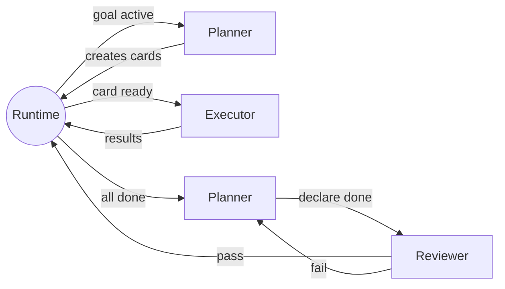

# Agents


> **Authority status: historical.** This page is retained for provenance only and has no current replacement yet.

## Agent Model

**The runtime drives the loop.** Agents are specialized, short-lived
LLM sessions invoked by the runtime at specific points. They do
their job, produce output, and return control. They do not invoke
themselves or each other — the support software handles sequencing,
card state transitions, and agent dispatch.

This means:
- Agents have **specific lifetimes**. Planner, executor, and reviewer
  are scoped to their parent goal. The analyst is a special
  user-facing agent that lives outside any one goal.
- The runtime decides **what runs when** — which terminal card is
  next, when to invoke the planner, when to run a review.
- Agents can be **restarted** at any point — if an agent crashes or
  the system restarts, the runtime re-reads the cards and restores
  that agent's context from persisted state.
- No MCP-style self-invocation — the executor doesn't call a "run
  next task" tool. The runtime feeds it tasks one at a time.
- Agents **cannot read or write `.saivage/` directly** — all card,
  state, skill, and instruction access goes through MCP tools or is
  loaded into context by the support software.
- Content that may have come from outside the project is screened by
  the content supervisor before it is placed in an agent's context.

Each goal has **three agents**, all scoped to that goal's lifetime:

| Agent    | Lifetime                 | Invoked when                              |
|----------|--------------------------|-------------------------------------------|
| Planner  | Goal activation → done   | Initial, all tasks done, after review rejection, on failure |
| Executor | Goal activation → done   | For each terminal card, sequentially       |
| Reviewer | On demand → goal done    | When planner declares done; on re-review after corrections  |



### Visible execution style

Every agent response that includes tool calls must begin with a
short explanation of what the agent is about to do. This keeps the
conversation trace readable and lets operators understand agent
intent without expanding every tool call.

---

## Analyst (the chat agent)

**Interface**: Chat (Telegram, web UI, CLI). This is the agent users
talk to.

**Role**: The single gateway for managing cards **and** controlling
execution. The analyst is a conversational agent whose tools cover
card CRUD, execution control, and inspection. Its system prompt
includes the project card context so it always knows the global
constraints.

**Lifetime**: Always available. Not scoped to a goal. Persists
across the entire session. Survives runtime restarts via chat log
persistence.

Tools — card management:

| Tool          | Description                                    |
|---------------|------------------------------------------------|
| `create_card` | Create a card at any level                     |
| `edit_card`   | Edit fields (title, description, acceptance…)  |
| `move_card`   | Re-parent a card in the tree                   |
| `delete_card` | Remove a card (and its children)               |
| `add_note`    | Append a note to a card's activity log         |
| `list_cards`  | Query/filter the card tree                     |
| `get_card`    | Read full card details (including notes)       |

Tools — execution control:

| Tool            | Description                                    |
|-----------------|------------------------------------------------|
| `pause_runtime` | Globally pause new planner/executor/reviewer dispatch |
| `resume_runtime`| Resume dispatch after a global pause           |
| `abort_goal`    | Abort a goal — marks it and children `cancelled`|
| `restart_card`  | Re-queue a done/failed task card → `backlog`   |
| `restart_goal`  | Reset a goal: cancel running children, clear the plan diary, re-queue the goal → `backlog` so the planner starts fresh when it is next activated |
| `kill_process`  | Kill a running external process                |

Tools — inspection:

| Tool              | Description                                    |
|-------------------|------------------------------------------------|
| `get_card`        | Full card details, notes, attachments          |
| `list_cards`      | Query/filter (by status, type, parent, etc.)   |
| `get_plan_diary`  | Read a goal's plan card diary + review results |
| `get_card_output` | Tail output of a card's running/completed processes |
| `get_tree`        | Show the full or partial card tree             |
| `get_status`      | Runtime status — active cards, running processes, queue |

The analyst can inspect everything: cards at any level, plan
diaries (including reviewer assessments stored there), execution
output, running processes, and system state. It uses this to answer
user questions about what's happening, what was tried, and why.

Typical interactions:

- **User**: "I want to try a caching layer for the search index"
  → analyst finds/creates the right goal, creates a goal
  with acceptance criteria, asks the user to confirm.
- **User**: "Change the project constraint to max 2-week experiments"
  → analyst edits the project card.
- **User**: "Stop the synonym expansion goal, it's going nowhere"
  → analyst calls `abort_goal` on the synonym expansion goal.
- **User**: "Pause everything until I check the data"
  → analyst calls `pause_runtime`, which stops new agent dispatch
  but does not automatically kill already-running processes.
- **User**: "What is the executor doing right now?"
  → analyst calls `get_status` and `get_card_output` to describe
  the current work and its output.

The analyst never performs terminal task work — it manages cards,
controls execution, and inspects runtime state.

---

## Planner (per-goal agent)

**Lifetime**: Scoped to its parent goal. Created when the goal
becomes `active` and retained until the goal reaches a terminal
state. If the system restarts, the runtime restores the planner's
context from the plan card diary and persisted runtime state.

**Invoked by the runtime** at four points (see card model):
1. **Initial decomposition** — goal becomes active.
2. **All tasks complete** — all sibling cards reach done/failed.
3. **After review rejection** — reviewer says criteria not met.
4. **On failure** — a sibling card fails.

Each invocation receives the plan card (diary) as context, so the
planner sees its full history of decisions.

**Role**: Decomposes goals, reads review assessments, handles
failures. At the project level, this is the regular planner for the
project card (depth 0): it decides strategic direction and proposes
new top-level goals when the system is idle.

**Configurable instructions**: Each planner reads:
1. Its own plan card (diary of previous decisions).
2. The parent goal's description and acceptance criteria.
3. The project card's context and constraints.
4. An optional user-editable instruction file
  (`.saivage/instructions/planner.md` for the depth-0 planner, or
  a field on the goal card for deeper levels). The support
  software loads or links these instructions into the planner's
  context; the planner does not read `.saivage/` directly.

The depth-0 planner instructions are where the user defines the
overall strategy:

```markdown
# Planner Instructions

## Strategy
- Prioritize goals that explore new approaches over
  re-running existing ones with minor tweaks.
- When a goal fails, try once with an adjusted approach before
  escalating to the user.
- Do not create more than 3 goals in backlog at any time.

## When idle
- Review completed goals and look for patterns.
- Propose follow-up goals for the best-performing results.
- Identify gaps in coverage.
```

The depth-0 planner can be **enabled or disabled**. When
disabled, only user-originated goals exist and the system idles
when all work is done.

**Interface**: The planner emits structured card mutation requests.
The runtime applies them through the same card MCP and validation
path used by the analyst. It doesn't have direct card-write access;
this ensures every card goes through the same structuring logic.

---

## Executor (per-goal agent)

**Lifetime**: Scoped to its parent goal. Created when the first
terminal card under that goal is ready to execute. Persists until
all terminal cards are complete (or the goal is cancelled/failed).

**Invoked by the runtime** for each terminal card in sequence. The
runtime determines the order based on `depends_on` and `priority`.
The executor does not choose what to run next — it receives a card,
does the work, returns results.

**Execution is sequential by default** — one terminal card at a
time. Besides the analyst, the runtime runs only one agent at a
time. Planner, executor, and reviewer invocations are not parallel
unless explicitly configured as a future extension.

**Role**: Runs terminal cards — the actual leaf work. The card's
type tells the executor what kind of work is expected:

| Terminal type  | Executor behavior                                  |
|----------------|----------------------------------------------------|
| Architecture   | Produce design docs, diagrams, API specs           |
| Code           | Write, modify, or refactor code                    |
| Test           | Write and run tests, report results                |
| Doc            | Write documentation, guides, runbooks              |
| Data           | Acquire, clean, transform data                     |
| Research       | Investigate, benchmark, review literature          |
| Ops            | Deploy, configure, monitor, fix infrastructure     |

For each terminal card:
1. Receives the card from the runtime.
2. Reads the card's description and acceptance criteria.
3. Reads unhandled notes/directives and marks them handled.
4. Does the work (shell commands, file edits, scripts, etc.).
5. Captures results (metrics, artifacts, attachments).
6. Returns results to the runtime, which transitions the card
   to `done` or `failed`.

The executor has tools for doing work (shell, filesystem, git,
etc.) but does **not** have tools for card management or
self-dispatch. It cannot create cards, choose the next task, or
invoke other agents.

### External command execution model

All external commands (shell, scripts, training runs, etc.) are
launched as **processes** and executed asynchronously. Tasks are the
low-level terminal cards; processes are external programs launched
while executing those cards. The MCP layer provides:

| Tool              | Description                                         |
|-------------------|-----------------------------------------------------|
| `start_process`   | Start a command asynchronously. Returns a process ID. Output is streamed to a file. |
| `wait_process`    | Wait for a process to finish, up to a timeout. If the timeout is reached, the process is **not killed** — the return says it's still running. The agent decides whether to kill or let it continue. |
| `start_and_wait`  | Shortcut: `start_process` + `wait_process` in one call. |
| `tail_output`     | Get the last N lines of a process's output file.    |
| `kill_process`    | Kill a running process by ID.                       |
| `list_processes`  | List running/completed processes for the current card. |
| `download_file`   | Download a file and run it through content supervision before it can be used. |

Key properties:
- Output is always saved to a file, so it survives agent restarts
  and can be inspected later (by the analyst, planner, or reviewer).
- `start_and_wait` is the common case — run a command and get the
  result. But if the command takes longer than expected, the agent
  isn't stuck: it gets a "still running" response and can decide
  to wait more, kill, or move on.
- Long-running processes (training, benchmarks) are started with
  `start_process` and polled with `tail_output`.
- When the planner is re-invoked after all tasks complete, the
  runtime includes the list of still-running processes so the
  planner can decide what to do with them.

---

## Reviewer (per-goal agent)

**Lifetime**: Scoped to its parent goal. Invoked the first time the
planner declares the goal done. Recalled for every subsequent
re-review (when the planner adds correction cards and they
complete, and the planner declares done again). Follow-up review
calls in the same goal return to the same reviewer conversation,
so the reviewer can compare new corrective results with its
earlier findings.

**Invoked by the runtime** when the planner declares the goal done.

**Role**: Checks whether the goal's acceptance criteria were met.
For each review:
1. Reads the parent goal's acceptance criteria.
2. Reads results, metrics, and artifacts from sibling cards.
3. Produces a structured assessment: pass/fail, what was achieved,
   what's missing.
4. Returns the assessment to the runtime, which **appends it
   to the plan card** (the planner's diary).

If the review **passes**, the goal transitions to `done`.

If the review **fails**, the planner is re-invoked. It reads
the review from the plan card, creates correction cards, and the
cycle continues.

The reviewer does NOT decide what happens next — it only assesses.
The planner reads the review from its diary and decides.
