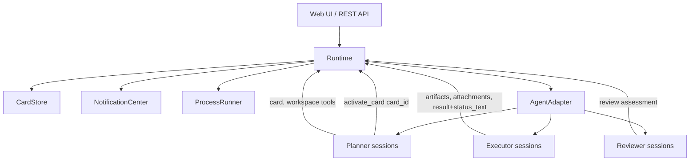
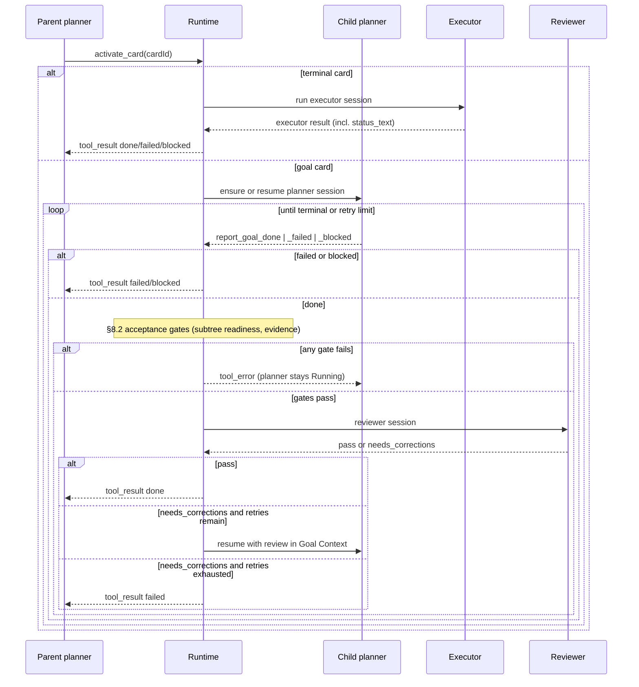
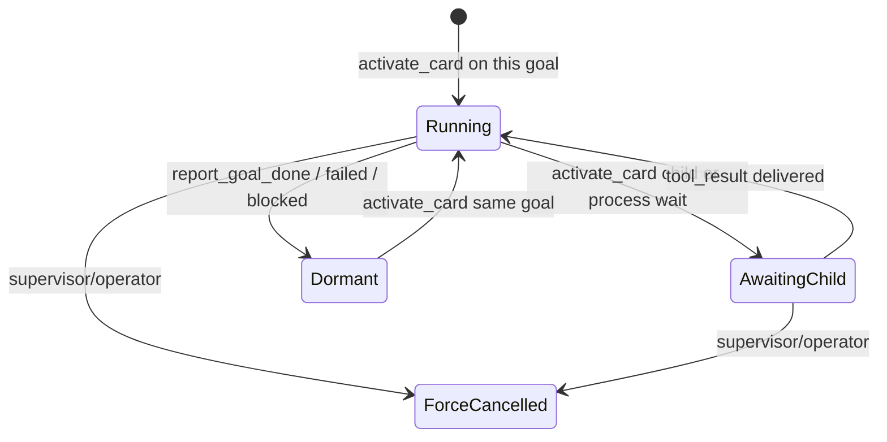

# Agent Architecture

<!-- doc-authority
status: current
disposition: keep
owner: docs-maintainers
superseded_by: none
last_verified_against: src/agents/agent-adapter.ts:1
-->

This document is the current Saivage v3 agent architecture reference. See historical: the companion implementation plan is preserved as [Planner Redesign Implementation Plan](./historical/2026-05-remediation-dossiers/planner-redesign-plan.md).

The design is card-centered. A planner owns a goal subtree, but it does
not directly invoke another planner or executor. It asks the runtime to
`activate_card(card_id)`. The runtime passes control to the agent that
owns the card, handles any planner/reviewer loop required for it, and
eventually returns one terminal result to the caller.

`activate_card` is intentionally not called `run_card`. Planner
sessions are long-lived: the same planner session that owns a goal
card may receive control again on a subsequent `activate_card` call
from its parent. Executor sessions are one-shot per activation; a
re-activation of a terminal card always opens a new executor session.
The verb names the control-transfer, not a single execution.

## 1. Roles

| Role | Responsibility | Lifetime | Started by |
|---|---|---|---|
| Planner | Owns one goal subtree: creates and edits child cards, activates child cards, and reports the goal result. | Long-lived for the goal. Goes `Dormant` after `report_goal_done`, `report_goal_failed`, or `report_goal_blocked`. Resumed by a later `activate_card` on the same goal. | A parent planner calling `activate_card(goalCardId)`. The project card has no parent planner; the runtime activates it only from an explicit root runtime start command (§11). |
| Executor | Performs one terminal card. | One-shot per card activation. A re-activation of the same terminal card opens a new executor session. | Runtime, inside `activate_card` for a terminal card. |
| Reviewer | Assesses a planner's completed goal. | One-shot per assessment. | Runtime, inside `activate_card` after `report_goal_done` clears the runtime acceptance gates (§8.2). |
| Analyst | Operator-facing assistant for creating cards, notes, correction directives, and the project kickoff. | Session-oriented. | Operator. |
| Project planner | The planner for the project root. It is an ordinary goal planner whose goal is the project card. | Long-lived for the project. | The runtime, when an explicit root runtime start command/run is active (§11). |

## 2. Component View



The Runtime is the only dispatcher. The AgentAdapter runs LLM sessions
and hands runtime tools back to Runtime for authoritative execution.

## 3. Primary Sequence



From the parent planner's point of view, `activate_card` is synchronous:
one tool call receives one tool result. The runtime can persist and
resume the physical work across service restarts, but the caller sees a
single terminal outcome per call.

When the active leaf terminates, the runtime sets `active_card_run` to
point at the parent card-run reconstructed from the parent's pending
`activate_card` tool call (or to `null` if the leaf is the project
card), and delivers the synthesized `CardActivationOutcome` to that
parent. The parent planner transitions back to `Running` on its next
turn. Unwinding is recursive: a chain of finished children produces a
chain of `tool_result` deliveries, one per ancestor.

## 4. Card Model

Cards form the durable hierarchy. Parentage is derived from the card
tree with `CardStore.getParent(card_id)`. Session records never carry a
durable parent pointer.

Goal cards can contain child cards and are worked by planner sessions.
Terminal cards are worked by executor sessions.

### 4.1 Card Fields

In addition to the usual title, description, tags, priority, acceptance,
dependencies, and `result` fields, every card carries. Card priority is a
whole number on a 0-100 scale, where larger numbers sort and surface as
higher priority work:

- `status_text: string | null` — short free-form progress line written
  by the runtime from the most recent accepted terminal agent report
  on that card. `null` until the first accepted terminal report. It
  is the canonical surface for upward visibility (see §4.3).
- `status_text_updated_at: string | null` — ISO timestamp of the last
  write, or `null` while `status_text` is `null`.
- `status_text_author_session_id: string | null` — id of the session
  whose terminal report produced the current `status_text`, or `null`
  while `status_text` is `null`.

`status_text` is set by the runtime, never written directly by agents.
Agents include a `status_text` field in their terminal response
(executor result, `report_goal_done / _failed / _blocked`); the runtime
mirrors it onto the card. There is no `set_status_text` planner tool.

### 4.2 Statuses

- `backlog`: not currently active.
- `active`: ready for a planner to choose.
- `running`: work is in progress.
- `changed`: the card's state was externally modified (by the analyst
  or by a descendant subtree correction) since its planner last saw
  it. The card is not immediately re-activated; instead the parent
  planner (and, recursively, any ancestor) sees a `subtree_changed`
  note in its next Goal Context and decides whether to call
  `activate_card` on the affected descendant.
- `done`: accepted complete.
- `failed`: ended in failure.
- `blocked`: cannot proceed without external change.
- `cancelled`: operator cancelled.

`changed` can land on any card: an origin goal flagged by the analyst,
or any descendant whose state was edited under pause. Ancestors of a
`changed` card receive `subtree_changed` notes but keep their current
status.

Status transitions driven by `activate_card`:

| Source status | Effect of `activate_card(card_id)` |
|---|---|
| `backlog`, `active` | Card transitions to `running`. Activation proceeds. |
| `changed` | Card transitions to `running`; the `changed` marker is consumed by the activation and any queued `subtree_changed` notes referencing this card are delivered once and discarded (§11). |
| `done`, `failed`, `blocked`, `cancelled` | Re-activation is allowed for goal cards as the normal correction path: the `Dormant` planner is resumed with fresh notes and the card transitions back to `running`. For terminal cards, `restart_card` is required first to clear `result.executor`; otherwise `activate_card` returns a `tool_error` of kind `terminal_card_requires_restart`. |
| `running` | Tool error of kind `card_already_active`: only one activation may be in flight per card. |

The terminal activation outcome (`done`, `failed`, or `blocked`)
replaces `running` when control returns to the parent.

### 4.3 Status Reporting Contract

- Every executor's terminal response must include a `status_text`
  field. The runtime writes it onto the card.
- Every `report_goal_done / _failed / _blocked` call must include a
  `status_text` field. The runtime writes it onto the goal card.
- The runtime does not require status updates between terminal reports.
  Mid-run progress is not surfaced; the operator and ancestor planners
  see the most recent terminal `status_text` only.
- `status_text` is the field the operator console and ancestor planners
  read to learn how a descendant card last reported. The runtime does
  not aggregate or synthesize a separate "child summary" field; the
  authoritative surface is the card itself.

## 5. Planner Lifecycle

Planner sessions are long-lived and deterministic:

```text
planner:<goal_card_id>
```

Lifecycle states:

- `Running`: the session may receive LLM turns. At most one planner is
  in this state globally.
- `AwaitingChild`: the session owns an outstanding `activate_card` or
  process wait and receives no LLM turns.
- `Dormant`: the session reported done, failed, or blocked. It can be
  resumed by a later `activate_card` on the same goal.
- `ForceCancelled`: the supervisor or operator terminated the session.

Runtime pause is a global gate (`RuntimeState.paused === true`) that
stops the runtime from delivering new LLM turns to any session. It is
not a per-session state; on resume the runtime simply continues from
whichever session was about to receive its next turn.



There is no reviewer-wait planner state. While a reviewer is running,
the goal's active card-run record has `phase: 'reviewer'`; the planner
session itself is `Dormant`.

## 6. Runtime State

The runtime starts in an idle state: `active_card_run === null` and no
agent session is executing. Root work begins only after an explicit
`start_project` runtime command creates running runtime intent and a root
runtime run (§11).

At any moment thereafter, at most one card-run is doing real work.
Every ancestor planner up to the project root is `AwaitingChild` of its
direct child. The runtime stores only the leaf card-run; the ancestor
chain is derived on demand from the card hierarchy.

```ts
type RuntimeState = {
  paused: boolean;
  notice?: string | null;
  active_card_run: ActiveCardRun | null;
};

type ActiveCardRun = {
  card_id: string;
  card_type: CardType;
  runtime_status: 'idle' | 'running' | 'paused' | 'error' | 'frozen' | 'stopped' | 'cancelled';
  phase: 'executor' | 'planner' | 'reviewer';
  caller_session_id: string | null;
  caller_tool_call_id: string | null;
  planner_session_id?: string;
  executor_session_id?: string;
  reviewer_session_id?: string;
  correction_attempts: number;
  started_at: string;
  last_turn_at: string;
};
```

`active_card_run` is `null` when the runtime is idle (e.g. before the
project card has been activated, or after the project planner goes
`Dormant`). Otherwise it holds the single card that is currently
executing, planning, or under review. The persisted-state invariant is
enforced in `src/runtime/state.ts`: an idle state with
`current_card_id === null` must not retain a non-terminal running
`active_card_run`; production reads self-heal historical corruption and
`tests/utils/runtime-state-invariant.test.ts` covers the guard.

Pause is a pure global gate. In-flight LLM turns finish their current
tool dispatch and then the runtime stops scheduling new turns. Durable
process terminal results that arrive while paused are buffered in the
process registry and delivered exactly once to the planner route when
the runtime resumes. Acceptance-gate extensions remain future stages (§17).

**Caller-edge reconstruction.** When the active leaf terminates, the
runtime resolves which planner receives the synthesized `tool_result`
purely from the card hierarchy and persisted session logs:

1. `parentCardId = CardStore.getParent(active_card_run.card_id)`.
2. If `parentCardId === null` the leaf is the project card; see
   the system-caller path below.
3. `parentSessionId = "planner:" + parentCardId`. That session must be
   `AwaitingChild`; its message log contains exactly one unresolved
   `activate_card(active_card_run.card_id)` tool call.
4. That call's `session_id` and `tool_call_id` become the caller edge.
5. The runtime reconstructs `ActiveCardRun` for `parentCardId` with
   `phase: 'planner'`, sets `active_card_run` to that record, and
   delivers the synthesized `CardActivationOutcome` as the parent's
   next `tool_result`. Unwinding repeats recursively when the parent
   in turn reports `done`, `failed`, or `blocked`.

This works because each card has at most one activation in flight at
any moment: a card may be activated multiple times sequentially, but
never concurrently. There is therefore no ambiguity in which
`activate_card` tool call to resolve. Restart repair uses the same
algorithm; no persisted caller stack is required.

**System-caller path.** When the terminating leaf is the project card
(`parentCardId === null`), there is no parent planner to receive a
tool_result. The runtime persists the outcome on the project card
(status, `result.review` when applicable, `latest_self_report`),
clears `active_card_run` to `null`, emits
`project_run_completed { project_card_id, result, summary, failure_kind?, blocked_reason?, latest_self_report?, at }`,
and returns to idle. The specific operator-notification or
analyst-handoff flow after a project completion is a future stage
(§17).

**Execution invariant.** A planner session may have at most one
unresolved `activate_card` tool call at any time. Shell execution is
represented by durable process records: `start_and_wait` and
`run_project_command` remain available for synchronous command waits,
and long-lived process control is exposed through `wait_for_process`
and `kill_process`. Acceptance-gate extensions remain deferred to §17.

Ancestors are derived:

- The breadcrumb from project root to leaf is `walkParents(leaf.card_id)`
  using `CardStore.getParent`.
- An ancestor planner's `AwaitingChild` status is implied by the fact
  that it has an outstanding `activate_card` tool_call with no matching
  `tool_result` in its message log. Restart repair uses the same
  evidence.

`caller_session_id` and `caller_tool_call_id` are the transient edges
that let restart repair deliver exactly one `tool_result` to the
parent planner of the leaf. They live on `active_card_run` only and
are not part of `AgentSession`.

`ForceCancelled` applies to the leaf. Runtime pause is global
(`RuntimeState.paused`); it does not change `active_card_run` and does
not change any session's lifecycle state. While paused, no new LLM
turns are delivered; any tool dispatch that was already in flight on
the runtime side completes synchronously, after which the runtime
stops scheduling new turns. Shell processes that outlive an LLM turn
continue running; terminal process results are buffered during pause
and delivered once on resume.

**Planner no-progress recovery.** If a planner LLM turn cannot make
progress because it repeats the same tool-call fingerprint or exhausts
the bounded tool-call loop, the adapter records a `model_issue`, adds a
final-answer prompt that forbids further tool calls, and requires the
next assistant payload to be the normal planner result envelope. The
runtime parses only that coerced envelope (`status`, `summary`,
`created_cards`, `updated_cards`, and optional `blocked_reason`); raw
`toolCalls` objects are never a runtime state transition. If the only
planner tool call is a deferred `activate_card`, the adapter instead
synthesizes the same `status: 'continue'` envelope so the active card
run remains coherent while the child activation proceeds.
Force-cancel emits exactly one synthetic `failed` tool_result to the
leaf's parent and clears `active_card_run`; the parent then becomes
`Running` again on its next turn. If the cancelled leaf is the
project card, the runtime persists a synthetic `failed` outcome on
the project card and emits `project_run_completed` (no tool_result is
delivered).

**Runtime-state layout.** The authoritative persisted `RuntimeState` path is
`.saivage/tmp/state/runtime.json`, defined by
`src/runtime/state.ts#symbol:runtimeStatePath` and written by `initRuntimeState`,
`saveRuntimeState`, and `updateRuntimeState`. A supported legacy
`.saivage/runtime/state.json` is migrated exactly once only when the
authoritative file is absent (`src/runtime/state.ts#symbol:readRuntimeState`); if both
old and new files exist, runtime-state helpers throw
`RuntimeStateLayoutError` and refuse the mixed layout to avoid
split-brain state (`src/runtime/state.ts#symbol:RuntimeStateLayoutError`,
`src/runtime/state.ts#symbol:assertNoMixedRuntimeStateLayout`). Regression coverage lives in
`tests/utils/runtime-state-layout.test.ts:64`.

## 7. Planner Tools

Planner tools are subtree-scoped to the planner's goal.

Card mutation, inspection, and notifications:

- `create_card(parent_id, type, title, description, status?, depends_on?, priority?, tags?, acceptance?)`
- `edit_card(card_id, patch)`
- `move_card(card_id, new_parent_id)` — bounded to sibling descent or grandparent ascent.
- `reorder_child(parent_id, ordered_child_ids)` — persists explicit child order within a parent.
- `cancel_card(card_id)` — see §7.1.
- `delete_card(card_id)` — see §7.1.
- `restart_card(card_id)` — see §7.1.
- `queue_notification(recipient, kind, body)`
- `list_cards(filter?)`
- `get_card(card_id)`
- `get_tree(card_id?)`
- `list_card_history(card_id)`
- `get_card_history_entry(entry_id)`
- `diff_card(card_id, from, to)`

Workspace and process tools:

- `list_project_files`
- `read_project_file`
- `write_project_file`
- `start_and_wait`
- `run_project_command`
- `wait_for_process`
- `kill_process`

Durable async process handling is current scope. `ProcessRecord`s are
persisted under `.saivage/runtime/`, include salted `command_hash`,
`cwd_canonical`, `started_at_monotonic`, owner and terminal metadata,
and are reconciled on restart with identity probes. Reattach mismatch
or failure produces a single synthetic lost `process_failed` terminal.

Runtime dispatch:

- `activate_card(card_id) -> CardActivationOutcome`

Completion tools (each carries `status_text` for the runtime to mirror
onto the goal card):

- `report_goal_done({summary, status_text, evidence_card_ids})`
- `report_goal_failed({summary, status_text, error?})`
- `report_goal_blocked({summary, status_text, blocked_reason})`

There is no `set_status_text` tool. Status flows only at terminal
report (§4.3).

The planner has no reviewer invocation tool. Review is automatic inside
the active card activation, after the runtime acceptance gates pass.

### 7.1 Destructive Card Operations

These tools are subtree-scoped: the target card must lie inside the
calling planner's goal subtree.

- `cancel_card(card_id)`
  - Allowed transitions: from `backlog`, `active`, or `changed` to
    `cancelled`.
  - Refused for the active leaf, for any card whose subtree contains
    the active leaf, for cards in status `running`, and for cards
    already in a terminal status (`done`, `failed`, `blocked`,
    `cancelled`). Cancellation cascading onto running ancestors of
    the active leaf is a future stage (§17).
  - Effect: marks the card `cancelled`, persists a synthetic
    `latest_self_report` of result `failed` (reason `cancelled`)
    when none exists, leaves the planner session (if any) `Dormant`,
    and emits `card_cancelled`. This is the prerequisite to
    `delete_card` for non-terminal cards.

- `delete_card(card_id)`
  - Refused if `card_id` or any descendant equals
    `RuntimeState.active_card_run?.card_id`, or any descendant planner
    session is not `Dormant`.
  - Allowed targets: cards in `backlog`, `done`, `failed`, `blocked`,
    or `cancelled`. To delete an `active` or `changed` card, the
    caller must first call `cancel_card`. Deleting a `running` card
    is not allowed in this stage (it would imply ancestor-cascade
    cancellation; see §17).
  - Effect: archives the full card record (fields, notes, result,
    evidence references) under `.saivage/archive/cards/<card_id>.json`,
    removes the card from `CardStore`, and emits
    `card_destructive_delete`.
  - Cascades: descendants are archived and removed under the same
    rules; if any descendant fails its precondition, the whole
    operation is rejected with no partial mutation.

- `restart_card(card_id)`
  - Allowed transitions: from `done`, `failed`, `blocked`, `cancelled`,
    or `changed` back to `active`.
  - Refused while the card is the active leaf. Because every card has
    at most one activation in flight at any moment and `running` is
    held only by the active leaf and its in-flight ancestors, no
    other `running` source is reachable in this stage.
  - Effect on terminal cards: clears `result.executor`, leaves
    `status_text` as-is (the next executor run will overwrite it),
    leaves history intact.
  - Effect on goal cards: clears `result.review`, clears
    `latest_self_report`, resets `correction_attempts` to 0, and
    leaves the planner session in its current `Dormant` state. The
    planner is not woken; the parent must call `activate_card(card_id)`
    to give control back.
  - Reset of a planner's internal LLM message log is **not** part of
    `restart_card`. It is listed as a future stage in §17.

## 8. Card Activation Outcomes

```ts
type CardActivationOutcome =
  | { result: 'done'; summary: string; evidence_card_ids?: string[] }
  | {
      result: 'failed';
      summary: string;
      error: string;
      failure_kind?:
        | 'executor_failed'
        | 'planner_failed'
        | 'review_retries_exhausted'
        | 'planner_force_cancelled'
        | 'service_restart';
    }
  | { result: 'blocked'; summary: string; blocked_reason: string };
```

`needs_corrections` is a reviewer verdict, not a parent-visible
activation outcome. The runtime handles it by resuming the same goal
planner inside the current activation until the retry limit is reached.
Retry exhaustion is reported as `failed` with
`failure_kind: 'review_retries_exhausted'`.

Reviewer issues, when retries are exhausted, are not duplicated into
the `failed` payload. The parent reads them from the failed child's
`card.result.review`.

### 8.1 Evidence Validation Is a Tool Error

`report_goal_done` validates the planner's evidence references before
any reviewer is invoked. If validation fails, the runtime returns a
`tool_error` on the `report_goal_done` call with kind
`invalid_evidence` and a per-card breakdown of which references were
rejected and why. The planner stays `Running`; `active_card_run` is
not cleared; the reviewer is not invoked; `correction_attempts` is not
incremented. **A rejected `report_goal_*` call does NOT mirror its
`status_text` onto the card and does NOT update
`latest_self_report`.** Those fields are written only when a
`report_goal_*` call is accepted (or when an executor's terminal
result is accepted). The runtime also emits
`goal_report_rejected { kind: 'invalid_evidence' }` for operator
visibility.

Repeated `invalid_evidence` errors are governed only by the standard
stuck-supervisor path and by `report_goal_done` not consuming review
retries; there is no separate cap. The planner may keep retrying as
long as the supervisor and runtime pause controls allow.

There is no notification-acknowledgement gate. Notifications never
block `report_goal_done` and are not part of the activation contract.
Operator observability rollups are non-blocking: Debug derives
per-session-per-minute notification summaries from failure/error timeline
events in `web/src/stores/debug.ts`, while
`web/src/__tests__/notifications-panel.test.ts` verifies latest-message
selection and multi-session/minute bucketing.

### 8.2 Runtime Acceptance Gates

Before invoking the reviewer, the runtime additionally validates that
the goal's subtree is safe to close:

```ts
type SubtreeReadinessReason =
  | { kind: 'descendant_blocking'; card_id: string; status: 'blocked' | 'changed' };
```

The runtime rejects `report_goal_done` with a `tool_error` of kind
`subtree_not_ready` whose payload is
`{ reasons: SubtreeReadinessReason[] }` when any descendant card is in
status `blocked` or `changed`. (Additional statuses can be added to
this list in the future without breaking the contract.)

The gate does not need to scan descendants for live subprocesses: by
invariant, a subgoal cannot have reported `done` while it held live
processes (its own readiness gate would have rejected the report).
Once the asynchronous-process work lands (§17), an additional
`pending_subprocess` reason will be added here for the goal card's
own processes.

On rejection, the runtime appends a synthetic note on the goal card
naming the offending descendants. The planner stays `Running`;
`active_card_run` is not cleared; `correction_attempts` is not
incremented. The runtime emits
`goal_report_rejected { kind: 'subtree_not_ready' }`.

Gate order on `report_goal_done` is:

1. `subtree_not_ready` (§8.2).
2. `invalid_evidence` (§8.1).
3. Reviewer phase (plan §7.4).

## 9. Goal Context

Goal Context is generated on planner creation and every runtime resume. The enforcing implementation is `src/runtime/runtime.ts` (`buildGoalContextPayload`, `buildGoalContextBlock`, `appendPlannerResumeContext`), with recursive shape/resume regression coverage in `tests/utils/runtime-restart-orphan-repair.test.ts` and ancestor/HTTP status mirroring coverage in `tests/utils/runtime-integration.test.ts`.
It is intentionally basic:

```ts
type GoalContext = {
  id: string;
  type: 'goal' | 'project';
  parent_card_id: string | null;
  depth: number;
  title: string;
  description?: string;
  acceptance?: string[];
  tags?: string[];
  priority?: number;
  depends_on?: string[];
  blocks?: string[];
  status_text?: string;
  child_card_tree: GoalContextCardNode[];
  notes: GoalContextNote[];
  latest_self_report?: LatestSelfReport;
  latest_review_result?: ReviewAssessment;
  correction_attempts: number;
  max_review_retries: number;
  resume_reason: 'initial' | 'reviewer_correction' | 'analyst_directive' | 'subtree_changed' | 'service_restart';
};

type GoalContextCardNode = {
  id: string;
  type: CardType;
  title: string;
  status: CardStatus;
  status_text?: string | null;
  child_card_tree?: GoalContextCardNode[];
};

type GoalContextNote =
  | {
      kind: 'pending_subtree_correction';
      origin_card_id: string;
      issues: AnalystIssue[];
      body: string;
      at: string;
    }
  | {
      kind: 'subtree_changed';
      descendant_card_ids: string[];
      body: string;
      at: string;
    }
  | { kind: 'subtree_not_ready'; reasons: SubtreeReadinessReason[]; at: string }
  | { kind: 'reviewer_interrupted'; assessment_id: string; at: string }
  | { kind: 'analyst_note'; body: string; at: string };

type LatestSelfReport = {
  result: 'done' | 'failed' | 'blocked';
  summary: string;
  status_text: string;
  at: string;
};

type ReviewAssessment = ReviewerResult & {
  assessment_id: string;
  at: string;
};
```

`latest_self_report` is the planner's most recent terminal report
(`report_goal_done / _failed / _blocked`) for this goal, persisted on
the card. There is no separate `PlanningResult` type.

Only the directive note kinds shown above are injected into `notes`;
ordinary notes remain available through note tools.

Every runtime resume appends one synthetic user turn to the planner's
message log containing the freshly rebuilt Goal Context block plus the
resume reason. Prior synthetic context turns are kept; compaction
handles drift.

Durable evidence is one of, scoped to descendants of the goal:

- A registered artifact containing Saivage process metadata/output under
  `.saivage-work`, such as a validation report, command log, or run
  manifest. Project source/config/test/data/doc files are not registered
  artifacts.
- A registered attachment containing Saivage process metadata/output under
  `.saivage-work`.
- For terminal cards, a non-null `result.executor` object that
  validates against the executor result schema for that card type.
- For goal cards, a `result.review.result === 'pass'` assessment.

Project file changes are surfaced through executor result metadata such
as `generated_files` plus verification command summaries; they remain
project state and are not copied into artifact storage.

Goal cards without a passed review and terminal cards without a
registered artifact, attachment, or valid executor result are rejected
as evidence per §8.1.

## 10. Reviewer

The reviewer validates a goal after its planner reports completion and
after the runtime acceptance gates (§8.1, §8.2) pass. Reviewer sessions
are one-shot and use stable ids:

```text
reviewer:<goal_card_id>:<assessment_id>
```

The runtime preallocates `assessment_id` before invocation; restart recovery records the interrupted stable reviewer session id in the synthetic `reviewer_interrupted` note before clearing `active_card_run.reviewer_session_id`.

The canonical reviewer result schema is `reviewerResultSchema` in `src/schemas/validators.ts` and is wrapped by `parseReviewerResult()` as `{ assessment: ReviewerResult }` in `src/agents/result-parser.ts`. Legacy `{ fail: ... }` / `{ missing: ... }` result shapes are invalid and must be rejected with a typed parse error.

Reviewer result schema:

```ts
type ReviewerIssue = {
  summary: string;
  severity: 'info' | 'warning' | 'blocker';
  evidence_card_id?: string;
  recommendation?: string;
};

type ReviewerResult = {
  result: 'pass' | 'needs_corrections';
  summary: string;
  achieved: string[];
  issues: ReviewerIssue[];
  evidence_card_ids: string[];
};
```

On `pass`, the runtime stores `result.review`, marks the goal `done`,
clears retry counters, updates `latest_self_report` and `status_text`
from the accepted `report_goal_done` call, and returns `done` from
the activation. Executor terminal mirroring is implemented in
`src/runtime/runtime.ts` (`dispatchPendingActivations`) and planner report mirroring
in `src/tools/planner-tools.ts` (`reportGoal`/`acceptReport`); destructive
restart/cancel/delete preservation is guarded by
`tests/utils/planner-tools.test.ts`.

On `needs_corrections`, the runtime stores `result.review`, increments
`correction_attempts`, and either resumes the same planner inside the
current activation or, after retry exhaustion, records correction notes
and returns `failed` to the parent. The stored `result.review` is the
parent's authoritative source for the reviewer issues that caused the
failure. The runtime does NOT mirror the rejected planner's
`status_text` onto the card while corrections are pending; it is only
written when a `report_goal_done` is finally accepted.

**Reviewer interrupt recovery.** If a service restart (or supervisor
force-cancel) interrupts a reviewer session before `result.review`
is persisted, the runtime sets the goal's planner session back to
`Running` with `resume_reason: 'reviewer_interrupted'` and Goal
Context that includes a `reviewer_interrupted` synthetic note. The
planner inspects its own subtree (the card status, child cards,
artifacts) and, if the work is still complete, calls
`report_goal_done` again. The runtime then re-runs the acceptance
gates and reviewer with a fresh `assessment_id`. The interrupted
reviewer session is discarded; nothing it produced is persisted.

## 11. Explicit Runtime Start and the Project Card

The runtime starts idle. It does not auto-activate the project card on
boot. The analyst kicks the system off with:

```ts
start_project(): runtime command
```

Root project execution is started by an explicit runtime command. The
runtime records durable intent and a root runtime run, and dispatch proceeds
from that runtime-owned run. No analyst directive, card status change, or
ready-queue scan starts the project. The project runs until it reports done,
failed, or blocked, or until the operator stops runtime intent through the
runtime controls. The operator/analyst recovery loop for project-level
failure is deferred to a future stage.

Analyst correction on a non-project goal records notes only:

```ts
mark_goal_needs_corrections(goalId, issues, note?): void
```

It records `pending_subtree_correction` notes on the origin and
ancestor goals and may flip the origin card to `changed`. It does not
activate any card. Reactivation is left to the planner: ancestor
planners observe the `changed` state through Goal Context (as
`subtree_changed` notes and updated child statuses) and decide whether
to call `activate_card` on the affected descendant.

For project-level intervention after kickoff, use runtime controls for
root execution intent and goal-scoped notes/corrections for planner context.
Project-level notes or directives are not executable triggers and do not
start the project by themselves.

The analyst always interacts with mutable state through the pattern
**pause → mutate → unpause**:

1. `pause_runtime` (global gate).
2. Write notes, update planner-owned card fields, or record correction
   context.
3. `resume_runtime`.

The active planner (if any) sees the new notes the next time it is
admitted to the LLM conversation. Concretely, the runtime queues the
notes and injects them as a synthetic user turn at the next point the
target planner is about to receive an assistant turn (a freshly
landed `tool_result`, a fresh activation, or a runtime resume). The
mechanism is one-shot per note: the synthetic turn is appended once,
then the note is removed from the queue. The card-side status (e.g.
`changed`) and any persisted `pending_subtree_correction` records on
the card remain; the queued note is just the delivery vehicle into
the LLM conversation.

**Note routing.** A synthetic note (`subtree_changed`,
`analyst_note`, `pending_subtree_correction`, `subtree_not_ready`,
`reviewer_interrupted`) is queued on the session of the deepest
planner whose goal subtree contains the affected card. If that
planner is currently `Dormant`, the note remains queued and is
delivered the next time the planner is brought to `Running` by
`activate_card`.

Guaranteeing semantic consistency of analyst mutations against
in-flight runtime state is deferred to a future stage.

When the project planner is `Running`, `active_card_run` points at the
project card itself; when it activates a top-level goal,
`active_card_run` moves down to that goal. The runtime does not
auto-spawn planners for newly-created goals; every planner, including
the project planner, exists because some `activate_card` call brought
it into being.

### 11.1 Planner Tool-Call Loop Recovery

Planner turns may use tools, but the final assistant payload delivered
to `parsePlannerResult` must always be the canonical planner JSON
envelope. The adapter's `forceFinalAnswer` recovery is the documented
escape hatch for no-progress tool loops: on a repeated tool-call
fingerprint or after the maximum tool rounds, it appends diagnostics to
the session, asks the model for a final answer with tools disabled by
instruction, and persists/parses only the returned planner envelope.
If a planner emits only a deferred `activate_card`, no follow-up LLM
turn is required; the adapter synthesizes
`{ status: 'continue', summary, created_cards: [], updated_cards: [] }`
so the parent planner can await the child without leaking an
unparseable `{ toolCalls: [...] }` object into result parsing or
runtime state. Assistant tool calls are persisted as one row per call
so Codex history assembly can drop only deferred `activate_card` calls
that have no matching tool output while preserving executed sibling
call/output pairs.

Source anchors: `src/agents/agent-adapter.ts:329`
(`handleToolCallsLoop`, repeated-fingerprint, maximum-round, deferred
`activate_card`, and per-call persistence paths),
`src/agents/llm-client.ts:544` (`codexMessages` matched-call/output
filter), and `src/agents/llm-client.ts:454`
(`max_output_tokens` unsupported-parameter retry). Provider HTTP error
bodies are sanitized before log-facing errors in
`src/agents/llm-client.ts:820` and before agent persistence/events in
`src/agents/agent-adapter.ts:215`. Regression anchors:
`tests/agents/agent-adapter-force-final-answer.test.ts`,
`tests/agents/codex-deferred-activate-card.test.ts`, and
`tests/agents/llm-client-integration.test.ts`.

## 12. Restart and Orphan Repair

On startup, the runtime repairs orphan tool calls from persisted state:

- If a parent planner has an `activate_card` tool call with no matching
  result and the child card has a terminal status on disk, synthesize
  the terminal `CardActivationOutcome` and deliver it.
- If `active_card_run` is persisted and points at a card still
  mid-flight in `phase: 'planner'`, re-enter that leaf.
- If `active_card_run` is persisted in `phase: 'executor'` with no
  persisted executor terminal result, synthesize a `failed` outcome
  with `failure_kind: 'service_restart'` and unwind to the parent.
- If `active_card_run` is persisted in `phase: 'reviewer'` with no
  persisted `result.review`, follow the reviewer-interrupt recovery
  path (§10): transition the goal's planner session back to
  `Running`, set `phase: 'planner'`, and queue a
  `reviewer_interrupted` note. The planner is expected to re-issue
  `report_goal_done`, and the runtime re-runs the gates and reviewer
  with a fresh `assessment_id`.
- Durable async process reattach is current runtime scope: startup reconciles
  persisted `ProcessRecord`s with identity probes, reattaches matching live
  processes where possible, and records mismatches or reattach failures as
  synthetic lost `process_failed` terminals.

Only the owner of the orphaned tool call is resumed. Other planners
keep their persisted lifecycle status. After repair, the runtime
returns to idle if no `active_card_run` remains. Startup repair must not
consume directive files, scan card status, or dispatch the project planner
before repair settles. The source guard is `repairStartupActiveCardRun()` plus
`safeTick()` in `src/runtime/runtime.ts`, with regression coverage in
`tests/utils/runtime-restart-orphan-repair.test.ts`.

Runtime pause is global (`RuntimeState.paused`). It does not change
`active_card_run`, `card.status`, or any session's lifecycle state; it
simply stops the runtime from scheduling new LLM turns.

Force-cancel produces a single synthetic `tool_result` to the leaf's
parent with `failure_kind: 'planner_force_cancelled'` and clears
`active_card_run`; the parent transitions back to `Running` on its
next turn (which delivers the tool_result).

## 13. Configuration

Runtime config includes:

```ts
type RuntimeConfig = {
  continuousImprovement: boolean; // reserved; see §17
  maxReviewRetries: number; // default 3
  processTimeouts: {
    plannerMs: number;
    executorMs: number;
    reviewerMs: number;
  };
};
```

A goal card may override review retries with:

```ts
card.metadata.max_review_retries
```

The effective retry limit is stored in Goal Context as
`max_review_retries`. Semantics: a value of `N` means the runtime will
resume the same planner up to `N` times after a `needs_corrections`
verdict; the `N + 1`-th consecutive `needs_corrections` causes the
activation to return `failed`. `correction_attempts` is incremented on
every persisted `needs_corrections` verdict and reset to 0 on `pass`.

Persisted JSON uses `snake_case` (`max_review_retries`,
`continuous_improvement`, `planner_ms`, etc.); the TypeScript shape
above is the in-memory mirror.

## 14. HTTP API

- `POST /api/runtime/start_project` and `POST /api/runtime/stop_project` —
  explicit root runtime-control commands. These endpoints are the root
  start/stop API; directive files and card status changes are not root
  execution controls.
- `POST /api/runtime/goals/:id/needs_corrections` — body
  `{issues: AnalystIssue[], note?: string}`. The `flagged_by` field is
  derived from the authenticated session. Records correction notes for
  the goal and ancestors and may flip the origin to `changed`. Resumes
  no planner and returns no planner session id.
  `{issues: AnalystIssue[], note?: string}`. Records planner context only;
  it is not an executable runtime trigger. Use `start_project` / `stop_project`
  for root runtime intent.
- `POST /api/runtime/pause` and `POST /api/runtime/resume` — global
  pause gate (§5, §12). Returns the updated `RuntimeState`.
- `GET /api/agents` — enumerates every persisted `.saivage/agents/messages/*.jsonl` session plus session manifests, parsing `analyst`, `planner:<id>`, `reviewer:<id>`, `executor:<id>`, and `card-*` ids and marking only `RuntimeState.current_agent_session_id` active after reload (enforced by `src/server/routes/runtime-config-notes.ts`, `tests/server/agents-api.test.ts`, and `tests/server/restart-persistence-operator-surface.test.ts`).
- `GET /ws` — WebSocket analyst chat/event stream. The server checks auth on upgrade, serializes analyst turns per client connection, and sanitizes analyst message/activity/tool payloads before sending them to operators (enforced by `src/server/websocket.ts`, `src/agents/analyst-sanitization.ts`, and `tests/server/websocket-analyst-safety.test.ts`).
- `GET /api/runtime/card-runs` — returns a typed union for operator UI:

  ```ts
  type CardRunsResponse = {
    active_card_run: ActiveCardRun | null;
    active_breadcrumb: CardBreadcrumbNode[]; // server-computed: project -> leaf
    dormant_planners: DormantPlannerRow[];
    cards_with_pending_corrections: PendingCorrectionRow[];
  };

  type CardBreadcrumbNode = {
    card_id: string;
    card_type: CardType;
    title: string;
    status_text?: string;
  };

  type DormantPlannerRow = {
    goal_card_id: string;
    planner_session_id: string;
    latest_self_report: LatestSelfReport | null;
  };

  type PendingCorrectionRow = {
    card_id: string;
    status: CardStatus;
    note_count: number;
    last_note_at: string | null;
  };
  ```

  The breadcrumb is computed server-side by walking
  `CardStore.getParent` from `active_card_run.card_id` up to the
  project card; it is not persisted.

- Legacy dispatch endpoints are removed.

`AnalystIssue` is the single canonical shape for both the analyst tool
and the HTTP endpoint:

```ts
type AnalystIssue = {
  summary: string;
  severity?: 'info' | 'warning' | 'blocker';
  evidence_path?: string;
};
```

## 15. Invariants

- At most one planner is `Running` globally. Ancestor planners are
  derivably `AwaitingChild` by virtue of holding an unresolved
  `activate_card` tool call in their message log.
- `active_card_run` is either `null` (idle) or points at the single
  card-run currently doing work.
- The card hierarchy is the durable source of parent/child structure;
  the runtime never persists an ancestor chain separately.
- One `activate_card` tool call yields exactly one terminal tool
  result.
- The parent sees only `done`, `failed`, or `blocked` from
  `activate_card`. Reviewer issues, when relevant, live on the child
  card's `result.review`.
- `subtree_not_ready` and `invalid_evidence` are `report_goal_done`
  tool errors, not reviewer corrections, and do not consume
  `max_review_retries`.
- `status_text` is written by the runtime from each agent's terminal
  response; no planner tool writes it directly.
- `AgentSession` stores no parent session id and no parent tool call
  id.
- Runtime caller edges live on `active_card_run` and process records.
- Planners are created or resumed only inside runtime-owned activation
  handling. The project planner is reached from an explicit root
  `start_project` command and an open root runtime run, not from an analyst
  directive, card status change, or ready-queue scan.
- Runtime pause is global state (`RuntimeState.paused`); it does not
  mutate `active_card_run`, `card.status`, or any session lifecycle
  state.
- Re-calling `activate_card` on a `Dormant` planner resumes that same
  planner with the freshly rebuilt Goal Context. The operation is
  idempotent in the sense that the same planner is reused; it is not
  side-effect-free, because the planner may emit new tool calls.
- Notifications do not wake planners and do not block
  `report_goal_done`.
- Old `.saivage/` state is not migrated.

### 15.1 Planner Tool Authority

The planner role is bound by the same write policies as the executor
role:

- The write-block list (`.saivage/`, lockfiles, generated outputs) and
  secret-path rules apply to `write_project_file` and
  `run_project_command` invoked from any agent role.
- Territory rules from earlier designs (per-card writable subtrees) are
  advisory in this stage and do not block tool calls; they are
  recorded for the operator console only.
- The content supervisor inspects every tool output, regardless of
  role.
- The planner role's allowed tool set is exactly the list in §7. Any
  other tool name in a planner turn is a hard tool error.

## 16. File Map

| File | Responsibility |
|---|---|
| `src/runtime/runtime.ts` | Runtime bootstrap, explicit start/stop commands, activation records, reviewer loop, single active card-run, restart repair. |
| `src/agents/agent-runtime.ts` | Runtime-facing agent interface: activate cards, ensure planners, invoke executors/reviewers, persist verdicts. |
| `src/agents/agent-adapter.ts` | Session loop, tool dispatch, single-active-planner enforcement hooks. |
| `src/agents/planner-tools.ts` | Planner tool registry: card tools, workspace tools, `activate_card`, report tools (each carrying `status_text`). |
| `src/agents/system-prompt.ts` | Planner and project-planner prompts. |
| `src/schemas/types.ts` | `RuntimeState`, `ActiveCardRun`, clean session and process schemas. |
| `src/schemas/validators.ts` | Validators for clean schemas, reviewer/evidence results, and subtree-readiness reasons. |
| `src/agents/analyst-tools.ts` | Analyst card/note tools; root execution bootstrap is not an analyst directive tool. |
| `src/server/server.ts` | Runtime correction, pause/resume, card-run, and operator HTTP endpoints. |
| `src/server/websocket.ts` | WebSocket auth, per-client analyst-turn serialization, runtime-event fan-out, and sanitized analyst payload emission. |
| `src/agents/analyst-sanitization.ts` | Shared analyst WebSocket/message sanitization for secret paths, credential literals, bounded strings, arrays, and secret-key fields. |
| `src/server/routes/runtime-config-notes.ts` | Operator HTTP routes including `/api/agents` persisted-session enumeration. |
| `web/src/components/chat/AnalystChatPanel.vue` | Analyst session picker grouping and read-only composer affordance for non-analyst agent sessions. |
| `web/src/stores/analystChat.ts` | Stable `card-<cardId>` per-card analyst discussions and first-turn card-context seeding. |

## 17. Future Stages

Shipped since this future-stage cycle began: durable process
reconciliation now emits the structured restart-time audit events
`process_reconciled_dead` and `process_reattach_rejected` alongside
the existing synthetic terminal records; these events are no longer
future-stage work.

The following items are intentionally out of scope for the current
redesign and are listed here so they are not lost:

- **`.saivage/` subdirectory layout.** Split persisted state into
  per-concern subdirectories (sessions, cards, runtime, archive,
  notifications). The clean-slate boot rule in this design only
  discards the legacy directory; the new layout is added later.
- **Reset-planner feature.** A dedicated operator action to truncate a
  `Dormant` planner's LLM message log so the next `activate_card`
  starts with only the Goal Context. Today the operator's recourse is
  to `add_note` and re-activate.
- **Continuous improvement agent.** The `continuousImprovement` config
  flag is reserved for a future stage where the runtime auto-emits
  currently read but has no runtime effect.
- **Project-level recovery loop.** Once a project run ends in `failed`
  after corrections. A dedicated operator/analyst fix-and-resume loop
  for project-root failures is deferred. The user-facing
  notification or analyst-handoff side of `project_run_completed`
  also lives here.
- **Analyst mutation consistency.** Guaranteeing that pause-mutate-
  unpause mutations leave the active planner's view consistent with
  the underlying state across arbitrary edits (status flips, notes,
  field edits) is deferred. The current contract is best-effort: the
  planner sees the changes as a synthetic note ASAP and replans.
- **Subtree-readiness for descendant subprocesses.** Durable process
  records now exist and are observable, but the acceptance gate does
  not yet add a `pending_subprocess` reason for the goal card's own
  processes (descendants remain covered by their own per-goal gates).
- **Cancel-cascade through running ancestors.** Cancelling a card
  whose subtree contains the active leaf would require cascading
  cancellation through the chain of `running` ancestors and the
  active leaf itself. This is deferred; `cancel_card` currently
  refuses any target whose subtree contains the active leaf.
- **Artifact and attachment registration schemas.** Evidence
  validation references registered artifacts and attachments
  (§9). The concrete schemas, on-disk layout, and registration
  flows are deferred to a dedicated stage.

## 18. Validation

Documentation changes should pass:

```bash
npm run docs:verify
```

Implementation changes should also pass typecheck, build, and focused
Jest coverage before broader test runs.

<!-- saivage:agent-tools:start -->
## Agent tool matrix (source-verified)

`npm run docs:verify` compares this table with `src/agents/agent-adapter.ts`, `src/agents/workspace-tools.ts`, and the analyst tool definitions.

| Role | Tools | Code anchor |
|---|---|---|
| `analyst` | `diff_card,get_card_history_entry,get_note,list_card_history,list_notes,mark_goal_needs_corrections,mark_note_handled` | `src/agents/role-tool-policy.ts:92` |
| `card-scoped analyst` | `abort_goal,add_note,create_card,delete_card,diff_card,edit_card,get_card,get_card_history_entry,get_card_output,get_note,get_plan_diary,get_status,get_tree,list_agent_sessions,list_card_history,list_cards,list_directory,list_notes,list_processes_tool,mark_goal_needs_corrections,mark_note_handled,move_card,pause_runtime,read_agent_session,read_control_actions,read_file,read_runtime_errors,read_runtime_events,restart_card,restart_goal,resume_runtime,run_shell_command` | `src/agents/analyst-tool-schemas.ts:21` |
| `executor` | `diff_card,get_card_history_entry,get_note,kill_process,list_card_history,list_notes,list_project_files,load_skill,mark_note_handled,mcp_tool_call,read_project_file,run_project_command,start_and_wait,wait_for_process,write_project_file` | `src/agents/agent-adapter.ts:125` |
| `planner` | `activate_card,add_note,cancel_card,create_card,delete_card,diff_card,edit_card,get_card,get_card_history_entry,get_tree,kill_process,list_card_history,list_cards,list_project_files,move_card,read_project_file,reorder_child,report_goal_blocked,report_goal_done,report_goal_failed,restart_card,run_project_command,start_and_wait,wait_for_process,write_project_file` | `src/agents/agent-adapter.ts:56` |
| `reviewer` | `diff_card,get_card_history_entry,get_note,list_card_history,list_notes,list_project_files,load_skill,mark_note_handled,mcp_tool_call,read_project_file` | `src/agents/agent-adapter.ts:126` |
<!-- saivage:agent-tools:end -->

| `analyst` | `diff_card,get_card_history_entry,get_note,list_card_history,list_notes,mark_goal_needs_corrections,mark_note_handled` | `src/agents/agent-adapter.ts:127` |
| `card-scoped analyst` | `abort_goal,add_note,create_card,delete_card,diff_card,edit_card,get_card,get_card_history_entry,get_card_output,get_note,get_plan_diary,get_status,get_tree,list_agent_sessions,list_card_history,list_cards,list_directory,list_notes,list_processes_tool,mark_goal_needs_corrections,mark_note_handled,move_card,pause_runtime,read_agent_session,read_control_actions,read_file,read_runtime_errors,read_runtime_events,restart_card,restart_goal,resume_runtime,run_shell_command` | `src/agents/analyst-tool-schemas.ts:11` |
