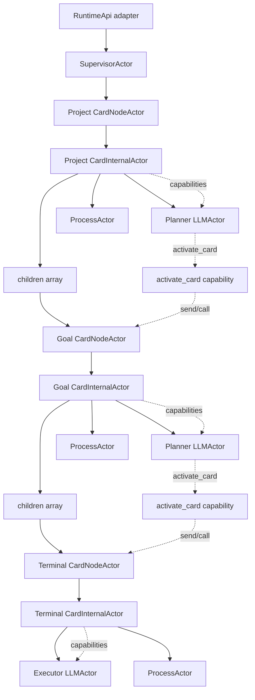

# Micro-Actor Runtime Core Architecture

Status: current runtime-core implementation architecture.

Last updated: 2026-06-15.

## 1. Purpose

This document defines how the Saivage v3 autonomous runtime core is built on the local micro-actor FSM module:

- [System functional specification](../spec/system-specification.md)
- [Operator UI specification](../spec/operator-ui.md)
- [System architecture](./system-architecture.md)
- [Declarative FSM module architecture](./declarative-fsm-module.md)

The runtime is a tree of `BaseActor` subclasses. Each actor declares a static `_actor` transition table, receives queued `send(event)` and `call(name, args?)` messages, and owns its own current state through `BaseActor` private slots.

## 2. Core Invariants

The implementation must preserve these functional invariants:

- The runtime is the only autonomous dispatcher.
- The Analyst is the user-facing mutation surface; UI mutation controls remain projection-only except authentication/bootstrap.
- At most one leaf card does real work at a time.
- A running chain may contain several `running` cards, but only the leaf receives scheduling, LLM turns, or process work.
- Parent planners activate only immediate children through `activate_card`.
- `activate_card` is a synchronous logical barrier from the parent planner perspective.
- Activatable child statuses are `backlog`, `changed`, `blocked`, and `failed`.
- Activating a child transitions it to `running`.
- Child activation outcomes update the child card to `done`, `failed`, or `blocked` before the parent receives the tool result.
- The Analyst cannot directly set a card to `blocked`; `blocked` is a main-agent activation outcome.
- Only `done` and `cancelled` descendants are completion-compatible for parent `done`.
- `changed`, `blocked`, `backlog`, `running`, and `failed` descendants block parent `done` until handled.
- `working_status` is free text for agents attached to the card.
- `result` is attached only from accepted main-agent results.
- Reviewer-negative results are stored with the card and injected into planner context; positive reviewer text is only attached to the card.
- Notifications are card-addressed, immutable, ephemeral delivery items, not user-managed note objects.
- Run starts idle work or resumes paused work; duplicate Run returns an already-running warning.
- Pause is a scheduling gate and does not mutate card/session/process state.
- Shutdown pauses first, then terminates runtime-owned running processes.
- Process handling uses launch, inspect, bounded wait, and explicit termination; wait timeout does not kill the process.
- Every external operation admitted by the runtime has a timeout or inactivity timeout.
- Operator APIs and UI expose Saivage read models, never raw actor internals.

Most task states use the same local completion protocol: the state starts or admits work, stores any result/error data on actor fields, sends `done` when that work completes successfully, and sends `failed` when that work fails. Use more specific events only for intermediate facts that a state must distinguish before deciding whether its own task is done or failed.

## 3. Actor Tree

The runtime actor tree has one root supervisor actor. The supervisor owns the parentless project `CardNodeActor`. `CardNodeActor`s are the durable card status/projection boundary. Each card node delegates type-specific behavior to a `CardInternalActor`. Project and goal internal actors own their child `CardNodeActor` references. Planner and executor `LLMActor`s own the LLM/tool loop for one card activation. Tool handling is a card-scoped capability registry; a capability becomes an actor only when it owns durable state, cancellation, recovery, or long-lived resources.

Actor ownership:

- `SupervisorActor` owns runtime mode, root run intent, pause gate, shutdown, the parentless project `CardNodeActor`, and recovery coordination.
- `CardNodeActor`s own durable card identity, public card status projection, and the type-specific `CardInternalActor` for that card.
- Project and goal `CardInternalActor`s own child-node references, child activation authority, readiness/review gates, planning diary updates, and construction of card-scoped capabilities.
- Terminal `CardInternalActor`s own terminal-card semantic execution and construction of terminal capabilities for one activation; they do not own children.
- Planner and executor `LLMActor`s own LLM/provider calls, tool-call loop states, the passed capability registry, tool-result waits, turn budgets, provider admission/cancellation intent, and tool-result context passed into later LLM calls.
- Capabilities are registered async operations. Promote a capability to an actor only when it needs durable state, cancellation boundaries, recovery semantics, or long-lived resource ownership.
- `ProcessActor`s own OS process lifecycle, process status, termination, and safe log read models.

## 4. RuntimeApi Boundary

`RuntimeApi` is the production adapter around the actor tree. It accepts requests from HTTP routes, CLI commands, Analyst tools, and application composition, then translates accepted requests into actor messages.

Allowed responsibilities:

- construct or attach to the supervisor actor;
- validate external command shape and authority before messages enter the actor tree;
- call `supervisor.call(...)` or `supervisor.send(...)` for accepted lifecycle requests;
- optionally wait for a state condition through runtime projections;
- project supervisor/card/session/process state into Saivage read models.

Forbidden responsibilities:

- instantiate goal, terminal, LLM, reviewer, child-activation, or process workflow actors directly;
- run workflow loops or branch over runtime phases;
- synthesize child activation completion outside the actor tree;
- expose raw actor private state or compiled transition tables over public APIs.

## 5. SupervisorActor

`SupervisorActor` owns runtime-level control.

States:

- `idle`: no root actor is running.
- `running`: the root project `CardNodeActor` exists and the pause gate is open.
- `paused`: the root project `CardNodeActor` may exist, but no new LLM/provider calls are admitted.
- `shutting_down`: pause gate is closed and runtime-owned processes are being terminated.

Calls:

- `run`: start idle work or resume paused work.
- `pause`: close the scheduling gate.
- `shutdown`: close the scheduling gate and terminate runtime-owned running processes.
- `cancel`: coordinate cooperative running cancellation for the active chain.

Events:

- `project_completed`
- `process_termination_completed`
- `recovery_reconciled`
- `failed`

Responsibilities:

- Run starts the parentless project `CardNodeActor` when idle.
- Run from `paused` lifts the pause gate.
- Run from `running` returns an already-running warning and creates no duplicate root run.
- Pause blocks new LLM/provider-call admission without killing running processes or mutating card status.
- Shutdown first pauses, then uses the process registry to find runtime-owned running process actors, call termination, and report results.
- Running cancellation coordinates cooperative cancellation only when the target is running or contains the active leaf.
- Supervisor recovery rebuilds safe actor state or records diagnostics for abandoned unsafe state.
- When the parentless project card completes with `done`, `failed`, `blocked`, or `cancelled`, the supervisor returns to `idle`.

The supervisor does not know planner, executor, reviewer, or tool semantics.

## 6. CardNodeActor

`CardNodeActor` is the durable card runtime boundary. It owns card identity, public status transitions, and one type-specific `CardInternalActor`.

States:

- `dormant`: card is not active.
- `activating`: activation validation and durable `running` status commit are in progress.
- `running`: the internal actor owns active semantic work.
- `completed`: the internal actor returned `done`, `failed`, or `blocked`, and durable card status/result have been committed.
- `cancelled`: runtime applied cancellation to this card.

Calls:

- `activate`: validate activation authority and start this card.
- `notify`: queue card-addressed context for the card's main agent session.
- `cancel`: apply inactive cancellation or coordinate running cancellation.

Events:

- `activation_committed`
- `internal_completed`
- `cancellation_requested`
- `status_committed`
- `failed`

Responsibilities:

- Validate immediate-child activation through parent-provided authority.
- Commit public card status changes before returning activation outcomes upward.
- Instantiate the correct `CardInternalActor` for project, goal, or terminal cards.
- Deliver queued notifications to the main agent session at LLM admission boundaries.
- Keep durable card status separate from private actor lifecycle state.

## 7. Goal CardInternalActor

Goal and project internal actors own goal-card semantics. They do not expose public card status directly.

States:

- `planning`: planner `LLMActor` is active with a card-scoped capability registry.
- `reviewing`: reviewer assessment is active.
- `completed`: accepted `done`, `failed`, or `blocked` outcome is ready for the owning `CardNodeActor`.

Calls:

- `start`: start or resume goal work for one activation.
- `cancel`: deliver cancellation intent to owned active work.

Events:

- `planner_completed`
- `readiness_rejected`
- `reviewer_approved`
- `reviewer_rejected`
- `changed_context_received`
- `failed`

Responsibilities:

- Build the planner capability registry, including direct-child activation, direct-child mutation, process tools, and working-status update paths.
- Invoke or reconstruct planner session data using deterministic identity derived from the goal card.
- Run readiness and evidence gates before review.
- Invoke reviewer work after readiness/evidence gates pass.
- Return exactly one `done`, `failed`, or `blocked` outcome to the owning `CardNodeActor`.
- Keep planner/reviewer LLM tool-loop states inside `LLMActor`, not in this actor.

## 8. Terminal CardInternalActor

Terminal internal actors own terminal-card semantic execution for one activation.

States:

- `executing`: executor `LLMActor` is active with a card-scoped capability registry.
- `completed`: accepted `done`, `failed`, or `blocked` outcome is ready for the owning `CardNodeActor`.

Calls:

- `start`: start terminal execution.
- `cancel`: deliver cancellation intent to active executor work.

Events:

- `executor_completed`
- `changed_context_received`
- `failed`

Responsibilities:

- Build terminal tool capabilities.
- Invoke one executor `LLMActor` with the capability registry.
- Return accepted executor outcomes to the owning `CardNodeActor`.
- Keep executor tool-call states inside `LLMActor`.
- Preserve raw diagnostics in logs/read models, not in model-visible context.

## 9. LLMActor

Planner, executor, reviewer, and Analyst LLM-facing work use `LLMActor` variants. Planner and executor actors are activation-lived. Durable planner session data is persisted separately and loaded when a planner `LLMActor` is invoked.

States:

- `thinking`: one LLM/provider call is active, or the actor is ready to start the next provider call with accumulated context.
- `running_tool`: exactly one requested tool/capability is active.
- `completed`: an accepted outcome or response is ready for the owning actor.
- `failed`: provider, protocol, tool, timeout, or budget failure.

Calls:

- `start`: begin the LLM loop.
- `cancel`: record cancellation intent for the next admission boundary.

Events:

- `done`
- `failed`
- `provider_succeeded`
- `provider_failed`
- `provider_timed_out`
- `tool_succeeded`
- `tool_failed`
- `turn_budget_exhausted`
- `outcome_accepted`

Responsibilities:

- Make one LLM/provider call at a time.
- Admit each provider call at its use boundary and retain that call's provider/configuration until it returns or times out.
- Interpret provider output as tool requests and/or one accepted outcome.
- Resolve tool requests by name from the supplied capability registry.
- Execute tool requests serially.
- Preserve semantic barrier ordering for `activate_card`.
- Store tool results in session context for the next provider call.
- Enforce turn budgets, operation timeouts, and protocol limits.
- Convert raw provider/tool diagnostics into sanitized model-visible failure context.

## 10. ProcessActor

`ProcessActor` owns one runtime-started OS process.

States:

- `starting`
- `running`
- `killing`
- `exited`
- `failed`

Calls:

- `launch`
- `inspect`
- `wait`
- `terminate`

Events:

- `started`
- `exited`
- `wait_timed_out`
- `termination_completed`
- `failed`

Responsibilities:

- Launch project commands in a contained working directory.
- Publish safe process read models: status, timestamps, rendered command, working directory, logs, and termination availability.
- Support bounded waits as caller/tool operations that observe process state.
- Keep a wait timeout non-destructive; the process remains `running` unless it exits or fails.
- Handle explicit termination from Analyst, card cancellation, or Shutdown.
- Reconcile persisted running process state during startup recovery.

## 11. Notifications And Changes

Notifications are queued to cards, not roles. Role phrasing from the user is resolved by the Analyst to the relevant card before runtime queueing.

The card runtime delivers pending notifications to that card's main agent session as soon as that session can admit new context. Notifications are not injected into an in-flight provider call. They are included at the next LLM/provider admission boundary, or in the next future main agent session if one starts.

Changed-state propagation updates durable card status and queues context, but it does not dispatch autonomous work by itself. Work resumes only through root Run or parent-planner activation.

## 12. Cancellation And Quiescence

Inactive cancellation is handled by the canonical card service. It can directly mark non-running cards/subtrees `cancelled`, preserving descendants already `done`, and terminate runtime-owned processes attached to inactive cancelled cards.

Running cancellation is cooperative:

- The runtime queues cancellation-request notifications to the requested card and active downstream cards.
- In-flight provider calls, tool calls, and bounded process waits finish or time out.
- Future LLM/provider admission for the requested card/subtree is limited to cancellation/cooperative-finish context.
- Active agents stop at safe points and report `failed` through the normal activation outcome path.
- The runtime applies `cancelled` as card status when the cancellation request is fulfilled.
- Failed outcomes unwind through activation barriers so parent planners handle interrupted work in context.

Project-card cancellation is coordinated by the supervisor because there is no parent planner to receive a `failed` activation outcome.

## 13. Persistence And Recovery

Persisted concerns:

- card tree and versioned card fields;
- agent messages and manifests;
- runtime state, root intent, runs, and activation edges;
- actor state needed for recovery classification;
- process registry and safe process logs;
- event/error/control-action timelines;
- pending card-addressed notifications until delivery or until the card leaves the active runtime.

Classify recovery at durable boundaries:

- `resume_safe`: rebuild and continue;
- `reconcile_then_resume`: inspect card/process state before continuing;
- `abandon_with_diagnostic`: cannot safely reattach to external work;
- `terminal`: no recovery work needed.

Examples:

- A `ProcessActor` in `running` may be `reconcile_then_resume` if the OS process can be found through the process registry.
- A provider call in progress at crash time is `abandon_with_diagnostic` because the external request cannot be safely reattached.
- A planner `LLMActor` waiting on `activate_card` is `reconcile_then_resume` if the active child actor and durable card state can be rebuilt from the active card chain and activation edge.
- A committed `done`, `failed`, `blocked`, or `cancelled` actor state is `terminal`.

## 14. Projections And Events

Public APIs expose Saivage read models, not actor internals.

Projection modules translate actor/card/session/process state into operator-facing REST responses and WebSocket invalidation events. Event/timeline mechanisms may carry projection updates and audit records. They must not become an internal workflow bus.

## 15. File And Module Shape

Prefer cohesive actor modules over controller classes:

- `src/runtime/actors/supervisor.ts`
- `src/runtime/actors/card-node.ts`
- `src/runtime/actors/goal-card-internal.ts`
- `src/runtime/actors/terminal-card-internal.ts`
- `src/runtime/actors/llm-loop.ts`
- `src/runtime/actors/process.ts`
- `src/runtime/actors/capabilities/*.ts`

Actor modules extend `BaseActor`, declare static `_actor`, implement convention methods, and delegate durable storage/projection to narrow services.

## 16. Testing Strategy

Required test groups:

- direct actor transition tests for supervisor Run/Pause/Shutdown;
- `CardNodeActor` tests for activation validation, status commit ordering, cancellation, and notification delivery;
- goal `CardInternalActor` tests for child activation success/failure/blocked, invalid activation, changed handling, readiness rejection, reviewer pass/correction/invalidation;
- terminal `CardInternalActor` tests proving it constructs tool capabilities, invokes executor `LLMActor`, returns accepted outcomes, and does not own tool-loop states;
- planner/executor `LLMActor` tests for provider admission, cooperative cancellation delivery, provider failure, serial tool execution, capability invocation, tool-result context, barrier ordering for `activate_card`, tool failure, turn budget exhaustion, and accepted outcomes;
- process actor tests for launch, wait timeout without kill, inspect, terminate, failure diagnostics, and startup reconciliation;
- `RuntimeApi` boundary tests proving it sends actor messages and projects read models but does not advance workflow itself;
- API/projection tests proving public responses expose Saivage read models, not raw actor internals;
- UI smoke tests when projection contracts change.

## 17. Implementation Sequence

### P0: Actor Contracts And RuntimeApi Boundary

- Define static `_actor` declarations, calls, events, and outcomes for supervisor, `CardNodeActor`, goal `CardInternalActor`, terminal `CardInternalActor`, `LLMActor`, card-scoped capabilities, and `ProcessActor`.
- Collapse `RuntimeApi` into message sender, state/projection waiter, and projection adapter.
- Add boundary tests proving runtime behavior cannot advance through wrapper-owned orchestration methods.

### P1: Supervisor And CardNodeActor

- Implement supervisor Run/Pause/Shutdown/Cancellation states and projections.
- Implement `CardNodeActor` activation validation, durable status commit, internal actor delegation, and outcome commit.

### P2: Vertical Terminal Slice

- Implement one terminal card activation end to end: `CardNodeActor`, terminal `CardInternalActor`, executor `LLMActor`, one simple capability, and accepted outcome commit.
- Prove actor boundaries with working behavior before expanding to goal/planner/reviewer complexity.

### P3: Process And Tool Loop Expansion

- Implement `ProcessActor` lifecycle.
- Implement executor/planner LLM tool loops with one tool result fed into the next provider call.
- Implement process-tool handling through registered capabilities and process actor calls/events.

### P4: Goal Planning And Review

- Implement goal `CardInternalActor` child activation capabilities, planner invocation, readiness guards, reviewer turns, reviewer corrections, and returned outcomes.
- Keep planning diary on goal/project card fields.

### P5: Changed Context And Notifications

- Wire canonical card service mutations to changed-state propagation and card-addressed notifications.
- Deliver notifications at LLM admission boundaries.

### P6: Cancellation And Recovery

- Implement inactive and running cancellation flows.
- Classify recovery behavior for durable boundaries.
- Rebuild safe actor state on startup and emit diagnostics for unsafe abandoned work.
