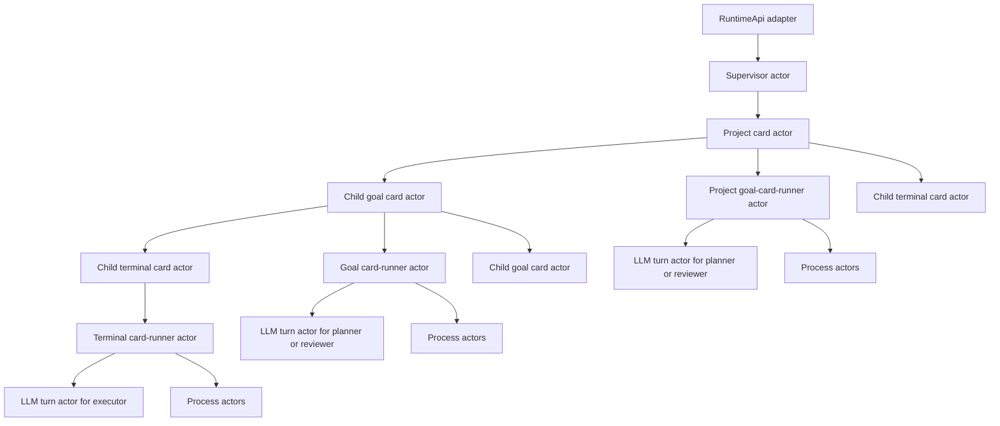

# XState Runtime Core Architecture

Status: current runtime-core implementation architecture.

Last updated: 2026-06-12.

## 1. Purpose

This document defines how the Saivage v3 autonomous runtime core is implemented on top of XState. It rescues the useful parts of the prior runtime-core plans while aligning them with the current functional specifications:

- [System functional specification](../spec/system-specification.md)
- [Operator UI specification](../spec/operator-ui.md)
- [System architecture](./system-architecture.md)

This document is implementation architecture, not a second product contract. If it conflicts with the functional specs, the specs win and this document must be updated.

## 2. Design Directive

XState is load-bearing infrastructure for the runtime core. Runtime behavior is driven by machine states, typed events, invoked services, and owned actors. It is not driven by imperative orchestration loops that call `start()`, `runTurn()`, `activateChild()`, `review()`, or `wait()` methods while XState snapshots are attached afterward.

The runtime must stay simple:

- no custom command bus around XState;
- no event-sourcing layer;
- no generic workflow framework;
- no detached actor islands used to emulate parent-child behavior;
- no compatibility path for discarded runtime state shapes, discarded run-ledger shapes, or discarded orchestration contracts;
- no generic actor registry unless the first direct actor tree proves it is needed.

Use the smallest machines that make invalid states hard to represent. A machine state should normally be a durable wait point, cancellation boundary, recovery boundary, or externally meaningful lifecycle phase. Synchronous card-store writes can be machine actions unless they need retry or recovery semantics.

## 3. Core Invariants

The implementation must preserve these functional invariants:

- The runtime is the only dispatcher.
- The Analyst is the user-facing mutation surface; UI mutation controls remain projection-only except authentication/bootstrap.
- At most one leaf card does real work at a time.
- A running chain may contain several `running` cards, but only the leaf receives scheduling, LLM turns, or process work.
- Parent planners activate only immediate children through `activate_card`.
- `activate_card` is a synchronous logical barrier from the parent planner perspective.
- Activatable child statuses are `backlog`, `changed`, `blocked`, and `failed`.
- Activating a child transitions it to `running`.
- `done` cards are not activatable unless later modification changes them to `changed`.
- Child activation outcomes update the child card to `done`, `failed`, or `blocked` before the parent receives the tool result.
- The Analyst cannot directly set a card to `blocked`; `blocked` is a main-agent activation outcome.
- Only `done` and `cancelled` descendants are completion-compatible for parent `done`.
- `changed`, `blocked`, `backlog`, `running`, and `failed` descendants block parent `done` until handled.
- `working_status` is free text for agents attached to the card.
- `result` is attached only from accepted main-agent results.
- Reviewer-negative results are stored with the card and injected into the planner context; positive reviewer text is only attached to the card.
- Notifications are card-addressed, immutable, ephemeral delivery items, not user-managed note objects.
- Run starts idle work or resumes paused work; duplicate Run returns an already-running warning.
- Pause is a scheduling gate and does not mutate card/session/process state.
- Shutdown pauses first, then terminates runtime-owned running processes.
- Process handling uses launch, inspect, bounded wait, and explicit termination; wait timeout does not kill the process.
- Configuration changes apply to future relevant work. Runtime components should read dynamically changeable settings at their relevant use/admission boundary rather than caching them indefinitely. In-flight LLM turns keep the provider/configuration they were admitted with; later LLM turns read the latest effective configuration at admission time.
- Operator APIs and UI expose Saivage read models, never raw XState snapshots.

## 4. Actor Tree

The runtime actor tree has one root supervisor actor. The supervisor owns the parentless project card actor. Card actors mirror the durable card hierarchy: each card actor owns its child card actors and, when that card is actively worked, its private card runner actor.

Actor ownership:

- The supervisor actor owns runtime mode, root run intent, pause gate, shutdown, the parentless project card actor, and recovery coordination.
- Card actors own durable card identity, public card status projection, child card actor references, and the currently active runner actor for that card when one exists.
- The project card actor is a card actor with no parent; when actively worked, it starts a goal-card-runner actor with project-specific input/context.
- Goal card runner actors own planner turns, active child activation barriers, reviewer turns, tool-result waits for planner tools, and planning diary updates for one active goal-card run.
- Terminal card runner actors own executor turns and process/tool work for one terminal activation.
- LLM turn actors own provider admission, provider invocation, provider cancellation, and typed provider output.
- Process actors own OS process lifecycle, process status, waits, termination, and safe log read models.

Child card activations are invoked through the card actor hierarchy because `activate_card` needs exactly one completion or failure outcome delivered to the waiting parent planner under the single-active-leaf model. Longer-lived owned resources such as process actors may be spawned when their lifecycle outlives one tool call. If Saivage later lifts the single-active-leaf model, child activation ownership can be reconsidered. Actor-to-actor runtime behavior flows through XState events, actor completion, and typed outputs. Event/timeline infrastructure may publish projections and audit records, but it must not become an internal workflow bus.

LLM turn actors never own card hierarchy traversal. An LLM turn actor may return a typed tool-call request such as `activate_card`, but the parent card-runner actor handles that request by sending an activation event to its owning card actor, which routes to the appropriate immediate child card actor. This keeps child card actors as children of their parent card actors, not children of transient LLM turn actors.

## 5. RuntimeApi Boundary

`RuntimeApi` is the only production wrapper around the actor tree. It is an adapter for external callers such as HTTP routes, CLI commands, the Analyst service, and application composition.

The Analyst is not part of the autonomous runtime actor tree. Analyst sessions are user-facing agent sessions that inspect projections and call canonical services. Analyst tools translate user intent into runtime, card, notification, process, and configuration operations; lifecycle operations enter the runtime actor tree as typed events through `RuntimeApi`, while card mutations go through the canonical card service.

The canonical card service owns Analyst-initiated card create, edit, reorder, archive, delete, and non-running cancellation requests. It validates authority and destructive-action confirmation, mutates the durable card tree, emits audit/projection events, and sends typed change/cancellation notifications to affected active runtime actors. It must not start autonomous work directly.

Allowed responsibilities:

- construct or attach to the supervisor actor;
- send accepted commands as supervisor events;
- reject commands that are invalid before they enter the actor tree;
- optionally wait for a state condition by subscribing to actor snapshots;
- project supervisor/card/session/process snapshots into Saivage read models.

Forbidden responsibilities:

- instantiate goal, terminal, LLM, reviewer, child-activation, or process runners directly;
- call workflow methods such as `start()`, `cancel()`, `runTurn()`, `activateChild()`, or `wait()` on runtime objects;
- synthesize child activation completion outside the actor tree;
- expose raw XState snapshots over public APIs;
- preserve discarded orchestration behavior to satisfy discarded tests.

If a public method needs completion-return semantics, it sends an event and waits by observing actor state. It must not run the workflow itself.

## 6. Supervisor Machine

The supervisor machine owns runtime-level control. Minimal states:

- `idle`: no root actor is running.
- `running`: the root project card actor exists and the pause gate is open.
- `paused`: the root project card actor may exist, but no new LLM turns are admitted.
- `shutting_down`: pause gate is closed and runtime-owned processes are being terminated.
- `failed`: unrecoverable supervisor-level failure, if needed.

Primary events:

- `RUN_REQUESTED`
- `PAUSE_REQUESTED`
- `SHUTDOWN_REQUESTED`
- `PROJECT_ACTOR_DONE`
- `PROJECT_ACTOR_FAILED`
- `PROJECT_ACTOR_BLOCKED`
- `RUNNING_WORK_CANCEL_REQUESTED`
- `PROCESS_TERMINATION_REPORTED`
- `RECOVERY_RECONCILED`

Responsibilities:

- Run starts the parentless project card actor when idle. The project card actor starts its project goal-card-runner actor when work is admitted.
- Run from `paused` lifts the pause gate.
- Run from `running` returns an already-running warning and creates no duplicate root run.
- Pause blocks new LLM-turn admission without killing running processes or mutating card status.
- Shutdown first pauses, then sends termination events to runtime-owned running process actors and reports results.
- `RUNNING_WORK_CANCEL_REQUESTED` coordinates cancellation only when the target is running or contains the active leaf. Non-running card/subtree cancellation is handled by the canonical card service.
- Supervisor recovery rebuilds safe actor state or records diagnostics for abandoned unsafe state.

The supervisor should not know planner/executor logic. It coordinates root lifecycle and owns the top of the actor tree.

## 7. Goal Card Runner Machine

The goal card runner machine handles active execution for regular goal cards and the parentless project card. It is private runtime state, not the public card lifecycle. Durable card status remains the fixed card-store state set (`backlog`, `running`, `changed`, `done`, `failed`, `blocked`, `cancelled`) and is exposed through projections. Runner phases describe what the active runtime is doing while a card is being worked.

Minimal externally meaningful phases:

- `preparing_activation`: card-store transition to `running` and activation metadata are being committed. The transition must commit before planner work starts; if it fails, the machine must not enter `planning`.
- `planning`: planner LLM turn is active, or the runner is ready to start the next planner turn with newly available context/tool results.
- `awaiting_tool_result`: a planner-requested tool or process wait is being handled outside the LLM turn actor. Process lifecycle remains owned by process actors; the runner waits only for the runtime tool result needed to continue the planner session.
- `activating_child`: activation is routed to an immediate child card actor behind an `activate_card` barrier.
- `checking_readiness`: runtime completion gates are being evaluated. This is intentionally a named local phase so readiness diagnostics and recovery boundaries are visible; it can be collapsed to guards later without changing the product contract if it proves trivial.
- `reviewing`: reviewer assessment is active.
- `committing_outcome`: accepted `done`, `failed`, or `blocked` result is being attached to the card.

Non-active cards do not need a running card-runner actor. Public statuses such as `done`, `failed`, `blocked`, `cancelled`, and `changed` are durable card-store statuses, not goal-card-runner phases.

Planner tool handling:

- `activate_card(child_id)` is emitted by an LLM turn actor as a typed tool-call request and handled by the goal runner machine. The LLM turn actor does not invoke the child card.
- Activation validates responsible parent planner, immediate-child relationship, and child status in `backlog`, `changed`, `blocked`, or `failed`.
- Activation transitions the child card to `running`, then the child card actor starts its appropriate private runner actor.
- Child actor completion returns exactly one typed outcome: `done`, `failed`, or `blocked`.
- The child card is committed to the matching status before the parent planner receives the tool result.
- Process tools spawn or address process actors, move the goal runner through `awaiting_tool_result` when the planner waits, and deliver process results to the next planner turn.
- Card create/edit/reorder/cancel tools are limited to direct children. Created children enter the tree in `backlog` unless the card API defines a stricter initial status. Recursive cancellation effects belong to runtime semantics, not planner authority over grandchildren.

Completion handling:

- Planner `done` reports go through readiness gates before review.
- Readiness rejects any executable descendant that is not completion-compatible.
- Required evidence references are validated before review. Evidence validation verifies that referenced evidence belongs to the assessed subtree or project context, still exists in the active card representation, and points to durable card result data, artifacts, attachments, process records, or file evidence that the reviewer can inspect.
- Reviewer assessment happens after readiness/evidence gates.
- If the reviewer requests corrections, the goal returns to planner ownership inside the same activation barrier.
- If the goal or any descendant changes before reviewer approval commits, the review pass is invalidated.
- Reviewer-negative text is stored as a specialized result and injected into planner context.
- Reviewer-positive text is attached for recordkeeping only.

Changed handling:

- `changed` is durable card status, not a long-running actor phase. A changed non-active goal is dormant until the responsible parent planner or Analyst action changes it again or the parent planner reactivates it.
- Activating a `changed` card transitions it to `running`, clearing the durable `changed` status.
- A goal cannot report `done` while any executable descendant remains `changed`.
- Change notifications and changed-subtree context are delivered when the goal actor next accepts context.

Planning diary:

- Planning diary state lives on goal/project card fields.
- Do not reintroduce a separate plan-card type.

Planner session lifecycle:

- Planner sessions use deterministic identity derived from the goal card.
- A planner is created lazily the first time the goal needs an LLM agent.
- The same logical planner session receives repeated activation requests over that goal's lifetime.
- When reactivated after `changed` or `blocked`, the planner resumes with prior session context plus new runtime-provided activation, notification, correction, and changed-subtree context.

Reviewer turn input:

- Reviewer LLM turn input includes the project card data, the assessed goal subtree, and the planner return value for that completion attempt.
- Reviewer-negative results include assessment details, cited evidence, and correction context for the next planner turn.

## 8. Terminal Card Runner Machine

The terminal card runner machine handles active executor work for terminal task cards. It is private runtime state, not the public card lifecycle.

Minimal phases:

- `preparing_activation`: card-store transition to `running` and activation metadata are being committed. The transition must commit before executor work starts; if it fails, the machine must not enter `executing`.
- `executing`: executor LLM turn is active, or the runner is ready to start the next executor turn with newly available context/tool results.
- `awaiting_tool_result`: an executor-requested tool or process wait is being handled outside the LLM turn actor. Process lifecycle remains owned by process actors; the runner waits only for the runtime tool result needed to continue the executor session.
- `committing_outcome`: accepted `done`, `failed`, or `blocked` result is being attached to the card.

Non-active terminal cards do not need a running card-runner actor. Public statuses such as `done`, `failed`, `blocked`, `cancelled`, and `changed` are durable card-store statuses, not terminal-card-runner phases.

Responsibilities:

- Invoke one LLM turn actor at a time.
- Handle executor tool calls through machine events and invoked services.
- Spawn process actors only when process tools require them.
- Update `working_status` only through agent-visible write paths.
- Attach `result` only after an accepted executor outcome.
- Preserve raw diagnostics in logs/read models, not in unsanitized model context.
- Treat `changed` as durable card status, not a long-running actor phase. A changed non-active terminal card waits in the card store until the responsible parent planner or Analyst action changes it again or the parent planner reactivates it.
- On cancellation request while active, deliver cancellation context and let the executor voluntarily stop and report `failed`. `cancelled` is a runtime-applied card status, not a parent-visible activation outcome.

The machine should enforce a turn budget through machine context and events, not through an external `for` loop.

## 9. LLM Turn Machine

The LLM turn machine owns one provider turn.

Minimal phases:

- `requesting_admission`: checks the supervisor pause/admission gate.
- `calling_provider`: provider invocation is active and cancellable.
- `returned_message`: assistant message result without tool call.
- `returned_tool_call`: exactly one supported tool call.
- `unsupported_output`: provider output violates the current protocol, such as multiple tool calls in the first implementation pass.
- `failed`: provider or protocol failure.
- `cancelled`: cancellation accepted before completion.

Responsibilities:

- Admission request and release happen as machine actions/invoked services at state boundaries.
- Admission checks read the current supervisor pause/admission gate at the start of each provider turn. The gate is evaluated per turn, not continuously during an already-admitted provider call.
- Provider calls are cancellable invoked services.
- Parent card runner machines receive typed outputs; they do not inspect child context after a method call.
- Multiple provider tool calls must fail fast or follow an explicit future protocol. The first implementation must not silently select the first tool call.
- Raw provider errors are stored for diagnostics and sanitized before being included in model-visible context.

## 10. Process Machine

The process machine owns one OS process lifecycle.

Minimal phases:

- `starting`
- `running`
- `waiting`
- `killing`
- `exited`
- `failed`
- `abandoned`, if recovery cannot safely reattach or terminate

Responsibilities:

- Launch project commands in a contained working directory.
- Publish safe process read models: status, timestamps, rendered command, working directory, logs, and termination availability.
- Implement bounded waits. A wait timeout returns control to the calling card runner actor and does not kill the process.
- Handle explicit termination from Analyst, card cancellation, or Shutdown.
- On cancellation, terminate gracefully when possible, then force-kill or record an abandoned diagnostic when needed.
- Reconcile persisted running process state during startup recovery.

The functional spec imposes no process concurrency limit for now.

## 11. Card Changes And Notifications

Card changes enter the runtime as events. Direct store mutation without actor notification is not part of the active runtime path.

Change behavior:

- Non-running edited cards become `changed`.
- Running edited cards remain `running`.
- Every edit queues a card-addressed notification for the modified card.
- Inactive ancestors on the path to the project root become `changed` until the first running ancestor.
- Running ancestors receive notification/context instead of status overwrite.
- Creating a new backlog child marks the parent/ancestor chain changed as needed.

Notification behavior:

- Notifications are queued to cards, not roles.
- Role phrasing from the user is resolved by the Analyst to the relevant card before runtime queueing.
- The card runtime delivers pending notifications to that card's main agent session when it is active and can accept context, or to the next future main agent session if one starts.
- Notifications are immutable and forgotten as queue items after delivery.
- Undelivered notifications on deleted/archived cards remain with that card representation and are no longer delivered through the active runtime.
- There is no notification inbox, list/get/edit/delete/acknowledge API, or bulk-management UI.

## 12. Cancellation And Quiescence

Pause and cancellation are separate.

- Pause is a scheduling gate. It blocks new LLM turn admission and leaves card/session/process state unchanged.
- Cancellation changes work intent for a card/subtree.
- Shutdown is pause plus process termination.

Inactive cancellation:

- A card that is not `running` can be cancelled directly.
- Recursive cancellation preserves already-`done` descendants.
- Recursive cancellation converts non-completion-compatible descendants, including `failed` and `blocked`, to `cancelled`.
- Runtime-owned processes attached to non-running cancelled cards are terminated through process actors.

Running cancellation:

- The runtime queues cancellation-request notifications to the requested card and active downstream cards.
- Active agents stop at safe points and report `failed` through their normal activation outcome path.
- The runtime marks the cancelled requested card/subtree status as `cancelled` as part of fulfilling the cancellation request; `cancelled` is not a parent-visible activation outcome.
- Failed outcomes unwind through normal activation barriers so parent planners can handle the interrupted work in context.
- The runtime should reach a bounded quiescent state or report that unsafe work was abandoned.

Do not add a separate user-facing Abort operation. Cancel is the required operation.

## 13. Persistence And Recovery

Persist state at meaningful machine boundaries. Do not persist snapshots merely to mirror imperative code after it already ran.

When persisting actor state, prefer XState persisted snapshots plus Saivage metadata needed for actor identity, projection, and recovery classification. Do not expose persisted XState snapshots as public read models.

Card-store writes that must commit before the state changes are invoked services with explicit success/failure transitions. Purely synchronous writes may be machine actions only when a write failure can safely fail the transition loudly rather than leaving the machine in a misleading externally visible state.

Persisted concerns:

- card tree and versioned card fields;
- agent messages and manifests;
- runtime state, root intent, command records, runs, and activation edges;
- meaningful actor state and minimal context required for recovery classification;
- process registry and safe logs;
- event/error/control-action timelines;
- pending card-addressed notifications until delivery, or until their card leaves the active runtime through deletion/archival.

Every persisted actor state should have one recovery classification before implementation:

- `resume_safe`: rebuild and continue;
- `reconcile_then_resume`: inspect card/process state before continuing;
- `abandon_with_diagnostic`: cannot safely resume; write a diagnostic and reconcile card/process state;
- `terminal`: no recovery work needed.

Examples:

- A process actor in `running` may be `reconcile_then_resume` if the OS process can be found.
- A provider call in progress at crash time is usually `abandon_with_diagnostic` because the external request cannot be safely reattached.
- A card runner actor waiting for a child outcome is `reconcile_then_resume` if the child runner actor and durable card state can be rebuilt.
- A committed `done`, `failed`, `blocked`, or `cancelled` actor state is `terminal`.

## 14. Projections And Events

Internal XState snapshots are not public API.

Projection responsibilities:

- build card read models with status, `working_status`, `result`, specialized results, and field history availability;
- expose runtime mode, pause gate, active chain, command outcomes, process records, agent sessions, timeline, and errors;
- emit WebSocket/event freshness hints without making WebSocket the source of truth;
- let the Analyst drive workspace navigation by projecting route/view changes to the UI;
- keep secret redaction as output/display policy, not Analyst authority limitation.

Event/timeline mechanisms may carry projection updates and audit records. They must not coordinate internal runtime workflow.

## 15. File And Module Shape

Prefer machine and actor files over controller classes:

- `src/runtime/actors/supervisor.machine.ts`
- `src/runtime/actors/supervisor.actor.ts`
- `src/runtime/actors/supervisor.projection.ts`
- `src/runtime/actors/goal-card-runner.machine.ts`
- `src/runtime/actors/goal-card-runner.actor.ts`
- `src/runtime/actors/terminal-card-runner.machine.ts`
- `src/runtime/actors/terminal-card-runner.actor.ts`
- `src/runtime/actors/llm-turn.machine.ts`
- `src/runtime/actors/llm-turn.actor.ts`
- `src/runtime/actors/process.machine.ts`
- `src/runtime/actors/process.actor.ts`

Avoid controller classes by default. A class or module is suspect if it owns loops, branching, or methods that advance runtime workflow. Keep wrappers only at real external boundaries.

## 16. Testing Strategy

Do not preserve orchestration-heavy tests solely because they are familiar. Prefer smaller tests that protect the new architecture.

Required test groups:

- direct machine transition tests for supervisor Run/Pause/Shutdown;
- goal-card-runner machine tests for activation success/failure/blocked, invalid activation, changed handling, readiness rejection, reviewer pass/correction/invalidation;
- terminal-card-runner machine tests for executor success/failure/blocked, tool delivery, process wait, process termination, and cancellation request delivery;
- LLM turn tests for pause-before-admission, provider cancellation, provider failure, assistant message, one tool call, and unsupported multiple tool calls;
- process machine tests for launch, wait timeout without kill, inspect, terminate, failure, and abandoned recovery;
- RuntimeApi boundary tests proving it sends events and projects read models but does not instantiate/call card/LLM/process workflow runners;
- API/projection tests proving public responses expose Saivage read models, not raw XState snapshots;
- UI smoke tests when projection contracts change.

## 17. Implementation Sequence

### P0: Actor Contracts And RuntimeApi Boundary

- Define typed events and outputs for supervisor, goal card, terminal card, LLM turn, and process actors.
- Collapse `RuntimeApi` into event sender, snapshot waiter, and projection adapter.
- Add boundary tests proving runtime behavior cannot advance through wrapper-owned orchestration methods.
- Define the permanent module ownership map: actor/machine modules own workflow, projection modules own read models, canonical services own validated external requests, and no additional layer owns autonomous work sequencing.

P0 is complete when runtime workflow cannot advance except through supervisor events, card actor events, runner actor events, invoked services, child-card activation barriers, spawned resource actors, and machine transitions.

### P1: Supervisor Machine

- Implement Run/Pause/Shutdown.
- Own parentless project card actor creation.
- Enforce duplicate Run warning.
- Gate LLM admission while paused.
- Terminate process actors during Shutdown.
- Project supervisor status into read models.

### P2: LLM Turn Machine

- Implement provider admission, provider invocation, typed outputs, cancellation, provider failure, and unsupported output.
- Fail fast on multiple tool calls unless a later explicit protocol supports them.

### P3: Process Machine And Terminal Card Runner Machine

- Implement process lifecycle first if terminal tools need it.
- Implement terminal card executor turns and process-tool handling through actor events.
- Attach accepted `result`; keep `working_status` separate.

### P4: Goal Card Runner Machine

- Implement planner turns, child activation, planner process waits, readiness gates, reviewer turns, reviewer corrections, and committed outcomes.
- Keep planning diary on goal/project card fields.
- Do not reintroduce plan cards.

### P5: Changed Propagation, Notifications, And Cancellation

- Implement card edit events, changed propagation, notification delivery, and cancellation request delivery.
- Implement direct inactive cancellation and collaborative running cancellation.

### P6: Projections, Analyst, And UI Integration

- Wire Analyst tools to canonical services backed by the actor tree.
- Ensure UI remains read-only for Analyst-owned mutations.
- Project cards, active chain, sessions, processes, timeline, errors, and navigation context.

### P7: Startup Recovery

- Classify recovery behavior for every persisted actor state.
- Rebuild safe actor state on startup.
- Reconcile card/process state before admitting new LLM turns.
- Emit diagnostics for abandoned unsafe work.

Do not begin broad goal/terminal rewrites before P0/P1 make the supervisor boundary stable.
