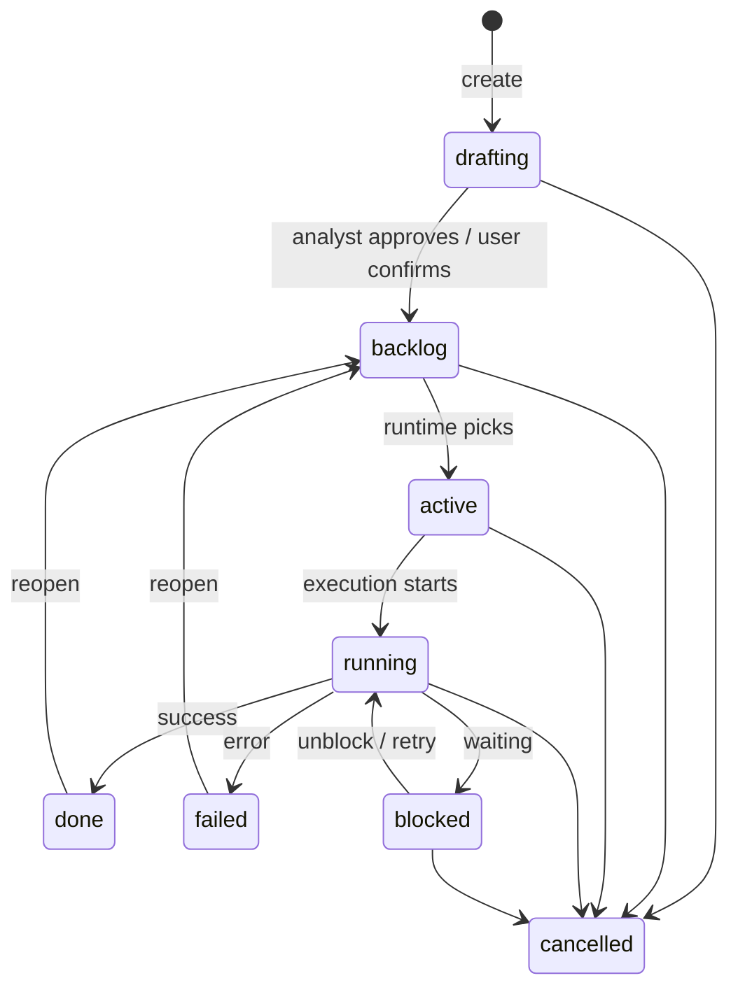

# Card Lifecycle

> Canonical design document consolidated from `docs/design/card-lifecycle.md` during Stage 22. Stage 23 will reconcile detailed source anchors where needed.

## States

| State     | Meaning                                              |
|-----------|------------------------------------------------------|
| drafting  | Being shaped by analyst + user/planner. Not yet actionable. |
| backlog   | Fully specified, waiting to be picked up.            |
| active    | Assigned to the runtime, preparing to run.           |
| running   | Executor is working (scripts, training, etc.).       |
| blocked   | Waiting on a dependency or user input.               |
| done      | Completely done. A task is done when its executor says it is done; a goal is done only after reviewer pass. |
| failed    | Completed with errors.                               |
| cancelled | Abandoned.                                           |

---

## Transitions

Any non-terminal state → `cancelled`.

---

## Global Pause

Pause is **global**, not per card/task. A global runtime pause stops
new planner, executor, and reviewer dispatch. It does not change
individual card state and does not automatically kill already-running
external processes.

While paused:
- No new agent sessions are started.
- Already-running processes continue unless explicitly killed.
- The analyst remains available for inspection and card management.
- Resume restores normal dispatch from the current queue position.

---

## Permissions by State

| State     | Card editable? | Notes editable?  | Executor works? | User can…                        |
|-----------|----------------|------------------|-----------------|----------------------------------|
| drafting  | yes            | yes (all)        | no              | edit everything, delete card     |
| backlog   | yes            | yes (unhandled)  | no              | reprioritize, edit, add notes    |
| active    | no             | yes (unhandled)  | preparing       | add directives, cancel           |
| running   | no             | yes (unhandled)  | yes             | add directives, cancel           |
| blocked   | no             | yes (unhandled)  | waiting         | unblock, add notes, cancel       |
| done      | no             | no               | no              | reopen → backlog                 |
| failed    | no             | no               | no              | retry → backlog, cancel          |
| cancelled | no             | no               | no              | reopen → drafting                |

---

## Views over the Card Tree

The leaderboard is not a separate data structure. It is a **query**
over the card tree:

> Show all `done` result cards sorted by a chosen metric.

The web UI renders this as a sortable table. Each row links to the
result card with full details, sub-tasks, attachments, execution
logs, etc.

Different views:
- **Leaderboard**: done result cards, sorted by metric.
- **Board**: kanban-style columns (backlog / active / done / failed).
- **Tree**: hierarchical view of all cards.
- **Timeline**: Gantt-style view of card durations.
