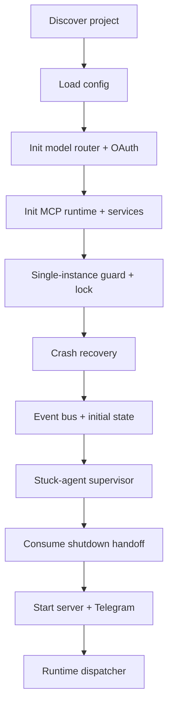

# Runtime

> Canonical design document consolidated from `docs/design/runtime.md` during Stage 22. Stage 23 will reconcile detailed source anchors where needed.


The runtime is the non-LLM support software that drives agent
dispatch, manages card state transitions, tracks processes, handles
crashes, and provides the event bus. Agents do not control the
runtime — the runtime controls agents.

---

## Startup Sequence

1. **Discover project**: Walk up from `cwd` looking for
  `.saivage/saivage.json`, or use `PROJECT_ROOT` / `SAIVAGE_ROOT`
   environment variables. Set both env vars for subprocess
   inheritance.

2. **Load configuration**: Read `.saivage/saivage.json`, interpolate
   `${ENV_VAR}` references, validate against the config schema
   (see `configuration.md`).

3. **Initialize model router**: Create provider and account instances
  from config. Inject OAuth tokens for providers and accounts that
  use them. Discover or load each provider's model capabilities,
  order providers by priority, and initialize per-candidate health
  state for `provider/account/model` attempts.

4. **Initialize MCP runtime**: Register built-in MCP services
   (plan, notes, filesystem, shell, git, process management).
   Start configured external MCP servers
   (see `configuration.md §MCP Servers`). Begin health
   monitoring of external servers.

5. **Single-instance guard**: Check the authoritative runtime state at
   `.saivage/tmp/state/runtime.json` for a still-alive PID. If alive and recent (< 14 days), abort with an
  error. Then acquire an exclusive runtime lock via `O_CREAT|O_EXCL`
  on `.saivage-work/tmp/runtime/runtime.lock`. This closes the TOCTOU
   gap between the PID check and the first state write. If the lock
   file exists but its PID is dead or its timestamp is stale
   (> 14 days), the lock is removed and re-acquired.

6. **Crash recovery**: Read `.saivage/tmp/state/runtime.json`. If a
   supported legacy `.saivage/runtime/state.json` exists and no
   authoritative file exists, `src/utils/runtime-state.ts:67` migrates it
   once; if both files exist, `src/utils/runtime-state.ts:61` refuses the
   mixed layout to avoid split-brain recovery. If the previous process
   died mid-execution:
  - Sweep stale `.tmp` files from `.saivage-work/tmp/runtime/`.
  - Reset any `active` or `running` cards to `backlog`.
   - If a card has a completed result file but was not yet
     transitioned, mark it for archival by the planner.
   - Clean stale notes from previous runs.
   - Clean stale stash files older than 24 hours.
   - Reconcile orphan card-history entries whose sequence exceeds the
     persisted card version.

7. **Event bus**: Create the in-process event bus for runtime event
   distribution.

8. **Write initial runtime state**: Persist `.saivage/tmp/state/runtime.json`
   with `status: "idle"`, current PID, and timestamp.

9. **Start stuck-agent supervisor**: If enabled, begin periodic
   stuck-agent detection (see §Stuck Agent Detection below).

10. **Consume shutdown handoff**: If a previous shutdown left a
    handoff summary, queue it as a startup directive for the
    planner's first session.

11. **Start server**: Bind the HTTP + WebSocket server
    (see `server-api.md`).

12. **Start Telegram bot**: If configured, connect the Telegram bot
    and wire it to analyst chat sessions.

13. **Start runtime dispatcher**: Begin dispatching ready card work
    and wrapping each agent invocation with recovery handling
    (see §Agent Invocation Recovery below).



---

## Canonical runtime control

Runtime pause/resume/freeze controls are shared across surfaces.

Mutating runtime state must flow through canonical helpers rather than
ad hoc writes:

- `pauseRuntimeControl`
- `resumeRuntimeControl`
- runtime freeze/resume-from-freeze helpers
- `src/utils/runtime-state.ts` for actual persisted state writes and the idle/`active_card_run` coherence guard

Operational invariants:

- there should be no direct production writers of
  `.saivage/tmp/state/runtime.json` outside the runtime-state module and
  canonical runtime-control helpers.
- idle runtime states with `current_card_id === null` cannot retain a
  non-terminal `active_card_run`; `src/utils/runtime-state.ts` rejects
  that shape in strict/test mode and self-heals historical production
  state, with regression coverage in
  `tests/utils/runtime-state-invariant.test.ts` and
  `tests/server/operator-api-contract-fixtures.test.ts`. Runtime layout
  migration/refusal is anchored by `src/utils/runtime-state.ts:26` and
  `tests/utils/runtime-state-layout.test.ts:64` and `tests/server/runtime-layout-startup-api.test.ts`.

Cross-surface parity means web UI, REST, CLI, analyst chat, and runtime
internals should observe the same pause/freeze state and the same
resume rules.

Generic resume is intentionally rejected from `frozen` and `error`
states; operators must use `resume-from-freeze` for the frozen path.

---

## Notification delivery and stale-work protection

The runtime persists notifications on disk and delivers them to running
sessions at the next safe point. The Debug observability surface also
derives operator-visible error rollups from timeline events: event kinds
matching `invocation_failed`, `*_error`, or `*_failed`, plus any event
carrying `error_message` or `error`, are grouped by `session_id`;
notification rollups are bucketed one per session per minute with the
latest message. This contract is enforced by
`web/src/stores/debug.ts` and the focused guards in
`web/src/__tests__/debug-view.integration.test.ts` and
`web/src/__tests__/notifications-panel.test.ts`.

Sources in the current design:

- tracked card mutations
- directive/escalation notes
- runtime pause/resume/freeze/resume-from-freeze
- process termination
- supported config/provider changes

Delivery behavior:

1. notifications are queued per session and for operator surfaces;
2. immediately before the next model call, the agent adapter prepends a
   synthetic user-role message summarizing operator updates;
3. after a successful model call, the notification is marked delivered;
4. if the call fails, the notification remains pending and will be
   replayed (at-least-once delivery).

Blocking behavior:

- `block` severity notifications prevent executor/reviewer terminal
  results from being accepted until they are acknowledged;
- if an agent tries to finish anyway, the runtime reinvokes it with a
  blocking-notification instruction;
- a second silent attempt fails the dispatch instead of silently
  accepting stale work.


### Goal Context and terminal status mirroring

Planner prompts and resume turns receive the canonical recursive Goal Context from `src/utils/runtime.ts` (`buildGoalContextPayload` / `buildGoalContextBlock` / `appendPlannerResumeContext`). Terminal executor results are mirrored onto cards by `executeReadyCards`, and accepted planner goal reports are mirrored by `src/utils/planner-tools.ts`; focused guards live in `tests/utils/runtime-restart-orphan-repair.test.ts`, `tests/utils/runtime-integration.test.ts`, and `tests/utils/planner-tools.test.ts`.

---

## Model Router Resolution

The router receives an agent role and resolves it into an ordered
attempt chain. The chain is built from the role's configured model
list, provider capabilities, provider priority, account priority, and
current health state.

For each requested model:

1. Find all providers that can serve the model.
2. Sort providers by priority, then skip providers whose candidate for
   that model is still in cooldown.
3. For each provider, sort eligible accounts by account priority, then
   skip accounts whose candidate for that model is still in cooldown.
4. Try each resulting `provider/account/model` candidate in order.

If one provider or account fails, the router tries the next eligible
provider or account for the same model. It moves to the next model only
after every provider/account candidate for the current model is
unavailable, failing, or in cooldown. Candidate failures use the same
recovery-delay behavior as agent invocation recovery: failed candidates
are not retried until their cooldown expires, and successful candidates
clear their failure state.

---

## Graceful Shutdown

On `SIGINT` or `SIGTERM`:

1. **Freeze runtime tracker**: Prevent agent activity callbacks from
   racing the final state write.
2. **Write shutdown summary**: Persist why the shutdown happened
   (reason, requester, runtime uptime, active agents, current
   card, plan state) so the next startup can hand off context
   to the planner.
3. **Stop stuck-agent supervisor**.
4. **Shutdown MCP runtime**: Stop external MCP servers, close
   connections.
5. **Clear event bus**: Drain subscriptions.
6. **Write final runtime state**: Set status to `idle`.
7. **Release runtime lock**: Delete the lockfile.

If the shutdown was requested explicitly (via the analyst or an
external signal), a shutdown reason is persisted separately. On the
next startup, the planner receives a handoff directive explaining
what happened and why, so it can resume from the right context.

---

## Runtime Lock

The runtime lock prevents concurrent instances from corrupting
project state.

- **Mechanism**: `O_CREAT|O_EXCL` atomic file creation at
  `.saivage-work/tmp/runtime/runtime.lock`. Contains JSON with
  `{ pid, started_at }`.
- **Stale detection**: If the lockfile exists, check whether its PID
  is alive (`kill(pid, 0)`). If the PID is dead or the recorded
  `started_at` is older than 14 days, the lock is considered stale,
  removed, and re-acquired.
- **Release**: Lockfile is deleted on graceful shutdown and on fatal
  error handlers (`uncaughtException`, `unhandledRejection`).
- **Manual override**: If the lock is truly stuck, the user can
  delete `.saivage-work/tmp/runtime/runtime.lock` manually.

---

## Runtime Loop

The runtime does not have a single event loop — it is driven by
agent completion events:

1. When a goal becomes `active`, invoke its planner for initial
   decomposition.
2. When the planner finishes, queue the created terminal cards /
   sub-goals based on `depends_on` and `priority`.
3. Pick the next ready card from the queue and invoke the executor.
4. When the executor finishes a card, check if more cards are ready.
  If yes, execute the next one. If all sibling cards have reached
  terminal states (`done`, `failed`, or `cancelled`), re-invoke the
  planner.
5. When the planner declares done, invoke the reviewer.
6. When the reviewer passes, mark the goal `done` and check the
   parent. When the reviewer fails, re-invoke the planner with
   the assessment.

### Dispatch rules

- Only one planner, executor, or reviewer runs at a time (besides
  the analyst).
- The analyst is always available concurrently.
- Global pause stops new dispatch but does not kill running
  processes.
- Card order within a goal is determined by `depends_on` first,
  then `priority` (lower number = higher priority).
- A pending analyst-created project directive (`lets_dance` or `project_needs_corrections`) is consumed by `Runtime.safeTick()` only when the runtime is unpaused, idle, has no `active_card_run`, and startup repair has settled. Consumption calls `dispatchGoal('project')`, removes the persisted directive exactly once, and emits `directive_consumed`; pause buffering and restart-style persistence are guarded by `tests/utils/runtime-analyst-directives-safe-tick.test.ts`.

---

## Agent Invocation Recovery

Planner, executor, and reviewer sessions are discrete invocations
started by the runtime. Each invocation runs inside a recovery wrapper:

1. Start the agent session for the current card and invocation reason.
2. If the agent returns a valid structured result, apply the result and
   continue the normal runtime loop.
3. If the agent exits without a valid result (failure, context
   exhaustion, max compactions reached, provider error, process abort):
   - Persist the failure to the relevant card note or plan diary.
   - Publish a runtime event.
   - Wait a recovery delay (default: 60 seconds).
   - Restart the same invocation with a recovery directive telling the
     agent to re-read persisted state and continue from the last safe
     point.
4. If the analyst explicitly requests a restart, cancel the current
   invocation, persist the user's reason, and restart immediately
   without delay.
5. On `SIGINT`/`SIGTERM`, cancel the active invocation, write shutdown
   handoff, and stop dispatching.

Continuous improvement mode applies only to the depth-0 project
planner when the project is otherwise idle. In that mode, once all
current top-level goals are terminal and no user work is queued, the
runtime may invoke the project planner with an improvement directive.
This does not change ordinary goal planning: goal planners are still
invoked only at the defined card lifecycle points.

---

## Stuck Agent Detection

A background supervisor periodically checks whether any agent is
stuck (making no progress):

- **Interval**: Configurable, default 20 minutes.
- **Method**: Feed recent runtime logs to a lightweight LLM and ask
  for a structured verdict: `{ stuck, confidence, reason, evidence }`.
- **Threshold**: After N consecutive "stuck" verdicts (default: 3),
  the supervisor selects an abort target.
- **Abort priority**: Lower-level agents are aborted first
  (reviewer → executor → planner), so the planner can handle the
  failure and retry or escalate.
- **Force cancel**: If an aborted agent doesn't stop within 10
  minutes, a second cancel signal is sent.
- **Recovery**: When the supervisor detects the system is no longer
  stuck, the consecutive counter resets.

The supervisor only logs and acts on truly stuck situations. It
does not interfere with long-running but progressing agents.

---

## Context Compaction

When an agent's conversation approaches its model's context window
limit, the runtime performs compaction:

- **Trigger**: When estimated token count exceeds a configurable
  percentage of the context window (default: 80%).
- **Method**: Summarize the full conversation using a cheap LLM
  call, then replace the history with the summary plus a directive
  to re-read authoritative state from disk.
- **Fallback**: If summarization fails, keep only the most recent
  20% of messages plus a truncation notice.
- **Limit**: Maximum compactions per agent session (default: 3).
  After the limit, the agent is terminated and the invocation recovery
  wrapper restarts it with fresh context.
- **Timeout**: Summarization calls have a generous timeout
  (default: 20 minutes) to handle large conversations.

---

## Self-Check

Agents periodically perform self-assessment during long-running
work:

- **Mechanism**: Every N tool-call rounds (configurable per role),
  the runtime injects a progress-assessment prompt asking the agent
  to evaluate whether it is making progress.
- **Default frequencies**: Executor roles check every 15 rounds,
  planner every 30 rounds, analyst never (chat-driven).
- **Purpose**: Detect circular behavior, unnecessary repetition,
  or goal drift before the stuck-agent supervisor needs to
  intervene.

---

## Event Bus

An in-process pub/sub system distributes runtime events to
interested subscribers (chat agents, Telegram channels, web UI):

### Event types

| Event type         | Severity | When                                     |
|--------------------|----------|------------------------------------------|
| `goal_completed`   | info     | A goal transitions to `done`             |
| `goal_failed`      | error    | A goal transitions to `failed`           |
| `escalation`       | warning  | A planner escalates to its parent        |
| `card_failed`      | warning  | A terminal card fails                    |
| `review_complete`  | info     | A reviewer finishes assessment           |
| `plan_updated`     | info     | The planner creates/modifies cards       |
| `dispatch_held_for_notification` | warning | Blocking operator change prevented finalization |

### Subscription features

- **Filtering**: Subscribers specify minimum severity (`info`,
  `warning`, `error`) and/or allowed event types.
- **Pause/resume**: Subscriptions can be paused (e.g. when a
  Telegram user is offline). Events are buffered up to a
  configurable limit (default: 100). Oldest events are dropped
  when the buffer is full.
- **Timeout**: Event handlers have a delivery timeout (default: 5
  seconds) to prevent slow handlers from blocking the bus.

---

## Process Registry

The runtime maintains a registry of all external processes launched
by executors:

- Each process is tracked by ID, card association, PID, start time,
  status, and output file paths.
- Process output (stdout, stderr, combined log) is always written
  to files under `.saivage-work/processes/<proc-id>/`.
- When the planner is re-invoked, the registry provides the list of
  still-running processes so the planner can decide to wait, kill,
  or ignore them.
- The analyst can tail, kill, or inspect any process through its
  tools.
- Canonical process termination enqueues a `process_state`
  notification for the owning session when applicable.

---

## Runtime State Persistence

The runtime state file (`.saivage/tmp/state/runtime.json`) is updated on
every significant state change. `src/utils/runtime-state.ts:26` defines
that path, and `src/utils/runtime-state.ts:160` /
`src/utils/runtime-state.ts:167` are the canonical init/save writers:

```yaml
status:           idle | running | paused | frozen | error
pid:              number
started_at:       ISO timestamp
updated_at:       ISO timestamp
current_card_id:  string | null
current_agent_session_id: string | null
paused:           boolean
paused_at:        ISO timestamp | null
queue:            string[]
running_processes:string[]
frozen_reason:    string | null
```

The runtime state file is the source of truth for crash recovery.
It is written atomically (write to `.tmp`, then rename) to prevent
corruption on crash. A supported legacy `.saivage/runtime/state.json` is
migrated exactly once only when no authoritative file exists
(`src/utils/runtime-state.ts:67`); if both paths exist, runtime-state
helpers throw `RuntimeStateLayoutError` instead of choosing one
(`src/utils/runtime-state.ts:19`, `src/utils/runtime-state.ts:61`). After server restart/reload, `/api/state` must
return a `runtimeStateSchema`-valid state whose `status`,
`current_card_id`, `active_card_run`, and `current_agent_session_id`
remain coherent; `/api/agents` derives its sole active session from
that same `current_agent_session_id`. The enforcing implementation is
`src/utils/runtime-state.ts` plus `src/server/routes/runtime-config-notes.ts`,
with restart/reload coverage in
`tests/server/restart-persistence-operator-surface.test.ts` and layout
coverage in `tests/utils/runtime-state-layout.test.ts:64` and server/API migration-refusal coverage in `tests/server/runtime-layout-startup-api.test.ts`.

---

## Stash

When a tool call produces output too large for the LLM context
window, the result is **stashed** — saved to a temporary file and
replaced with a reference. The agent can then selectively read
portions of the stashed content via `read_stash(path, offset,
length)`.

- Stash files are stored under `.saivage-work/tmp/stash/`.
- Each file is named `<tool_name>_<short_uuid>.txt`.
- Security: `read_stash` only allows reading from the stash
  directory (path traversal is rejected).
- Cleanup: Stash files older than 24 hours are removed on startup.
