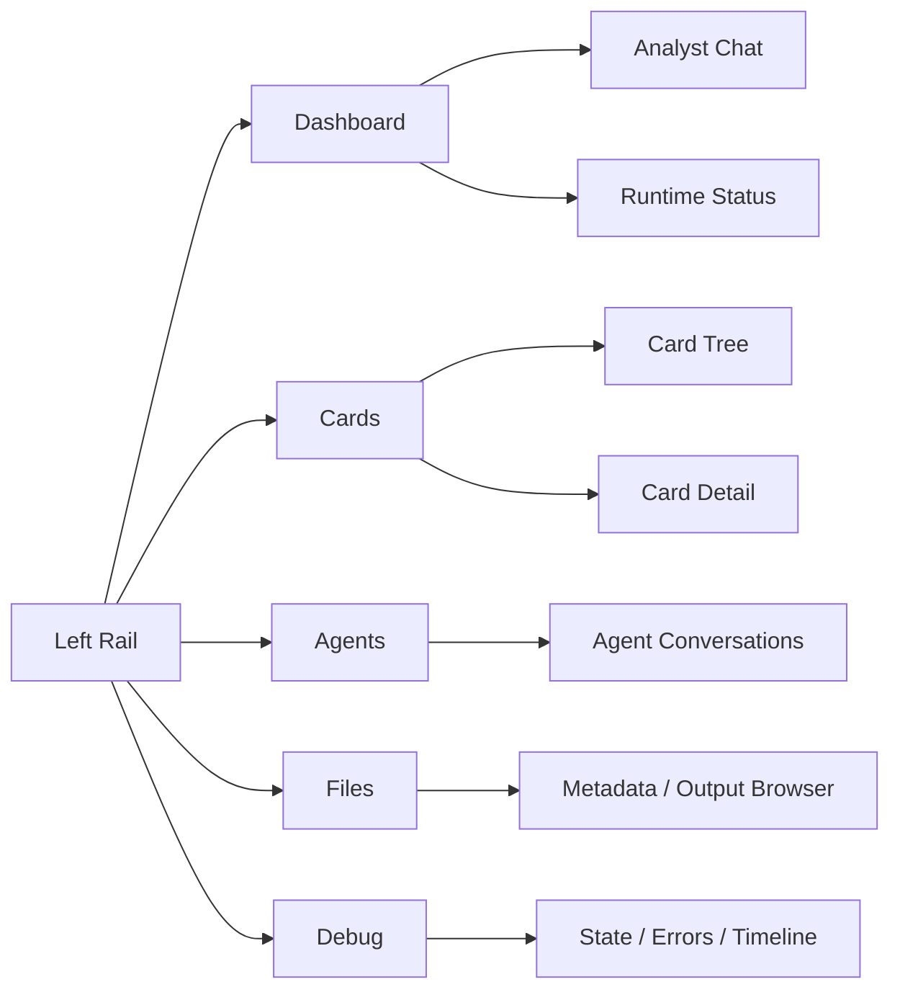

# UX Design

> Canonical design document consolidated from `docs/design/ux-design.md` during Stage 22. Stage 23 will reconcile detailed source anchors where needed.

## Purpose

Saivage v3 is a dense control room for supervising an autonomous
runtime, not a marketing-style app. The UI provides a left navigation
rail, live dashboard, chat command stream, card tree/plan view, agent
conversation inspector, file browser, and debug console. The card
tree is the primary navigation model.

The core UX principle is: **every important runtime fact is inspectable
from a card**. Cards link to their plan diary, review results,
processes, logs, artifacts, notes, and related cards.

The authoritative schemas and filesystem layout are defined in
`data-model.md`.

---

## UX Goals

- Make the current runtime state obvious: running card, current agent,
  queued work, failures, blocked work, and global pause state.
- Let users talk to the analyst without losing operational context.
- Make the card tree the primary navigation model.
- Provide rich inspection tools: agent conversations, file
  browser, debug state, errors, timeline, and artifacts view.
- Support safe intervention: pause globally, abort/restart goals,
  kill processes, add directives, inspect outputs.
- Keep attachments rendered in the web UI only; Telegram links to cards
  or notifies that attachments exist.
- Avoid hidden system state: plan cards are visible in the tree.

---

## Application Shell

The application shell follows a standard operational-console pattern:

- **Left rail**: primary sections with icon + label + hotkey.
- **Workspace header**: current section title, project path/name, live
  status chip, global pause chip if paused.
- **Main workspace**: tab-specific view.
- **Keyboard shortcuts**: numeric section shortcuts and `/`
  to focus chat.
- **API token handling**: local token entry for secured deployments.

Recommended navigation:

| Section | Purpose |
|---|---|
| Dashboard | Live command room: analyst chat plus runtime summary. |
| Cards | Recursive card tree, board, detail, diary, review, process views. |
| Agents | Planner/executor/reviewer/analyst conversations and tool traces. |
| Files | Browse `.saivage/` metadata and `.saivage-work/` outputs safely. |
| Debug | Runtime state, errors, timeline, raw JSON, health diagnostics. |
| Docs | Open generated docs/reference. |

---

## Dashboard

The dashboard is the default control room, combining the analyst chat
stream and the runtime status panel.

### Analyst Chat

The analyst chat is a persistent command stream.

- WebSocket connection with visible state: connected, connecting,
  offline, unauthorized. Analyst messages on one connection are
  serialized in send order, and inbound activity/message/tool payloads
  are sanitized before rendering (`src/server/websocket.ts`,
  `src/utils/analyst-sanitization.ts`,
  `tests/server/websocket-analyst-safety.test.ts`).
- API token entry for secured deployments.
- Chat history stored in agent session records, recoverable on reload; the session picker groups analyst/card/planner/reviewer/executor sessions, disables the composer for read-only planner/reviewer/executor transcripts, and keeps `card-<cardId>` discussions writable with first-turn card-context seeding (`web/src/components/chat/AnalystChatPanel.vue`, `web/src/stores/analystChat.ts`, `web/src/__tests__/analyst-chat-panel.test.ts`, `web/src/__tests__/card-detail-view.test.ts`).
- Markdown rendering of analyst responses.
- System/event messages inline in the stream.
- Send on Enter, multiline with Shift+Enter, `/` focuses input.
- Scroll-to-latest affordance when new messages arrive offscreen.

Analyst capabilities shown in chat:

- Create/edit/move/delete cards at any level.
- Add notes/directives to cards.
- Inspect cards, plan diary, review results, process outputs, artifacts,
  active agents, and runtime state.
- Control runtime: global pause/resume, abort/restart goal,
  restart task card, kill process.

Chat should include structured action previews before destructive
actions, for example aborting a goal or killing a process.

### Runtime Status Panel

The runtime status panel is card-aware.

Metrics:

- Runtime status: running, idle, paused, error, unauthorized.
- Current active card.
- Running process count.
- Queued ready tasks.
- Done goals.
- Failed/blocked cards.
- Active agent count, excluding analyst.

Sections:

- **Current Work**: active card title, type, parent goal, elapsed time.
- **Workers**: planner/executor/reviewer currently active, if any.
- **Queue**: next ready cards in priority order.
- **Recent History**: recent completed goals/tasks, failures,
  reviewer results, escalations.

---

## Cards Section

The Cards section is the primary workspace. It supports four
presentations over the same card model:

- **Tree**: recursive project -> goal -> plan -> sub-goals/tasks.
- **Board**: status columns (`drafting`, `backlog`, `active`,
  `running`, `blocked`, `done`, `failed`, `cancelled`).
- **Leaderboard**: query over done result cards sorted by a selected
  metric.
- **Timeline**: duration-focused view for cards/processes.

### Tree View

Tree requirements:

- Project card is root.
- Plan cards are visible.
- Maximum goal depth is configurable, default 5 levels.
- Use type icons for goal, plan, architecture, code, test, doc, data,
  research, ops.
- Show status, priority, blocked/dependency markers, active agent, and
  unread notes/review markers.
- Support focus by card ID from dashboard, agents, files, debug, and
  Telegram links.

Tree actions:

- Create child card.
- Edit card while not scheduled.
- Add note/directive.
- Move/reparent valid cards.
- Abort goal.
- Restart task/goal.
- Open plan diary.
- Open related process output.
- Open artifacts/attachments.

### Card Detail

Card detail is the central inspection surface.

Sections:

- Header: title, type, status, parent, priority, urgency, created by,
  updated time.
- Description and acceptance criteria.
- Dependencies and blocked-by/blocks graph.
- Notes/activity log with mutable-until-handled behavior.
- Results and metrics.
- Artifacts and attachments. Attachments render inline in the web UI.
- Process list: async commands launched for this card, state, elapsed,
  tail output, kill/wait controls.
- Related agent conversation links.

Goal cards additionally show:

- Child card summary.
- Plan card link.
- Latest reviewer assessment.
- Goal completion gate: reviewer pass required.

Plan cards additionally show:

- Planner diary rendered from structured JSON as Markdown.
- Planner invocations: initial, all tasks complete, review rejection,
  failure.
- Card mutations requested by planner.
- Reviewer assessments appended to the diary.

Terminal task cards additionally show:

- Executor result.
- Process output files and tails.
- Artifacts generated by the task.
- Skill file loaded/linked for the card type.

### Board View

The board is a compact operational view for scanning state. Cards are
grouped by status. It should support filtering by type, parent goal,
tag, priority, and text search.

### Leaderboard View

The leaderboard is a saved query over done result cards. It is not a
separate data model. Rows link to card detail and expose the same
artifacts, metrics, process logs, and review history.

### Timeline View

Timeline combines card duration and process duration:

- Card started/completed times.
- Process start/end and still-running markers.
- Review and planner invocation markers.
- Global pause intervals.

---

## Agents Section

The Agents section shows all active and historical agent conversations
scoped to their roles.

Agent list:

- Analyst conversations (chat sessions).
- Planner for active goal.
- Executor for active goal.
- Reviewer when active.
- Content supervisor events when it blocks or quarantines content.

Conversation detail:

- Messages grouped into reasoning/tool-call/tool-result steps.
- Tool calls expandable by default for current work, collapsed for old
  history.
- Model/provider metadata.
- Runtime events, model repair/recovery events, tool errors.
- Links from tool calls to affected cards, processes, files, artifacts,
  and quarantined content.

The analyst is always available concurrently with the runtime. Other
agents do not run in parallel by default.

---

## Files Section

The Files section separates persistent state from generated outputs.

Panels:

- Metadata browser (`.saivage/`).
- Work/output browser (`.saivage-work/`).
- Notes queue / directives.
- Quarantine browser for content-supervisor blocks.

Behaviors:

- Breadcrumb navigation.
- Directory stats.
- JSON highlighting.
- Markdown rendering where appropriate.
- Safe file reads through MCP; dangerous/external provenance is routed
  through content supervision.
- Downloaded files must enter through `download_file`, not arbitrary
  writes.

---

## Debug Section

The Debug section exposes raw runtime internals:

- **State**: runtime state, card index, active agents, process registry,
  global pause state, configuration.
- **Errors**: source, type, severity, message, details, timestamp.
- **Timeline**: runtime events, card transitions, process events,
  planner/reviewer invocations, content-supervisor events. The Debug
  Timeline defaults to showing every event kind returned by the runtime
  and narrows only when the operator selects kinds in the multi-select
  filter; `web/src/views/DebugView.vue` implements the filter and
  `web/src/__tests__/debug-view.integration.test.ts` guards the
  documented event taxonomy and default-show-all behavior.
- **Errors**: groups runtime error records and timeline-derived failure
  events by `session_id`/source with counts and latest messages; the
  same focused test guards the `invocation_failed`, `*_error`,
  `*_failed`, `error_message`, and `error` predicates.

Debug is for inspection, not normal operation. Actions should link back
to the relevant card or process instead of duplicating controls.

---

## Notifications

- Notify when goals are done.
- Depth-0 planner escalation must notify via Telegram and be visible in
  the web UI.
- Telegram notifications should link to the relevant card. Attachments
  are not rendered in Telegram; Telegram can say attachments exist.

---

## UX Coverage Checklist

| Feature | UX location |
|---|---|
| Analyst chat | Dashboard |
| Global pause/resume | Dashboard status + analyst command |
| Abort/restart goal | Card detail actions + analyst command |
| Restart task | Terminal card detail actions |
| Kill/wait/tail process | Card detail process panel |
| Card tree | Cards / Tree |
| Plan diary | Visible plan card detail |
| Reviewer assessment | Plan card diary + goal detail summary |
| Attachments | Card detail, web only |
| Artifacts/files | Files section + card detail links |
| Agent conversations | Agents section |
| Content supervision/quarantine | Files + Debug + card notes |
| Depth-0 escalation | Telegram notification + UI banner/card marker |
| Debug state/errors/timeline | Debug section |